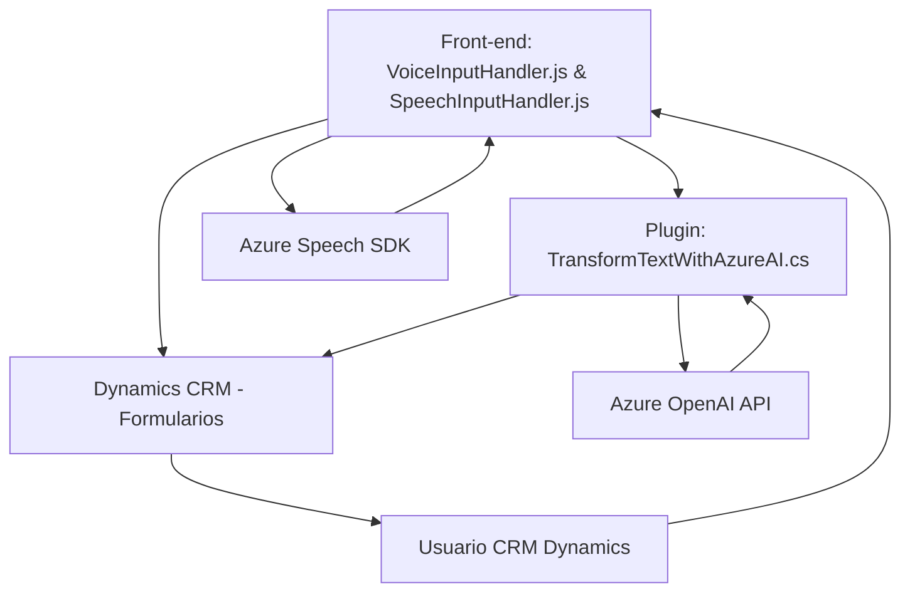

### Resumen técnico

Este repositorio contiene tres archivos principales que forman parte de una solución que utiliza servicios cognitivos y la plataforma Dynamics CRM. El propósito general es integrar funcionalidades avanzadas de voz (transcripción, síntesis) y procesamiento de texto mediante Azure Speech y Azure OpenAI, enriqueciendo la interacción con formularios en Dynamics CRM.

---

### Descripción de la arquitectura

La arquitectura del repositorio presenta características que sugieren un diseño **modular de n-capas**:
1. **Capa de interacción de front-end**: Archivos JavaScript específicos (`VoiceInputHandler.js`, `SpeechInputHandler.js`) que permiten la comunicación entre el usuario y Dynamics CRM. Sobresalen por la integración con Azure Speech para tareas **Speech-to-Text** y **Text-to-Speech**, además de operaciones dinámicas sobre formularios.
2. **Capa de lógica de negocio**: Plugins como `TransformTextWithAzureAI.cs` procesan texto utilizando reglas específicas mediante Azure OpenAI. Actúan como extensiones personalizadas para Dynamics CRM, demostrando el **patrón de complementos (plugin pattern)**.
3. **Capa de servicios externos**: Las tres capas hacen uso de dos servicios principales de Azure: Speech (text-to-speech y speech-to-text) y OpenAI (transformación de texto con IA). Esto indica una **arquitectura centrada en servicios externos**, optimizada para encapsular las tareas cognitivas.

---

### Tecnologías usadas
- **Frontend Web (JavaScript)**: Para enriquecimiento de CRM Dynamics a nivel de formularios.
- **Azure Speech SDK**:
  - speech-to-text: convierte grabaciones de voz en transcripciones procesables.
  - text-to-speech: sintetiza texto y devuelve audio hablado personalizado.
- **Backend (.NET - C#)**:
  - Extiende Dynamics 365 mediante **Microsoft.Xrm.Sdk**.
  - Lógica de negocio personalizada con Azure OpenAI API.
- **Azure OpenAI**: Realiza transformaciones de texto guiadas por IA.
- **Patrones**:
  - **Carga dinámica de librerías**: El SDK de Azure Speech se descarga y carga solo cuando es necesario.
  - **Separación de responsabilidades**: Las funciones están altamente modularizadas con claros propósitos en extracción, síntesis, y procesamiento.
  - **Complementos (plugin pattern)**: Extensiones en Dynamics CRM para procesamiento de texto.

---

### Diagrama Mermaid (Arquitectura conceptual)

---

### Conclusión final

La solución es un sistema modular **de n-capas**, preparado para operar sobre la plataforma Dynamics 365. Su propósito principal es enriquecer la interacción entre usuarios y formularios mediante voz y texto, soportado por servicios de Azure. Las tecnologías y patrones usados muestran una clara estrategia de integración con servicios de nube y una arquitectura modular que facilita escalabilidad y mantenimiento. Este enfoque es ideal para aplicaciones empresariales que buscan mejorar la experiencia de usuario mediante inteligencia artificial y automatización.