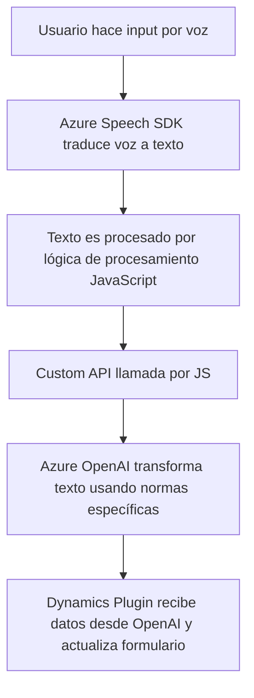

### Breve resumen técnico:

La estructura del repositorio indica una solución que integra múltiples componentes pensados para interactuar con formularios en una plataforma CRM (probablemente Dynamics 365). Esta solución combina procesamiento de voz, reconocimiento de texto y servicios en la nube (Azure Speech SDK y Azure OpenAI API). Se divide en frontend (JavaScript), integración de API externa (via un plugin backend en C#), y lógica de manejo de datos formularios que incluye elementos de inteligencia artificial.

---

### Descripción de arquitectura:

#### Tipo de solución:
La solución es una **hibridación de microservicios y frontend** orientada principalmente a la interacción con formularios de CRM mediante reconocimiento y síntesis de voz. Además, presenta características de un sistema service-oriented (SOA) que integran APIs de terceros.

#### Tecnologías utilizadas:
1. **Frontend:**
   - Tecnología: **JavaScript**.
   - Framework externo: **Azure Speech SDK**.
   - Uso de manipulación de DOM en contextos CRM/formularios.

2. **Backend:**
   - Lenguaje: **C#**.
   - API: Interacción con **Azure OpenAI** a través de HTTP (REST).
   - Framework: **Microsoft Dynamics SDK** para gestión del contexto CRM.
   - JSON para trabajo con objetos y respuestas API.

#### Arquitectura:
- **Frontend (JS):** La arquitectura de este módulo parece estar basada en **n-capas**, con una clara separación de responsabilidades entre ellas:
  - Capa de presentación (formularios y frontend de la aplicación CRM).
  - Capa de lógica de negocio (procesamiento del reconocimiento y síntesis de voz, asignación de datos del formulario, llamadas a la API).
- **Backend (Dynamics Plugin):** Arquitectura **hexagonal**, con servicios externos y reglas específicas que interactúan directamente con Dynamics CRM.
- **Microservicios externos:** Consumo de servicios en la nube de Microsoft Azure para reconocimiento de voz (Speech SDK) y transformación de texto (OpenAI).

#### Dependencias o componentes externos:
1. **Azure Speech SDK:** Utilizado para convertir texto a voz en español y para procesar reconocimiento de voz.
2. **Azure OpenAI API:** Consume un modelo de inteligencia artificial (GPT) desde Azure para transformar texto dinámicamente.
3. **Microsoft Dynamics CRM SDK:** Framework que estructura el plugin y la comunicación con el CRM.
4. **Newtonsoft.Json** y **System.Net.Http**: Manejo de datos JSON y solicitudes HTTP dentro del plugin.

---

### Diagrama Mermaid válido para GitHub:

---

### Conclusión final:

Este repositorio implementa una solución compleja orientada a la interacción con el usuario y a la automatización de procesos en contextos empresariales, particularmente en un ambiente CRM como Dynamics 365. La integración de tecnologías como Azure Speech SDK y Azure OpenAI API muestra un enfoque moderno hacia el uso de servicios en la nube. Sin embargo, esta arquitectura tiene dependencias específicas, lo que podría disminuir la flexibilidad en entornos fuera de los ecosistemas de Microsoft Azure o Dynamics.

La solución está bien estructurada en términos de modularidad y separación de responsabilidades, aunque podría beneficiarse de una mejora en la gestión avanzada de errores y la implementación de pruebas. Consideraciones como la seguridad en las llamadas al API y la optimización de rendimiento serán fundamentales en un entorno de producción.