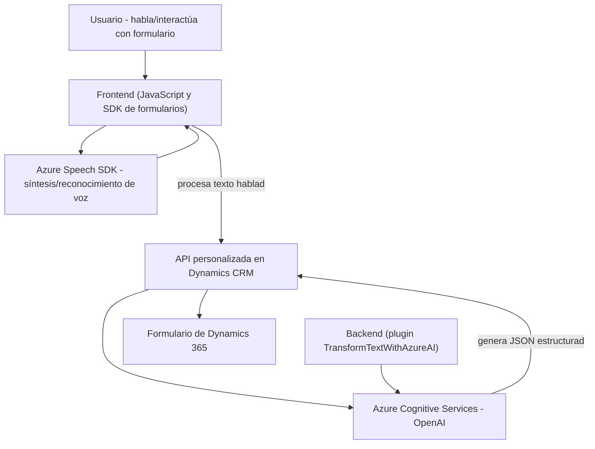

### Breve resumen técnico
El repositorio descrito parece ser una solución integrada para formularios accesibles mediante tecnología de síntesis y reconocimiento de voz. Consiste de varios componentes: un frontend basado en JavaScript que utiliza el Azure Speech SDK para leer y transformar datos hablados, y un plugin backend en C# que interactúa con Azure OpenAI para procesar texto. Se ha diseñado para integrarse con Dynamics 365 en un entorno empresarial.

---

### Descripción de arquitectura
La solución tiene una arquitectura **n-capas** que combina tecnologías frontend, servicios cloud y un backend. Utiliza:
1. **Frontend (JavaScript)**:
   - Como capa de presentación, se encarga de leer datos del formulario y sintetizar voz con Azure Speech SDK.
   - Implementa patrones como lazy-loading (para dependencias externas) y delegación funcional.
   
2. **Backend (C# Plugin)**:
   - Diseñado como plugin de Dynamics CRM (IPlugin), procesa información textual con Azure OpenAI para transformar texto en JSON estructurado.
   - Sigue el patrón Plugin Pattern y REST Client Architecture para integración de servicios externos.

3. **Servicios Cloud**:
   - Azure Cognitive Services para las capacidades de Speech (uso de SDK de voz).
   - Azure OpenAI para procesamiento y transformación estructurada de texto.

La solución está orientada a proporcionar accesibilidad, integrando voz como mecanismo de interacción para facilitar la usability en formularios.

---

### Tecnologías usadas
1. **Frontend:**
   - **Azure Speech SDK**: Synthesis y reconocimiento de voz.
   - **JavaScript**: Programación funcional con APIs del navegador.
   - **Dynamics 365 JavaScript SDK (Xrm)**: Manipulación de formularios en el contexto de Dynamics.

2. **Backend:**
   - **C#: .NET Framework** con Microsoft.Xrm.Sdk para desarrollar el plugin.
   - **Azure OpenAI API**: Generación de texto estructurado.
   - **System.Net.Http**: Llamadas REST al servicio OpenAI.

3. **Cloud Services**:
   - **Azure Speech**: Conversión de texto a voz y reconocimiento de voz.
   - **Azure OpenAI**: Transformación avanzada de texto.

4. **Patrones:**
   - Lazy-loading.
   - Plugin Pattern.
   - API Gateway/REST Client.

---

### Dependencias o componentes externos
1. **Azure Speech SDK** (cargado dinámicamente en el navegador).
2. **Dynamics 365 JavaScript SDK** para integrar directamente con formularios.
3. **Custom APIen Dynamics 365 (`trial_TransformTextWithAzureAI`)** que consume el servicio Azure OpenAI.
4. **Azure OpenAI REST API** para transformación automática de texto.
5. **Librerías estándar de .NET** para serialización, comunicación HTTP, y manejo del context de plugins.

---

### Diagrama Mermaid válido para GitHub

---

### Conclusión final
La solución en cuestión está diseñada como un sistema **accesible orientado a la voz** para formularios empresariales, con una arquitectura modular basada en n-capas. Utiliza tecnologías avanzadas como **Azure Speech SDK** para síntesis y reconocimiento de voz, junto con **Azure OpenAI** para transformar texto en estructuras más útiles, integrándose fuertemente con **Dynamics CRM**.

Esta estructura modular asegura adaptabilidad y escalabilidad, mientras que sus servicios cloud permiten procesamiento avanzado. Sin embargo, se recomienda implementar mejoras en la gestión de configuraciones (como las claves de API) para garantizar mayor seguridad. La arquitectura es adecuada para entornos empresariales que requieren fuerte accesibilidad y procesamiento automatizado de datos.