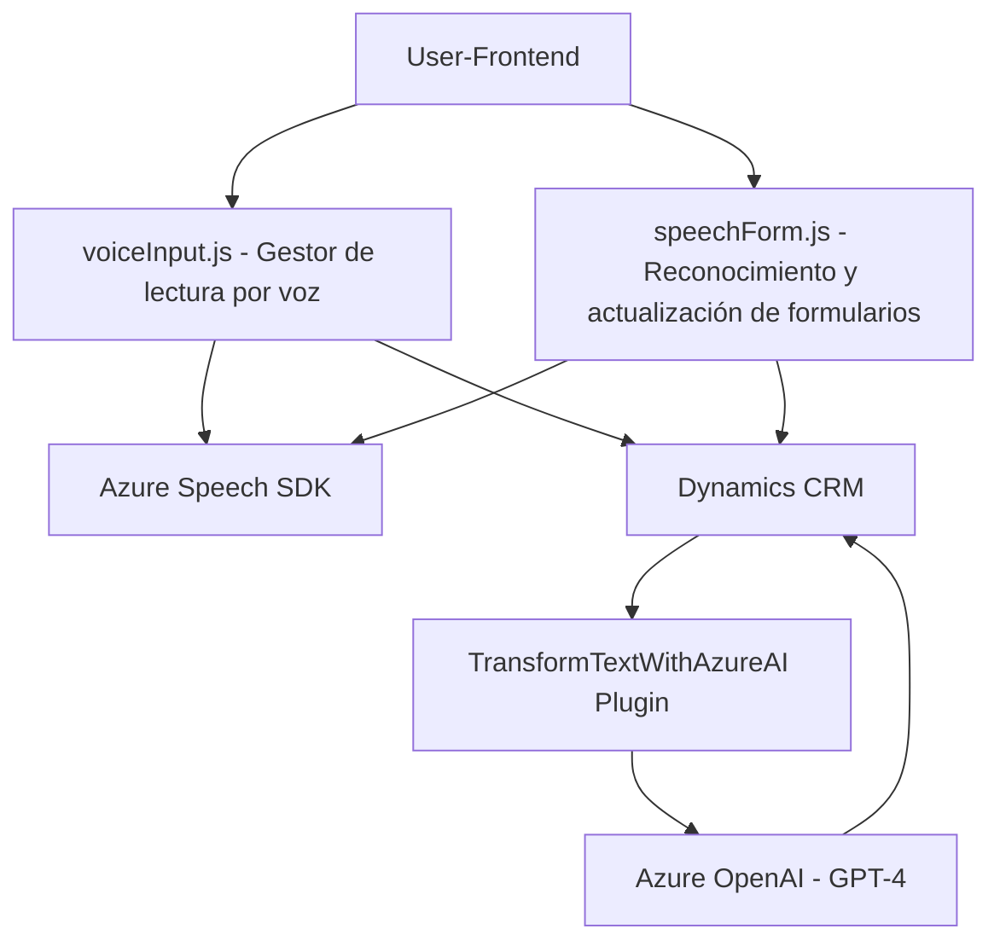

# Análisis Técnico de la Solución

## Breve Resumen Técnico
La estructura presentada incluye módulos frontend en JavaScript para la interacción con formularios mediante reconocimiento y síntesis de voz (usando Azure Speech SDK), así como un plugin backend en C# que transforma textos mediante Azure OpenAI (GPT-4). La solución busca integrar tecnologías externas (Azure Speech y Azure OpenAI) dentro de un entorno basado en Dynamics CRM.

---

## Descripción de Arquitectura
La solución parece estar orientada a **extender la funcionalidad de Dynamics CRM**, combinando procesamiento de voz y texto con servicios de inteligencia artificial externos. La arquitectura utilizada incluye los siguientes componentes y patrones:
- **Frontend**:
  - Módulos JavaScript que interactúan con Dynamics CRM para gestionar formularios mediante la voz, implementando el reconocimiento y la síntesis mediante SDK de Azure.
- **Backend**:
  - Plugins escritos en C# para procesamiento estructurado de texto recibido (transformación a JSON) usando modelos de IA alojados en Azure OpenAI.
  
La arquitectura sigue el patrón de **n capas**:
- **Presentación**: Módulos JS (interacción a nivel de cliente).
- **Lógica de negocio**: Plugins en Dynamics CRM y servicios API que procesan lógica avanzada como IA y actualización dinámica de formularios.
- **Persistencia**: Interacción con datos de entidades CRM (CRUD).

El diseño integrado con componentes externos como SDKs de Azure refuerza el desacoplamiento para cumplir con los principios de arquitectura modular, permitiendo una extinción simple.

---

## Tecnologías Usadas
1. **Frontend**:
   - **JavaScript**: Lógica modular para procesamiento de datos.
   - **Azure Speech SDK**: Reconocimiento y síntesis de voz dinámica desde un CDN.
2. **Backend**:
   - **C#**: Plugins en Dynamics CRM para lógica avanzada.
   - **Azure OpenAI Service (GPT-4)**: Procesamiento de textos mediante tecnología de IA externa.
   - **System.Net.Http y System.Text.Json**: Para comunicación y manejo de datos en formato JSON.
3. **Entorno**:
   - **Microsoft Dynamics CRM**: Base de datos, API y estructura del sistema.
   - **Xrm.WebApi**: API utilizada en los módulos para integrar con Dynamics CRM.

---

## Dependencias o Componentes Externos
1. **Azure Speech SDK**:
   - Tratamiento y lectura de formularios por voz.
   - Reconocimiento de voz dinámico desde el micrófono del usuario.
   - Integración directa desde un CDN (lazy-loading para optimizar recursos).
2. **Azure OpenAI Services**:
   - Transformación lógica de textos en JSON utilizando el modelo GPT-4.
   - Verificación de API keys y comunicación segura vía HTTP.
3. **Microsoft Dynamics CRM**:
   - Almacenamiento de datos autogenerados en campos.
   - Plugins extendidos como base para lógica.

---

## Diagrama Mermaid (Estructura General)

### Detalle del diagrama
1. El cliente (usuario) interactúa con el frontend mediante `voiceInput.js` y `speechForm.js`.
   - Ambas asignan valores en tiempo real a formularios según datos reconocidos o procesados.
2. Se utiliza **Azure Speech SDK**, con una doble funcionalidad:
   - Síntesis de voz (lectura de formularios).
   - Reconocimiento de texto desde grabaciones.
3. Los formularios actualizados se procesan en una lógica interna con CRM.
4. Los plugins backend (`TransformTextWithAzureAI`) delegan la validación y transformación a Azure OpenAI Services (estructura en JSON).
   - El JSON resultante se refleja en el sistema CRM.

---

## Conclusión Final
La solución representa una integración flexible y moderna para enriquecer Dynamics CRM utilizando servicios avanzados como voz y OpenAI. La arquitectura es modular y basada en n capas, destacando por su capacidad para encapsular responsabilidades y maximizar el aprovechamiento de servicios externos como Azure Speech SDK y OpenAI.

Esta herramienta debería ser útil para procesos que requieren interacción dinámica basada en voz y procesamiento de datos no estructurados en entornos empresariales. Además, la integración de patrones como Lazy Loading agrega eficiencia en la carga de recursos solo cuando son necesarios.