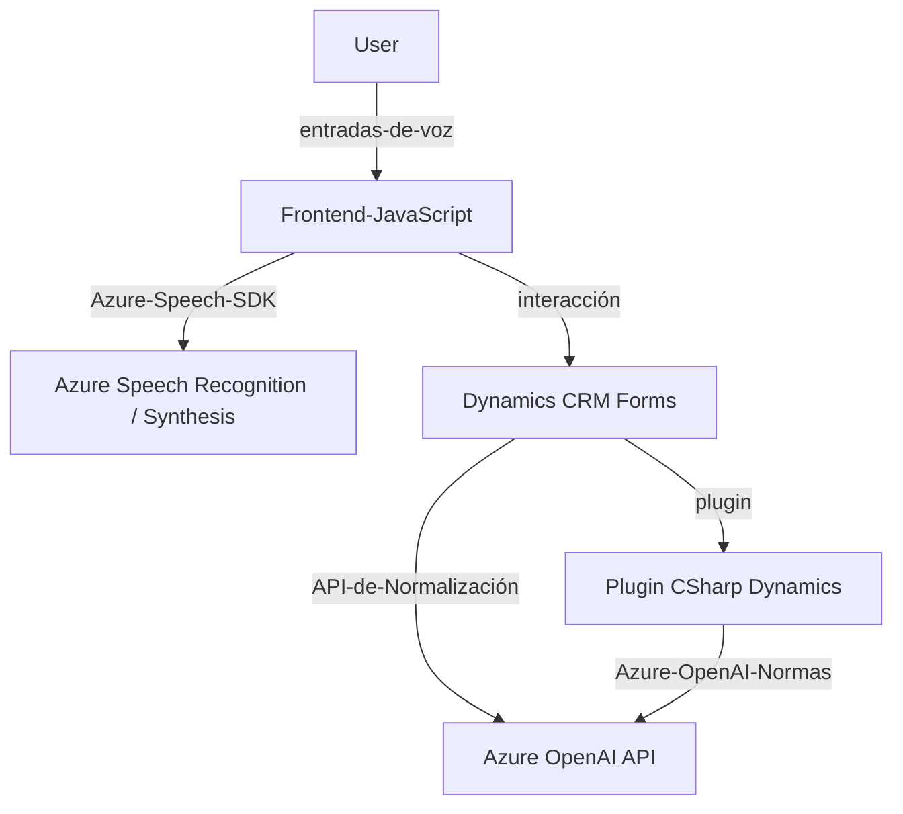

### Breve resumen técnico
El repositorio contiene varios archivos diseñados para integrar capacidades de entrada por voz, reconocimiento de voz y procesamiento de texto con los servicios de Azure en un sistema que aparenta ser parte de Microsoft Dynamics CRM. Presenta funciones específicas para interactuar con formularios (frontend) y un plugin en el backend para transformar texto mediante AI.

---

### Descripción de arquitectura
La arquitectura parece ser de estilo **n-capas**, donde las capas se dividen en:
1. **Frontend (JS)**: Encargada de manejar entradas/salidas (voz, datos formulados). Usa Azure Speech SDK para tareas de voz.
2. **Backend (Plugin)**: Plugin en un entorno de Dynamics CRM, ejecutando transformaciones de texto mediante Azure OpenAI y realizando interacciones en servidores externos.
3. **Servicios Externos (Azure)**:
   - Azure Speech SDK (síntesis y reconocimiento de voz).
   - Azure OpenAI para procesamiento avanzado de textos.

Aunque está diseñado para integrarse como parte de Microsoft Dynamics CRM, la existencia de servicios externos apunta a un enfoque que combina **microservicios** externos para funciones específicas (voz y procesamiento de texto) con un núcleo monolítico en la plataforma Microsoft Dynamics.

---

### Tecnologías usadas
- **Azure Speech SDK**: Para reconocimiento de voz y síntesis de texto a voz.
- **Azure OpenAI API**: Para transformación de textos con reglas personalizadas.
- **Microsoft Dynamics CRM SDK**: APIs y plugins para expandir las capacidades del CRM.
- **JavaScript**: En el frontend, para gestionar la interacción con formularios y servicios.
- **C# (.NET)**: Lenguaje usado para desarrollar el backend en forma de plugin.

#### Patrones de diseño y de arquitectura
- **n-capas**: Separación de lógica empresarial (plugin), servicios externos (Azure APIs) y front-end.
- **Microservicio**: Aprovechamiento de servicios externalizados de Azure (Speech SDK y OpenAI).
- **Modularidad**: Las funcionalidades del código están segmentadas, cada archivo y función tienen una responsabilidad específica.
- **Callback Pattern**: Usado para manejar scripts de SDK cargados dinámicamente.
- **Pipeline de procesamiento**: Entrada de datos transformada en salida estructurada, siguiendo un flujo de transformaciones.

---

### Dependencias o componentes externos
Las principales dependencias y componentes relacionados al proyecto incluyen:
1. **Azure Speech SDK**:
   - Servicios provistos por Microsoft Azure para síntesis y reconocimiento de voz.
2. **Azure OpenAI API**:
   - Endpoint configurado para procesamiento de texto con modelos GPT-4.
3. **Microsoft Dynamics CRM SDK**:
   - Integración directa con el CRM a través de plugins y contexto.
4. **Engines de voz e inteligencia artificial**:
   - Basados en entrada y salida para formularios y voz.

---

### Diagrama Mermaid válido para GitHub
El siguiente diagrama representa la interacción de los componentes descritos:

---

### Conclusión final
Este repositorio representa una solución que integra Azure Speech SDK y Azure OpenAI en un entorno de Microsoft Dynamics CRM. La arquitectura se organiza en capas (frontend/backend) y utiliza servicios externalizados destinados a realizar tareas específicas con alta eficiencia. Esto sugiere una mezcla de monolito (CRM central) y microservicios (Azure APIs). La modularidad y la elección de tecnologías como JavaScript en el frontend y C# en el backend están optimizadas para el ecosistema en el cual opera.