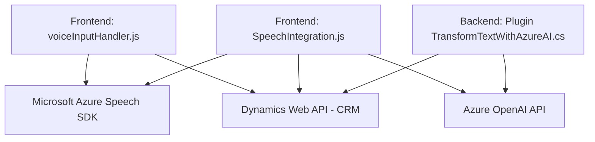

### Breve Resumen Técnico
El repositorio presenta una solución centrada en la interacción entre formularios dinámicos (probablemente de un CRM, como Dynamics 365), reconocimiento de voz mediante **Azure Speech SDK**, y transformación de texto usando la API de **Azure OpenAI**. Se utiliza para automatizar tareas de lectura, transcripción y procesado de datos en sistemas CRM. 

### Descripción de Arquitectura
La solución sigue una arquitectura **orientada a servicios** combinando diferentes componentes que operan en distintas capas de responsabilidad:

1. **Frontend/JS (`voiceInputHandler.js` y `SpeechIntegration.js`)**:
   - Los archivos proporcionan una interfaz de usuario que interactúa con formularios dinámicos. Se encargan de la lectura de campos visibles, transcripción de voz y envío de datos procesados.
   - Se utiliza un enfoque **modular** en el código y un patrón de integración con SDK proporcionando eventos y callbacks.

2. **Plugins (`TransformTextWithAzureAI.cs`)**:
   - El **backend**, mediante plugins para Dynamics CRM, realiza procesado avanzado de texto usando servicios de Azure OpenAI y manipula datos estructurados en JSON. Este plugin sigue el **Plugin Pattern** típico de Dynamics, manejando datos dentro del contexto de ejecución del CRM.

3. **General**:
   - La arquitectura podría describirse como **servicio orientado a eventos**: SDKs y APIs son cargados dinámicamente en el flujo de interacción según sea necesario.
   - Funciona como una solución de múltiples capas:
     - **Capa de presentación**: Archivo JS que interactúa con formularios visibles.
     - **Capa de lógica**: Procesado de datos y llamadas a SDKs mediante funciones en JS.
     - **Capa de integración y backend**: Plugins que procesan datos usando Azure OpenAI para actualizar la lógica del CRM.

### Tecnologías Usadas
1. **Azure Speech SDK**:
   - Para reconocimiento de voz y síntesis de texto en voz en los scripts JS.
   - Implementa métodos para transcripción y aplicación dinámica de api keys.
   
2. **Dynamics Web API (`Xrm.WebApi`)**:
   - Se usa en el frontend para interacción con formularios del CRM (lectura y aplicación de valores).

3. **Azure OpenAI**:
   - Plugin para transformar texto en un objeto JSON con uso de **GPT models**.

4. **Frameworks de Backend**:
   - **Microsoft.Xrm.SDK**: Arquitectura de plugin basada en Dynamics CRM.
   - **Newtonsoft.Json**, `System.Text.Json`: Manipulación JSON.
   - **System.Net.Http**: Consumo de APIs exteriores.

5. **Patrones**:
   - **Modularidad**: Creación de funciones independientes (cada una con un propósito definido).
   - **Dynamic SDK loader**: Carga dinámica de librerías externas.
   - **Service-Oriented Architecture (SOA)**: Interacción entre servicios y APIs externas.
   - **Plugin Pattern**: Los plugins de Dynamics CRM manejan lógica dentro de eventos de la plataforma.

### Diagrama Mermaid

### Conclusión Final
La solución combina tecnologías de procesamiento de voz (Azure Speech SDK), interacción con sistemas CRM (Dynamics) y transformación de texto en JSON (Azure OpenAI). La arquitectura utiliza un enfoque modular basado en eventos y servicios externos, integrándose estrechamente con Dynamics 365. Se enfoca en automatización avanzada y flexibilidad, tanto en su capa de presentación como en la lógica de backend.