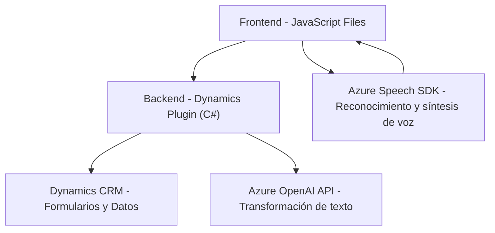

### Breve resumen técnico:
El repositorio parece implementar una solución híbrida orientada a sistemas CRM (como Microsoft Dynamics) que utiliza la integración con Azure Speech SDK y Azure OpenAI API. Los componentes principales abordan la entrada y salida de datos mediante reconocimiento y síntesis de voz, además de transformar texto en estructuras JSON basadas en reglas predefinidas de inteligencia artificial.

---

### Descripción de arquitectura:
La arquitectura puede clasificarse como de **n capas**, con una **capa frontend** en JavaScript (interacciones en formularios CRM) y una **capa de backend** basada en un plugin de Dynamics CRM en C#. Además, presenta integración directa con servicios de voz y IA de Azure, agregando características de **arquitectura externalizada hacia APIs**.

#### Componentes principales:
1. **Frontend (JavaScript)**:
   - Define la lógica de procesar datos del formulario CRM.
   - Interactúa con servicios de voz externos (Azure Speech SDK).
   - Utiliza funciones modulares y patrones de separación de responsabilidades.

2. **Backend (Plugin en C#)**:
   - Define un plugin para eventos en Dynamics CRM.
   - Consume Azure OpenAI para transformar el texto en JSON basado en reglas.
   - Realiza operaciones externas de red y maneja datos CRM.

3. **Servicios externos**:
   - **Azure Speech SDK**: Reconocimiento y síntesis de voz.
   - **Azure OpenAI**: Procesamiento de texto con inteligencia artificial.

---

### Tecnologías usadas:
1. **Frontend**:
   - **JavaScript**: Scripts personalizados para manejar eventos en formularios CRM, reconocimiento y síntesis de voz.
   - **Azure Speech SDK**: Biblioteca para servicios de reconocimiento y síntesis de voz en Azure.

2. **Backend**:
   - **C#**: Implementación del plugin de Dynamics CRM.
   - **Microsoft Xrm SDK**: Contexto del CRM para interactuar con datos.
   - **Azure OpenAI API**: Procesamiento avanzado de texto.
   - **HttpClient/REST API**: Para enviar y recibir datos de servicios externos.

3. **Servicios de terceros**:
   - Azure Speech Services (SDK).
   - Azure OpenAI para AI y procesamiento textual.

---

### Diagrama Mermaid:

---

### Conclusión final:
Este repositorio implementa una solución de **n capas** con integración en un entorno CRM (Dynamics). Utiliza JavaScript en el frontend para procesar datos de formularios y manejar voz, mientras que un plugin en C# conecta las operaciones del backend con servicios de Azure, aprovechando la nube para ejecutar reconocimiento de voz y IA. La utilización de Azure Speech SDK y OpenAI añade características avanzadas de accesibilidad y procesamiento de lenguaje, convirtiendo esta solución CRM en una herramienta de alto valor en contextos como accesibilidad o sistemas dinámicos basados en voz.