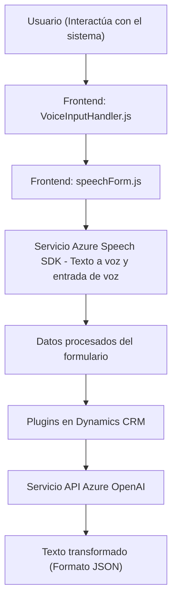

### Breve resumen técnico
La solución presentada combina varias funciones y componentes (frontend en JavaScript, backend en C#) para construir un ecosistema de interacción entre usuarios, formularios, procesamiento de voz y servicios externos (Azure Speech y Azure OpenAI). Está enfocada en la captura, síntesis y transformación de información mediante tecnologías basadas en IA.

---

### Descripción de arquitectura
La arquitectura tiene características híbridas, combinando:
1. **Arquitectura en capas**:
   - **Frontend**: Scripts de JavaScript para la interacción con usuarios y adquisición de voz/síntesis de texto.
   - **Backend**: Plugins en C# para integrar lógica avanzada con Dynamics CRM.
2. **Orientación a servicios**:
   - Se consuma el Azure Speech SDK para texto-a-voz y entrada verbal.
   - Azure OpenAI se utiliza para transformaciones de texto estructuradas.

Desde el punto de vista arquitectónico, existe una fuerte integración con APIs externas y uso modular de funciones, siguiendo patrones orientados a servicios y cliente-servidor.

---

### Tecnologías usadas
1. **Frontend**:
   - Lenguaje: JavaScript.
   - SDK external: Azure Speech SDK para manejo de síntesis de voz y entrada de voz.
   - Frameworks: Funcionalidad modular, sin frameworks visibles como React o Angular.

2. **Backend**:
   - Lenguaje: C#.
   - Integración con Dynamics CRM mediante plugins (.NET Framework o .NET Core).
   - API REST de Azure OpenAI para procesamiento de texto avanzado.
   - Librerías JSON (Newtonsoft, System.Text.Json) para manipulación de objetos estructurados.

3. **Servicios API**:
   - **Azure Speech SDK**: Síntesis texto-a-voz y entrada de voz.
   - **Azure OpenAI**: Procesamiento de texto basado en inteligencia artificial.

---

### Diagrama **Mermaid** válido para GitHub

---

### Conclusión final
La solución implementada conjunta varias tecnologías para realizar procesamiento de datos eficientes en un entorno orientado a nube (Azure Speech y Azure OpenAI). Además, interactúa con Dynamics CRM por medio de plugins y APIs personalizadas, lo que posiciona esta arquitectura como un **híbrido de varios estilos arquitectónicos**, predominantemente orientado a servicios (SOA) con elementos de capas específicas (frontend-backend).

**Puntos fuertes**:
- Modularidad en scripts y lógica de plugins.
- Uso de APIs cloud-first.
- Escalabilidad al integrar servicios como Azure OpenAI.

**Debilidades potenciales**:
- Dependencia fuerte de servicios externos (Azure APIs).
- Mantenimiento, dado que la integración entre frontend y backend podría complicarse en el tiempo.

En resumen, el enfoque es efectivo para contextos corporativos que buscan interfaces inteligentes basadas en voz y formulación, además de integración con IA y sistemas CRM robustos.