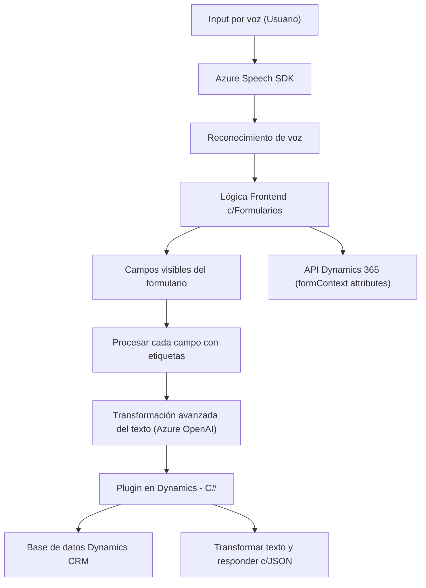

### Breve Resumen Técnico

El repositorio es parte de una **solución integral** utilizada en un entorno de Dynamics 365, enfocado en **entrada de datos por voz** y **transformación de texto usando AI**. Contiene tres módulos principales:

1. **Frontend/JS**: Implementa lógica de procesamiento interactiva para manejar entrada y salida de voz con **Azure Speech SDK** y manipulación de formularios en Dynamics 365.
2. **Plugins**: Define un plugin para extender Dynamics CRM con integración a **Azure OpenAI**.
3. **Dependencias externas**: Servicios de Azure como Speech SDK y OpenAI.

---

### Descripción de Arquitectura

Este proyecto sigue una arquitectura **modular orientada a servicios**:
- **Frontend**: Manejo de comunicaciones entre el usuario, los formularios interactivos de Dynamics 365 y los servicios de Azure.
- **Plugins (Backend)**: Complementa con lógica avanzada en Dynamics CRM para transformación de texto.
- **Patrones de arquitectura usados**:
  - **N capas**: Separación clara entre presentación (Frontend, UI), lógica de negocio (Plugins) y servicios externos (Azure Speech/OpenAI).
  - **Servicios externos como dependencias**: Integración profunda con Azure Speech SDK y OpenAI para interacción real-time y capacidad de inteligencia artificial.
  - **MVC (Front - Dynamics):** Estructura compuesta de roles (Model para datos, View en formularios, Controller para acciones de voz/texto).

---

### Tecnologías Usadas

1. **Frontend**:
   - **JavaScript**: Base para interacción cliente.
   - **Dynamics 365 Context API**: Obtiene y manipula datos de los formularios.
   - **Azure Speech SDK**: Permite la entrada y salida de datos por voz.
   - **DOM Manipulation APIs**: Manejo de scripts dinámicos como el cargado del SDK.

2. **Backend (Plugins)**:
   - **C# (.NET)**: Procesamiento lógico en el sistema CRM.
   - **Integration Libraries**:
     - **HttpClient**: Para llamadas HTTP con Azure AI.
     - **Newtonsoft.Json** y **System.Text.Json**: Procesamiento JSON.
   - **Dynamics Plugin Framework**: Extiende la lógica de CRM mediante integración directa.

3. **Dependencias externas**:
   - **Azure API Services** (Speech SDK, OpenAI): Funcionalidades de inteligencia artificial aplicadas en tiempo de ejecución.

---

### Diagrama Mermaid

---

### Conclusión Final

El repositorio combina funciones frontend avanzadas para manejar entrada/salida de voz en formularios interactivos con lógica backend extensible en Dynamics CRM, apoyándose en servicios externos de **Azure Speech SDK** y **OpenAI**. Su diseño modular y orientado a servicios asegura escalabilidad y mantiene la separación de responsabilidades, siendo ideal para soluciones que requieren personalización interactiva y capacidades de inteligencia artificial en un entorno CRM.