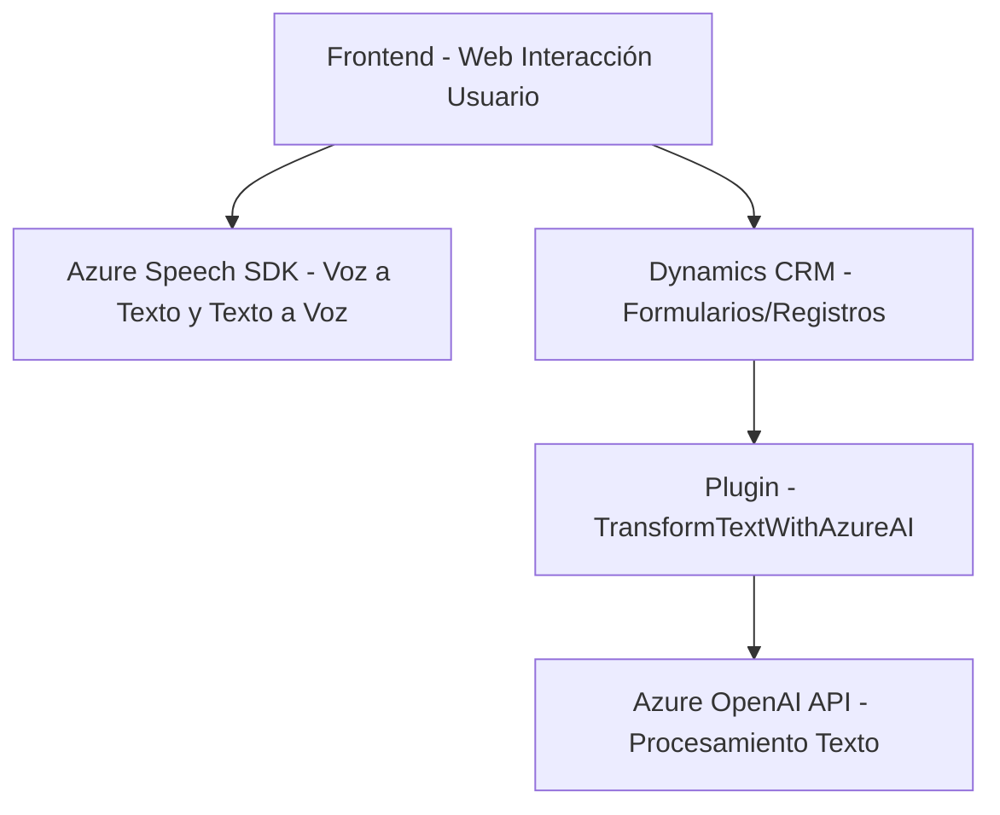

### Resumen Técnico
El repositorio parece estar diseñado para una solución tecnológica que integra **voz y texto** en el contexto de un sistema **Microsoft Dynamics CRM**. Su propósito es automatizar la interacción con formularios y realizar transformaciones avanzadas mediante el uso de **Azure Cognitive Services** y **Azure OpenAI**. La solución incluye tres módulos principales:
1. **Frontend**: Maneja la interacción entre usuario y el sistema, principalmente con capacidades de reconocimiento de voz y síntesis de texto a voz.
2. **Plugin del CRM**: Extendiendo las capacidades de Dynamics CRM mediante llamadas a APIs externas para realizar transformaciones de texto.
3. **APIs externas (no incluidas en el código pero referenciadas)**: Procesos suplementarios alojados fuera del CRM.

---

### Descripción de Arquitectura
1. **Arquitectura General**: 
   - La arquitectura es híbrida, combinando un sistema basado en n capas (Frontend y Plugins) con una integración de **servicios externos** para tareas específicas como reconocimiento y síntesis de voz, así como procesamiento avanzado mediante Azure OpenAI. Aunque no se utilizan microservicios, existe un **gateway** que conecta el plugin del CRM y el frontend con servicios externos de Azure.

2. **Organización Modular**:
   - Los archivos están organizados en directorios que separan funcionalidades (e.g., FRONTEND/JS y Plugins).
   - La modularidad del código en funciones específicas demuestra un diseño basado en principios de separación de responsabilidades y encapsulación.

3. **Patrones Implementados**:
   - **Facade Pattern**: El frontend centraliza las llamadas al **Azure Speech SDK** y manipulación de formularios, simplificando la interacción con múltiples APIs y módulos.
   - **Events Driven**: En el frontend, la interacción del usuario mediante voz desencadena un flujo que finaliza con acciones en el CRM o APIs externas.
   - **Gateway Pattern**: El plugin actúa como un intermediario entre Dynamics CRM y los servicios externos (Azure OpenAI).

4. **Dependencias Externas**: 
   - **Azure Cognitive Services Speech SDK**: Para la entrada y salida de voz en el frontend.
   - **Azure OpenAI API**: Para la generación de texto estructurado (usado en el plugin).
   - **Dynamics CRM SDK**: Acceso a contextos y datos del CRM en el plugin y el frontend.

---

### Tecnologías Usadas
1. **Frontend**:
   - **JavaScript/TypeScript** (sintaxis sugiere modularidad y sugerencia de TypeScript).
   - **Azure Cognitive Services Speech SDK** para reconocimiento y síntesis de voz.

2. **Backend Plugin**:
   - **C#** .NET framework (std Microsoft Dynamics CRM plugin model).
   - **JSON libraries** (`Newtonsoft.Json`).
   - **HTTP Client**: Integrado para interactuar con APIs de Azure OpenAI.
   - **Microsoft Dynamics SDK** (CRM, ejecución de plugins).

3. **Plataformas Externas:**
   - **Azure Speech Services**.
   - **Azure OpenAI Services**.

---

### Diagrama Mermaid para Repositorio

---

### Conclusión Final
El repositorio muestra una solución bien integrada en el ámbito de sistemas empresariales, diseñada para extender las funcionalidades de **Dynamics CRM** mediante el uso de tecnologías avanzadas de **Azure Cognitive Services** y **Azure OpenAI**. La arquitectura híbrida aprovecha la separación de frontend, backend y servicios externos, manteniendo modularidad y escalabilidad. Sin embargo, existen áreas de mejora, como la protección de las claves API y el manejo seguro de endpoints estáticos en el plugin. En general, la solución está bien alineada con patrones de arquitectura modernos y prácticas recomendadas.