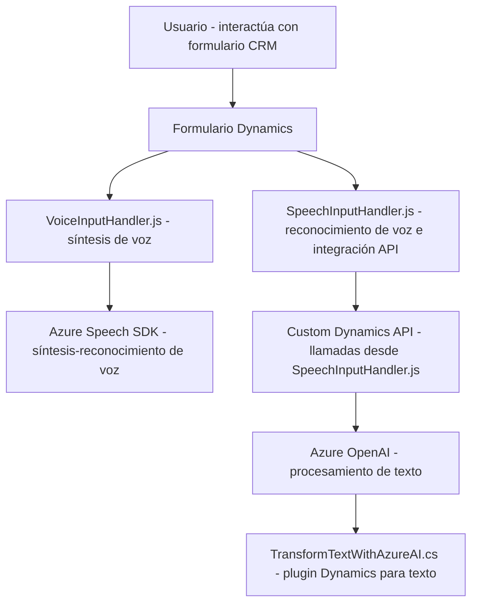

### Análisis técnico y descripción detallada:

#### Breve resumen técnico:
El repositorio parece estar orientado a una solución para mejorar **accesibilidad** e **interacción sobre formularios** mediante entrada y salida de voz, posiblemente en el contexto de un CRM como Dynamics 365. La solución integra funcionalidades de reconocimiento y síntesis de voz con **Azure Speech SDK**, así como transformación de texto con **Azure OpenAI**. Además, utiliza plugins dentro de Dynamics CRM para extender su funcionalidad.

---

#### Descripción de la arquitectura:
- **Principal:** La solución sigue una arquitectura distribuida que combina **elementos de microservicios y arquitectura basada en eventos** para responder a interacciones de voz.  
- **Frontend (JS archivos):** Modular, organizado en funciones autónomas con delegación de responsabilidades. Utiliza comunicación con servicios externos (Speech SDK, APIs de Dynamics).  
- **Backend (plugin C#):** Plugin basado en el sistema CRM que actúa como punto de integración con la **Azure OpenAI API**, transformando texto según reglas predefinidas y enviando JSON estructurado como salida.  
- **Integración**: Los componentes dependen de servicios externos mediante **APIs REST**, lo que sugiere una arquitectura hexagonal en el diseño.

---

#### Tecnologías usadas:
1. **Frontend (JavaScript):**
   - Azure Speech SDK (`https://aka.ms/csspeech/jsbrowserpackageraw`): Para síntesis y reconocimiento de voz.
   - Dynamics Web API (`Xrm.WebApi`): Manipulación directa de datos de formularios CRM.
   - ECMAScript (promesas y funciones modernas).

2. **Backend (C#, Dynamics Plugin):**
   - Dynamics CRM SDK (`Microsoft.Xrm.Sdk`): Extensión de funcionalidades con interacción directa en el entorno CRM.
   - Azure OpenAI Service: Procesamiento avanzado de texto usando GPT-4 o GPT-3.
   - Newtonsoft.Json y System.Text.Json: Para manejo de estructuras JSON.

3. **Patrones:**
   - **Carga dinámica**: Librerías como Speech SDK se cargan bajo demanda.
   - **Single Responsibility Principle (SOLID):** Cada función tiene una responsabilidad concreta y bien definida.
   - **Service Integration:** Extensivo uso de llamadas a APIs externas como Azure Speech y OpenAI.

---

#### Dependencias externas y componentes:
1. **Azure Speech SDK:** Manejo de voz (sintetización y reconocimiento).
2. **Azure OpenAI Service:** Procesamiento de texto bajo normas específicas.
3. **Dynamics CRM SDK:** Extensión de funcionalidades en el sistema CRM.
4. **Custom APIs en Dynamics:** Para manejo de datos entre plugins y lógica de negocio.
5. **Frontend + Backend:** Sincronización entre la lógica de la interfaz y los plugins que interactúan con la nube.

---

#### Diagrama **Mermaid**:

---

### Conclusión final:
El repositorio implementa una solución distribuida de **integración voz-texto** con elementos de microservicios, orientada especialmente a sistemas como Dynamics 365. Utiliza herramientas modernas como **Azure Speech SDK** y **Azure OpenAI**, aprovechando APIs REST para extender capacidades estándar del CRM. La organización modular y carga bajo demanda de dependencias externas hacen que la solución sea escalable, adaptable y adecuada para entornos empresariales.