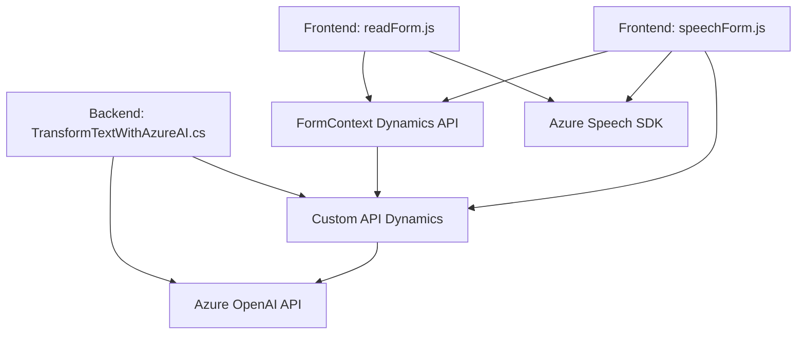

## Resumen técnico

El repositorio presenta una solución híbrida con componentes frontend y backend, diseñada para integrar la funcionalidad de inteligencia artificial de Azure en herramientas de Microsoft Dynamics 365 CRM. Los archivos analizados se centran en dos áreas principales:
1. Interacción de usuario en **frontend** mediante reconocimiento de voz (voz a texto) y síntesis de texto a voz.
2. Transformación de texto en el **backend** utilizando el plugin de Dynamics junto con Azure OpenAI.

## Descripción de arquitectura

La arquitectura es de tipo **n capas** con separación lógica entre el frontend (interfaz de usuario) y el backend (procesamiento de negocio con plugins). Aunque no es completamente desacoplada como una arquitectura de microservicios o hexagonal, sí utiliza patrones de modularidad y bien estructurados.

### **Componentes principales**
1. **Frontend**
   - Archivos basados en scripts JS que interactúan con el contexto del formulario de Dynamics y el Azure Speech SDK.
   - Modularización en funciones para ejecutar tareas como reconocimiento de voz, síntesis de texto, y mapeo entre campos de un formulario.
   - Dinámica cliente-servidor utilizando el Speech SDK y llamadas al API de Dynamics.

2. **Backend**
   - Plugin `TransformTextWithAzureAI.cs` como parte de la lógica de negocio en el lado del servidor de Dynamics.
   - Este plugin procesa datos usando Azure OpenAI, transformándolos en JSON estructurado según reglas específicas.

---

## Tecnologías y patrones usados

### **Tecnologías**
1. **Frontend**
   - **Azure Speech SDK**: Reconocimiento de voz y síntesis de texto a voz.
   - **Dynamics 365 Context API**: Captura y manipulación de datos de formularios en Dynamics.
   - Framework de ejecución dinámico (JS).

2. **Backend**
   - **Azure OpenAI**: Llamadas REST a modelos de GPT para procesamiento de datos.
   - **C#:** Programación del plugin basado en el SDK interno de Dynamics CRM.
   - **Microsoft Xrm SDK**: Interacción con la infraestructura de Dynamics CRM mediante el estándar `IPlugin`.

### **Patrones**
1. **Frontend**
   - Modularización: Cada función cumple un propósito único como extracción de datos del formulario o síntesis de texto.
   - Data Mapper: Mapear datos del formulario en estructuras útiles como JSON para procesarlas.
   - Dynamic Loading: Cargar dependencias del Speech SDK desde un CDN.
   - Callback Pattern: Uso de callbacks para asegurar que dependencias como el Speech SDK sean cargadas antes de ejecutar lógica.

2. **Backend**
   - Plugin Pattern: Uso de `IPlugin` como estándar para Dynamics CRM.
   - Service Integration: Consumo de servicios externos (Azure OpenAI) dentro del flujo de negocio de Dynamics.
   - REST API Communication: Interacción con OpenAI mediante HTTP POST organizada y controlada.

---

## Dependencias o componentes externos

1. **Externas**
   - **Azure Speech SDK (`SpeechSDK`)**: Para voz a texto y texto a voz.
   - **Azure OpenAI**: Para transformación y procesamiento avanzado.
   - **CDN Dynamics 365**: Dinámica para contextos y datos del formulario.

2. **Locales (CRM)**
   - Manipulación de datos de formulario usando `formContext` (Dynamics 365).
   - Extensión API personalizada de Dynamics CRM `Xrm.WebApi` para funcionalidades avanzadas como búsqueda en campos `lookup`.

---

## Diagrama Mermaid

---

## Conclusión final

El repositorio implementa una solución integrada para mejorar la accesibilidad y extender las funcionalidades de Microsoft Dynamics 365 CRM con inteligencia artificial (Azure Speech SDK y OpenAI). Utiliza un diseño de **n capas** orientado a la modularidad, asegurando separación de responsabilidades y facilidad para extender o integrar nuevas funcionalidades. Aunque no es una arquitectura completamente desacoplada, incorpora buenas prácticas como patrones de integración API y carga dinámica de recursos.