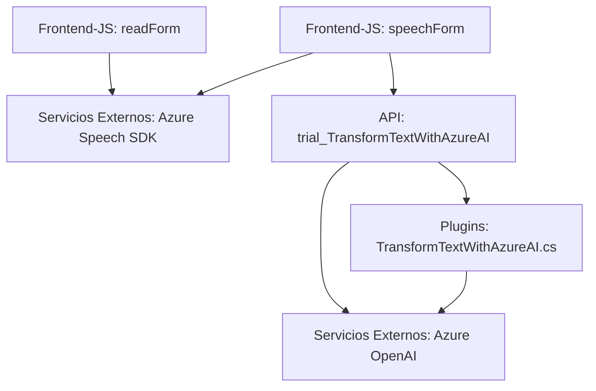

### Breve resumen técnico
Este repositorio contiene tres componentes principales: un **frontend** basado en JavaScript para integrar y exponer funcionalidad de entrada/salida de voz, un plugin de Dynamics 365 en `C#` para procesar texto mediante Azure OpenAI, y una API custom para interacciones IA. Entre los elementos principales destacan el uso modular del Azure Speech SDK y la integración de servicios externos.

---

### Descripción de arquitectura
La solución utiliza una arquitectura orientada a **microservicios** que integra componentes distribuidos y servicios externos:
1. **Frontend**: Maneja transcripción de voz y lectura de formularios en aplicaciones web, interactuando con Azure Speech SDK (dinámicamente cargado).
2. **Backend (plugin en C#)**: Procesa datos transformándolos mediante Azure OpenAI en Dynamics 365.
3. **API Custom**: Interfaz REST que extiende procesamiento IA en tiempo real.

También implementa comunicación por **HTTP**, llevando una estructura de sistemas desacoplada y adaptable.

---

### Tecnologías usadas
1. **Frontend:**
   - JavaScript (ES6+).
   - Azure Speech SDK.
   - DOM API para operaciones dinámicas.
   - Promesas y callbacks para lógica asíncrona.

2. **Backend:**
   - **C#:**
     - Microsoft Dynamics 365 (`Microsoft.Xrm.Sdk`).
     - HTTP communication via `System.Net.Http` to integrate `Azure OpenAI`.
     - JSON serialization (`System.Text.Json` and Newtonsoft.Json).

3. **Servicios externos:**
   - Azure Speech SDK (voz y reconocimiento).
   - Azure OpenAI (GPT-4) para procesamiento de texto.
   - Dynamics 365 Custom API.

---

### Diagrama Mermaid válido para GitHub

---

### Conclusión final
Este repositorio implementa una integración avanzada de tecnologías modernas para facilitar interacciones de voz y procesamiento IA. Combinando componentes frontend y backend con servicios de Azure, sigue una arquitectura basada en microservicios, asegurando modularidad, flexibilidad y extensibilidad. La integración del Azure SDK y OpenAI lo posiciona como una solución robusta para el manejo de voz y datos procesados en aplicaciones empresariales como Dynamics 365.