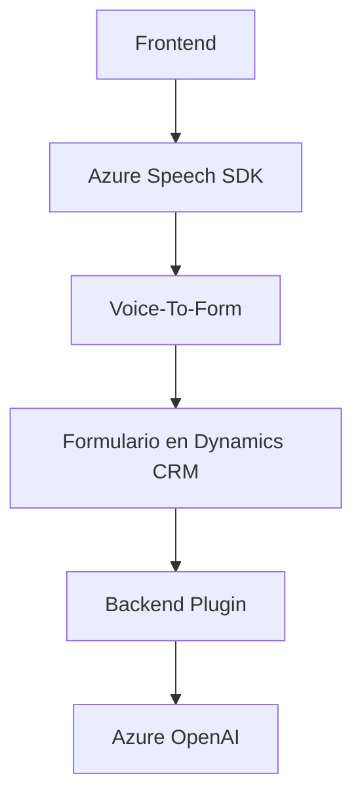

### Breve resumen técnico

El repositorio es principalmente una solución híbrida orientada a la funcionalidad de integración entre una aplicación web (frontend en JavaScript) y un backend Microsoft Dynamics CRM basado en plugins. Utiliza el **Azure Speech SDK** para procesar reconocimiento de voz y síntesis TTS (Text-to-Speech), junto con la **API de Azure OpenAI** para realizar transformaciones avanzadas de texto. La solución está diseñada para interactuar dinámicamente con formularios de usuario, promover accesibilidad mediante voz, y automatizar tareas relacionadas con la entrada y transformación estructurada de datos.

---

### Descripción de arquitectura

La arquitectura es una solución **de múltiples capas** con los siguientes componentes principales:
1. **Frontend**: Gestión y procesamiento de datos de usuarios mediante voz y texto, con un enfoque modular y utilizando el Azure Speech SDK.
2. **Integración intermedia**: Interacción con Dynamics CRM utilizando funciones y APIs para manipular formularios y realizar acciones específicas.
3. **Backend**: Uso de plugins de Dynamics CRM implementados en C# que extienden funcionalidades nativas y utilizan **servicios externos como Azure OpenAI**.

Esta solución muestra una arquitectura **n capas**, con capas claramente separadas y roles definidos:
- **Presentación**: Los scripts de JavaScript `<readForm.js>` y `<speechForm.js>` interactúan con el usuario utilizando voz y texto.
- **Aplicación/Integración**: Comunicación bidireccional entre el frontend y Dynamics CRM a través de llamadas a APIs, complementando eventos desde el frontend hacia el backend.
- **Lógica/Backend**: El plugin en C# (`TransformTextWithAzureAI.cs`) encapsula lógica específica y realiza transformaciones.

---

### Tecnologías usadas

1. **Frontend:**
   - **Azure Speech SDK**: Para procesamiento de voz y síntesis.
   - APIs del navegador: Manipulación de DOM para cargar SDK y gestionar datos.
   - Event-driven programming y módulos JavaScript.

2. **Backend:**
   - **.NET Framework (C#)**:
     - Microsoft Dynamics SDK (`IPlugin`, `IOrganizationService`).
     - Comunicación HTTP mediante `System.Net.Http`.
     - Serialización avanzada con `Newtonsoft.Json.Linq` y `System.Text.Json`.
   - **Azure OpenAI**: Procesamiento avanzado de texto.
   - **Regex**: Tratamiento textual en C#.

---

### Diagrama Mermaid

---

### Conclusión final

La solución une procesamiento avanzado de voz (Azure Speech SDK) y transformación de texto por IA (Azure OpenAI) con la gestión de datos estructurados en Dynamics CRM. Su diseño es modular y basado en múltiples capas, lo que contribuye a un sistema extensible y con responsabilidades bien definidas. Sin embargo, un desafío sería coordinar simultáneamente la latencia de dependencias externas como el SDK de voz y las APIs de Azure OpenAI.

El sistema enfatiza la accesibilidad y la integración dinámica, siendo ideal para mejorar la experiencia en plataformas empresariales como Dynamics 365. Se podría optimizar el flujo incorporando configuraciones dinámicas para dependencias (e.g., claves de API) y gestionando de manera más robusta los tiempos de carga para usuarios finales.