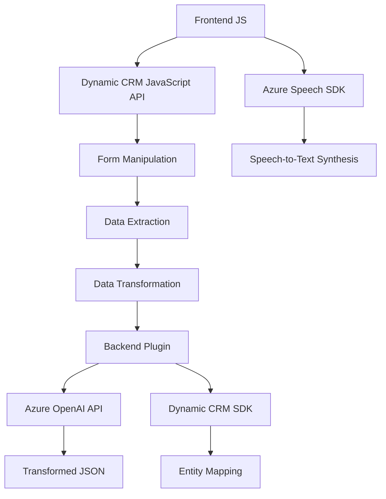

### Breve resumen técnico
La estructura del repositorio contiene elementos que integran un **frontend** basado en JS para interactuar con formularios visibles y un **plugin backend** para Dynamics CRM que realiza transformaciones de texto utilizando Azure OpenAI API. En términos técnicos, la solución combina un sistema **frontend-backend**, donde el frontend facilita la interacción con los datos y el backend procesa estos datos utilizando servicios de Azure.

---

### Descripción de arquitectura
El sistema tiene una arquitectura de **n capas**, donde el frontend (JavaScript) gestiona la interfaz y captura los datos del usuario en tiempo real. A través de componentes **API** o dinámicamente cargados (Azure Speech SDK y Azure OpenAI API), los datos son procesados por capas lógicas que los transforman o los sintetizan. En el backend, el plugin opera como un servicio específico en Dynamics CRM, enfocado en transformar texto y asegurar validación. Adicionalmente, la interacción con servicios HTTP implementa una arquitectura **Service-oriented Architecture (SOA)**.

Principales características dentro de la arquitectura:
- **Frontend** (JavaScript): Encapsula el acceso a formularios y gestiona la interacción de voz.
- **Backend** (.NET/C#): Centraliza la transformación avanzada de texto utilizando Azure OpenAI con un plugin plugin respetando el modelo de entidades de Dynamics CRM.
  
---

### Tecnologías usadas
1. **Frontend**:
   - **JS**: Implementa la lógica para capturar datos del formulario.
   - **Azure Speech SDK**: Para síntesis y transcripción de la entrada de voz.
   - **Dynamics CRM JavaScript API**: Gestiona la manipulación y asignación de datos al formulario.

2. **Backend**:
   - **.NET Framework (C#)**: Plugin que realiza transformaciones dinámicas de texto a través de Azure OpenAI.
   - **Azure OpenAI API**: Servicio externo para procesamiento de lenguaje natural.
   - **Dynamics CRM SDK**: Para integrar el plugin y acceso a la organización.

3. **Patrones de diseño**:
   - **Delegación asincrónica**: Para carga condicional de Azure Speech SDK en el frontend.
   - **Plugin Design**: Backend implementa un plugin específico para Dynamics CRM.
   - **Service-oriented Architecture**: Interacción con el servicio Azure OpenAI para procesamiento avanzado de datos.

---

### Diagrama Mermaid válido para GitHub

---

### Conclusión final
El repositorio representa una arquitectura **n capas** con integración entre servicios externos y plataformas CRM. En el frontend, la solución gestiona interacción con datos en formularios, mientras que en el backend, utiliza un plugin para manipular y realizar transformaciones avanzadas mediante Azure OpenAI. Esta combinación de tecnologías proporciona una solución robusta para entornos empresariales centrados en Dynamics CRM y servicios integrados de Azure. La arquitectura está bien estructurada, modular y optimizada para interacción en tiempo real y sintetización de voz.