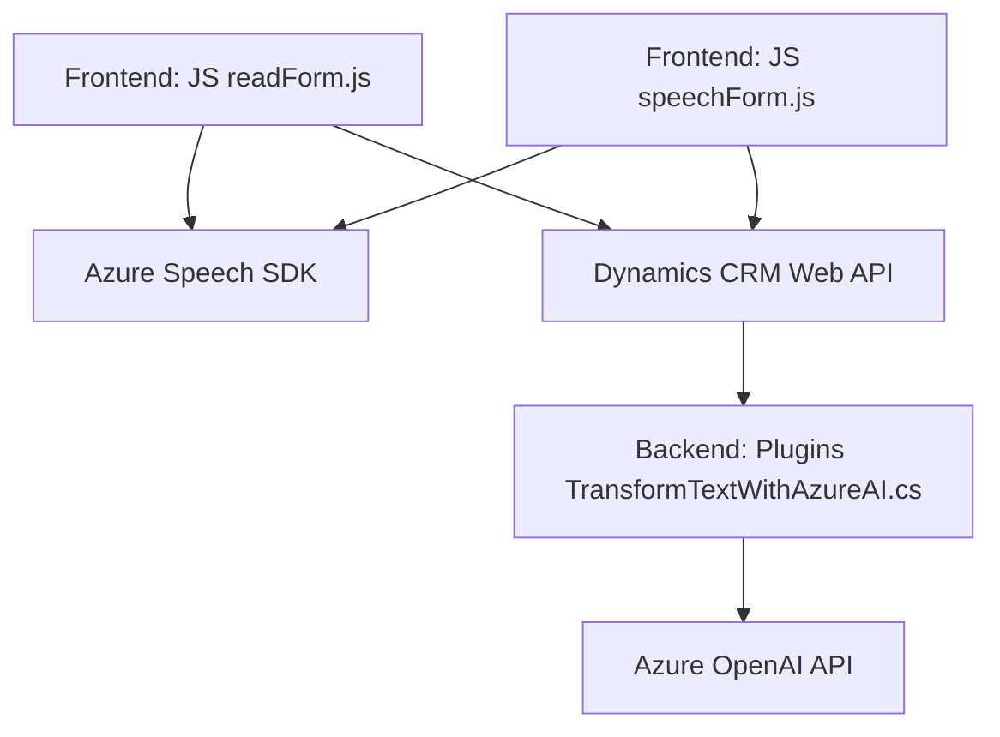

### Breve resumen técnico

Este repositorio contiene una solución que integra funcionalidades de reconocimiento de voz, síntesis de texto a voz y procesamiento avanzado de texto mediante servicios de Azure. Estos componentes están enfocados en la interacción con formularios dinámicos en Microsoft Dynamics CRM, transformando datos a través de funciones IA y mejorando la experiencia del usuario mediante reconocimiento y síntesis de voz.

---

### Descripción de arquitectura

1. **Tipo de solución:**  
   - La solución incluye una **API para procesamiento de texto** (Azure OpenAI Plugin) y componentes **frontend** para síntesis y reconocimiento de voz con interacción directa con Dynamics CRM.  
   - Es un **sistema híbrido**, que integra componentes backend (plugin en C#), frontend (JavaScript) y servicios en la nube (Azure Speech SDK y OpenAI).

2. **Arquitectura:**  
   - La arquitectura general se podría clasificar como **hexagonal** o **puertos y adaptadores**, debido a la integración de múltiples servicios externos y su interacción mediante una capa lógica que abstrae estas dependencias.  
   - En el aspecto del frontend, utiliza una estructura modular basada en componentes independientes.  
   - A nivel backend, implementa **Plugin-Based Architecture**, típica de Dynamics CRM donde el código se ejecuta como plugins específicos mediante reglas de ejecución.

---

### Tecnologías usadas

1. **Frontend:**
   - **JavaScript** como lenguaje principal del cliente, con foco en la interacción con formularios y servicios.  
   - **Azure Speech SDK** para síntesis y reconocimiento de voz.  
   - Interacción con Dynamics CRM API (`Xrm.WebApi`).  

2. **Backend:**
   - **C#** para el plugin basado en Dynamics CRM Plugin Framework.  
   - Integración con **Azure OpenAI API** para procesamiento inteligente de texto.  
   - Serialización y manejo de JSON con `Newtonsoft.Json.Linq`.

3. **Servicios en la nube:**
   - **Azure Speech SDK** para reconocimiento de voz y síntesis.  
   - **Azure OpenAI API** para transformación avanzada de texto.  

4. **Patrones arquitectónicos:**
   - **Modularidad:** Separación clara de lógica según responsabilidades.  
   - **Dynamic Dependency Loading:** Para la carga optimizada de servicios externos como el Speech SDK.  
   - **Facade Pattern:** En el frontend, funciones encapsulan la interacción con múltiples capas (formulario + SDK + APIs).  

---

### Dependencias o componentes externos

1. **Azure Speech SDK:**  
   Cargado dinámicamente en el frontend para síntesis y reconocimiento de voz.  

2. **Azure OpenAI API:**  
   Utilizada en el backend para transformar texto según reglas definidas.  

3. **Dynamics CRM Web API:**  
   Facilita la interacción de componentes frontend y backend con el modelo de datos del CRM.  

4. **Newtonsoft.Json and System.Text.Json:**  
   Utilizados para la manipulación de JSON en backend, incluyendo serialización y deserialización.  

---

### Diagrama Mermaid

---

### Conclusión final

Este repositorio representa una solución altamente especializada para aplicaciones CRM, integrando capacidades avanzadas de inteligencia artificial y servicios en la nube. El diseño promueve modularidad, lo que facilita la extensión futura del sistema. La integración con Azure Speech SDK y OpenAI API es manejada eficientemente, garantizando una arquitectura escalable y adaptable a nuevas necesidades. Aunque cumple con una arquitectura hexagonal, un potencial área de mejora sería implementar mejores prácticas de logging y gestión de errores en la interacción con servicios externos, especialmente en escenarios con múltiples fallos.