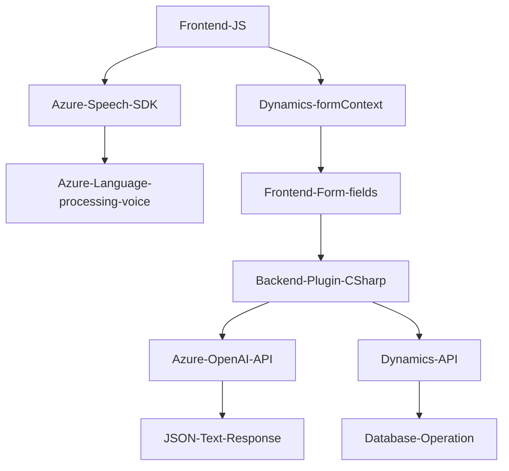

## Resumen técnico

El repositorio contiene tres archivos principales que conforman una solución integrable con servicios externos como Azure Speech SDK y Azure OpenAI. La solución parece estar diseñada para interactuar con formularios web y Dynamics CRM, proporcionando dos funcionalidades clave: entrada y transcripción de voz, y transformación de texto en formato JSON. Se utiliza un enfoque de integración con servicios externos mediante APIs.

---

## Descripción de la arquitectura

La arquitectura de la solución combina varias capas:

- **Frontend:**
  - Compuesta por archivos JavaScript que proporcionan las funcionalidades de interacción con los usuarios (entrada de voz y síntesis textual).
  - Los scripts cargan dinámicamente SDKs necesarios (como Azure Speech SDK) y manipulan formularios web, extrayendo datos y aplicándolos a los correspondientes elementos.

- **Backend (Dynamics CRM Plugin):**
  - Implementación de Plugins en Dynamics CRM para interactuar con la plataforma y ejecutar solicitudes a servicios externos como Azure OpenAI.
  - Arquitectura basada en eventos, gracias al uso de `IPlugin`, que centraliza la lógica de integración con sistemas externos.

- **Explotación de servicios externos:**
  - Uso intensivo de Azure Speech SDK y Azure OpenAI para proporcionar las capacidades de transcripción de voz y transformación de texto en JSON.

Aunque no se implementa una arquitectura orientada a objetos, el código sigue patrones como la orquestación funcional o basado en eventos, y utiliza un esquema de integración entre el backend (mediante Plugins), frontend y servicios externos.

---

### Tecnologías utilizadas
1. **Frontend:**
   - Lenguaje: JavaScript.
   - Frameworks/SDKs: 
     - Azure Speech SDK.
     - Dynamics CRM context API (`formContext`, `data.entity.attributes`).

2. **Backend:**
   - Lenguaje: C# (.NET Framework para Dynamics Plugins).
   - Frameworks/Dependencias:
     - `Microsoft.Xrm.Sdk` para integración con Dynamics CRM.
     - `Newtonsoft.Json` para el manejo de JSON.
     - `System.Net.Http` para solicitudes HTTP.
     - `System.Text.RegularExpressions`, `System.Text.Json` para manipulación y procesamiento de texto.

3. **Servicios Externos:**
   - Azure Speech SDK (entrada de voz y síntesis textual).
   - Azure OpenAI (transformación de texto mediante reglas específicas).

---

### Diagrama Mermaid

---

### Conclusión final

La solución presentada es una integración entre frontend basado en JavaScript y un backend extendido mediante Plugins en Dynamics CRM utilizando C#. Su propósito principal es la interacción por comandos de voz (entrada/salida de datos) y transformación de texto mediante Azure AI. La solución está bien estructurada para su objetivo, aprovechando servicios externalizados como Azure Speech SDK y Azure OpenAI.

Las tecnologías empleadas son adecuadas según las funcionalidades requeridas, aunque se pueden hacer mejoras en la gestión de configuraciones sensibles, como las claves API. Por ejemplo, migrar estas variables a un almacenamiento más seguro como Azure Key Vault o un archivo de configuración externo.

Considerando la descripción del código y las tecnologías, la arquitectura de la solución se clasifica como un sistema híbrido orientado a n-capas con funcionalidades de integración hacia microservicios (Azure APIs).