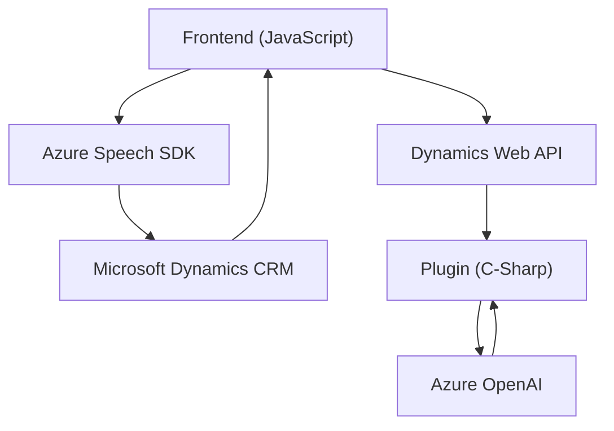

### Breve resumen técnico:

El repositorio describe una solución que integra el servicio **Azure Speech** para el manejo de síntesis y reconocimiento de voz, con operación asociada a un formulario en Dynamics CRM. Además, se implementa un plugin que utiliza **Azure OpenAI** para transformar texto según reglas predefinidas vía un servicio REST.

---

### Descripción de arquitectura:

1. **Tipo de solución**: Se trata de una solución híbrida que combina una **interfaz frontend**, integraciones con APIs externas (Azure) para la parte de procesamiento y síntesis de voz, y **plugins backend** basados en Dynamics CRM para extender la lógica del negocio. Es mayormente una arquitectura con enfoque en **integraciones funcionales**.

2. **Arquitectura**:  
   - **Frontend**: Basado en **n capas**, donde las capas lógicas de extracción y procesamiento están claramente diseñadas como funciones independientes.  
   - **Backend**: Implementa un **plugin pattern** sobre el **framework de Microsoft Dynamics CRM**, que puede considerarse una arquitectura modular extendida para los procesos del CRM.  
   - **Integración externa**: Las dos principales operaciones (procesamiento de voz y texto) dependen de **APIs de Azure** mediante integración REST.

3. **Patrones destacados**:  
   - **Conversión de datos dinámicos** para transformar inputs del frontend y backend en formatos adecuados.  
   - **SRP y modularidad** en funciones y métodos (en ambas partes del código).  
   - **Carga condicional de dependencias**: Evita dependencias innecesarias si las librerías ya están cargadas en el entorno.  
   - **Event-driven architecture** para el disparo de procesos, especialmente en el reconocimiento y captura de voz.

4. **Dependencias externas presentes**:  
   - **Azure Speech SDK**: Para el reconocimiento y síntesis de voz.  
   - **Azure OpenAI**: Para transformación de texto basado en inteligencia artificial.  
   - **Dynamics Web API** (Xrm.WebApi): Para interacción directa con el CRM Dynamics.  
   - **System.Net.Http** y **JSON libraries**: Para comunicaciones y parsing JSON en el plugin.

---

### Tecnologías usadas:

1. **Frontend**: Lenguaje **JavaScript** con uso de **promesas** y API de voz basada en Azure SDK.  
2. **Backend**: Desarrollo de un plugin personalizado en **C#** para Dynamics CRM (usando `IPlugin`).  
3. **Integraciones**:  
   - **Azure Speech SDK** y **Azure OpenAI** para funciones de síntesis y procesamiento de datos.  
   - **Dynamics API** para manejo de datos CRM.  

---

### Diagrama **Mermaid** válido para GitHub:

---

### Conclusión final:

La solución proporciona una arquitectura limpia y modular, con funcionalidad avanzada como reconocimiento de voz y transformación de texto por IA. Sin embargo, es esencial considerar el manejo de tasas de uso, credenciales seguras (como Azure Key Vault), y modelos de ejecución asincrónica. La combinación de frontend dinámico con extensiones específicas en Dynamics CRM hace que sea una implementación robusta para ecosistemas empresariales.