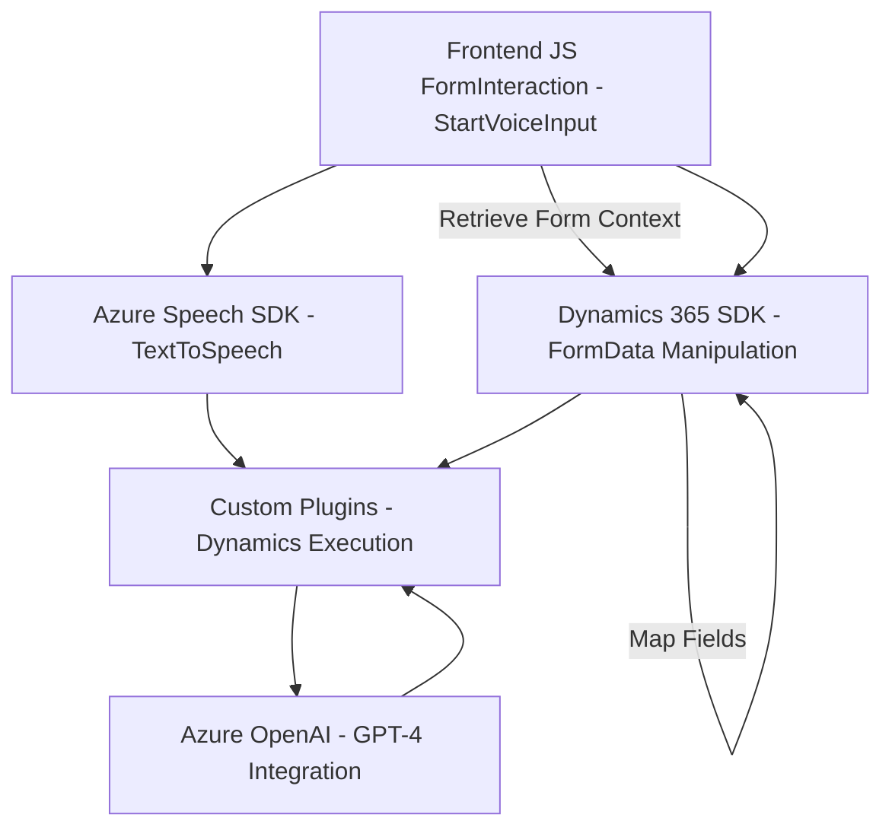

### **Análisis técnico del repositorio**

#### **1. Tipo de solución**
La solución analizada se conforma principalmente de tres componentes principales: un frontend basado en JavaScript para la interacción con formularios y funcionalidades de procesamiento de voz, un plugin de backend para la integración con Dynamics 365 CRM, y la utilización de servicios externos como Microsoft Azure Speech SDK y OpenAI GPT. 
Esto significa que estamos ante una arquitectura que combina:
   - **Frontend**: Manejo y procesado de datos en el cliente.
   - **Backend plugin**: Extensión a Dynamics 365 CRM para interacciones complejas.
   - **Integración de APIs externas**: Uso de Azure Speech SDK y OpenAI.

#### **2. Tecnologías, frameworks y patrones usados**
   - **Frontend**:
     - **JavaScript**: Para la interacción y procesamiento de datos de los formularios.
     - **Microsoft Azure Speech SDK**: Para sintetizar voz y reconocimiento de comandos hablados.
     - **Dynamics 365 SDK**: Uso de sus capacidades de extensibilidad para manipular formularios y realizar llamadas API en la estructura del CRM.
   - **Backend**:
     - **C# y Dynamics 365 Plugin Framework**: Extensión del CRM mediante plugins.
     - **System.Net.Http**: Para realizar llamadas HTTP a APIs externas.
     - **Azure OpenAI**: Para transformar texto utilizando capacidades de IA (GPT).
   - **Patrones**:
     - Modularización: Código separado en funciones/componente por responsabilidad.
     - Callback Delegate: Uso de funciones de callback en JavaScript para garantizar la carga adecuada del SDK.
     - Service Integration: Conexión directa entre múltiples APIs externas y microservicios en un flujo completamente desacoplado.
     - Plugin Architecture: En el backend, las funcionalidades de transformación y procesamiento textual están implementadas como plugins de Dynamics 365, siguiendo los patrones estándar del SDK.
     - Adaptador: Conversión entre datos del formulario, texto procesado y comandos hablados.

#### **3. Tipo de arquitectura**
La arquitectura **no es un monolito** y puede clasificarse como una **arquitectura modular distribuida**, con las siguientes características:
   - **N capas**: Separación de responsabilidades entre frontend (formulario y voz), middleware (Speech SDK y lógica de procesamiento), y plugins backend (Dynamics + OpenAI).
   - **Integración con microservicios**: La dependencia del plugin hacia Azure OpenAI para el procesamiento del texto lo convierte en un sistema que apoya principios de arquitectura distribuida y microservicios.
   - **Componentes desacoplados**: Los elementos interactúan entre sí por integración de APIs y modelos de datos JSON, manteniendo separación clara entre cliente, servidor y servicios.

#### **4. Dependencias o componentes externos**
   - **Microsoft Azure Speech SDK**: Herramienta principal para reconocimiento de voz y síntesis de texto.
   - **Dynamics 365 SDK**: Para manipulación de formularios y llamadas API internas.
   - **Azure OpenAI**: Procesamiento de texto con IA avanzada mediante la API REST proporcionada.
   - **HTTP Client**: Para comunicación directa con servicios externos.

---

#### **5. Diagrama Mermaid**

---

### **Conclusión final**
La solución representa una arquitectura moderna que combina frontend, servicios en la nube y extensibilidad de Dynamics CRM. Este diseño modular aprovecha tecnologías de Microsoft y Azure, junto con el potencial de IA avanzada (GPT) para simplificar interacción humano-sistema y generar experiencias optimizadas en el manejo de datos. Aunque depende de varios componentes externos, el desacoplamiento de servicios asegura capacidad de escalar y mantener la solución en el tiempo.