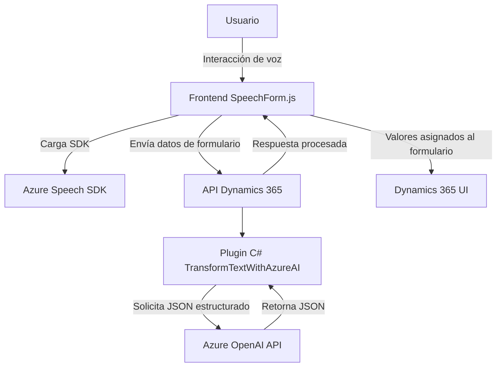

### Breve resumen técnico
El repositorio presenta un sistema basado en la integración de formularios dinámicos utilizando reconocimiento y síntesis de voz (JavaScript) y un plugin (C#) que transforma textos utilizando Azure OpenAI. Está diseñado para interactuar con Microsoft Dynamics 365, ofreciendo automatización de entrada, sintaxis de voz, y procesamiento de datos con inteligencia artificial.

---

### Descripción de arquitectura
1. **Tipo de solución:** 
   - Este repositorio apunta a un sistema híbrido basado en **extensiones de Dynamics 365**, compuesto por:
     - Un frontend en **JavaScript** que interactúa con el DOM de formularios dinámicos.
     - Un backend basado en **plugins de Dynamics 365** programados en C#.
     - Dependencias externas (Azure Speech y Azure OpenAI) para reconocimiento y síntesis de voz, junto con procesamiento avanzado de texto.

2. **Tipo de arquitectura:** 
   - La arquitectura tiene elementos de **n-capas** (frontend, servicio externo, backend), además de integrar **microservicios** gracias a sus dependencias con APIs externas como el plugin de Azure OpenAI y el SDK de Azure Speech.

3. **Características clave:** 
   - **Frontend modular:** Los scripts están diseñados de forma modular y orientados a funciones, utilizando integración ligera con controles de formularios dinámicos en Dynamics 365.
   - **Backend extensible:** El plugin en C# sigue el patrón típico de extensiones CRM (IPlugin) y permite la interacción directa con servicios externos.

---

### Tecnologías usadas
1. **Frontend:**
   - JavaScript como lenguaje principal.
   - SDK de Azure Speech para síntesis y reconocimiento de voz.
   - Microsoft Dynamics 365 Web API para manipulación dinámica de datos en formularios.
   - Promesas y programación asíncrona (`async/await`) para optimizar operaciones externas.

2. **Backend:**
   - C# para extensiones de Dynamics 365 como plugins.
   - **Microsoft.Xrm.Sdk** para interacción CRM.
   - **System.Net.Http** para solicitudes externas HTTP.
   - **Azure OpenAI API** para transformación avanzada de texto.

3. **Patrones:**
   - **Facade:** Simplificación de APIs complejas en ambos los archivos JS y C#.
   - **Dynamic Field Mapping:** Generación dinámica del mapeo de campos según el contexto.
   - **Microservicio:** Dependencia y comunicación con servicios externos para realizar tareas específicas (Azure Speech y OpenAI).

---

### Diagrama **Mermaid**

---

### Conclusión final
El repositorio se basa en un **sistema de extensiones n-capas** integrado dentro de Dynamics 365, que emplea reconocimiento y síntesis de voz junto con procesamiento de texto avanzado. Utiliza **Azure Speech SDK** y **Azure OpenAI API** como servicios externos para enriquecer la interacción del usuario. Su diseño modular en el frontend (JavaScript), combinado con un plugin orientado a eventos en el backend (C#), lo hace escalable y dinámico, aunque dependiente de servicios específicos como Azure.