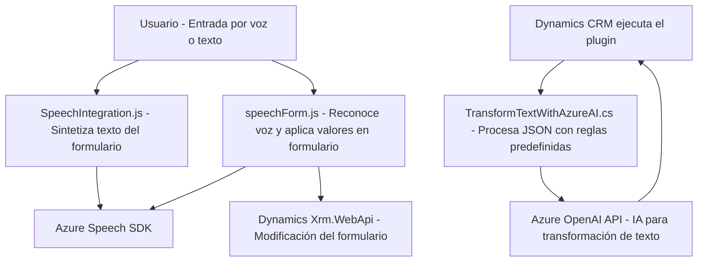

### Breve resumen técnico
El repositorio contiene tres archivos que representan diferentes componentes de una solución integrada con Azure y Dynamics CRM:
- Implementación de funcionalidades en frontend JavaScript (`SpeechIntegration.js` y `speechForm.js`), que interactúan con formularios dinámicos y el Azure Speech SDK para síntesis y reconocimiento de voz.
- Un plugin en C# (`TransformTextWithAzureAI.cs`) para transformar texto utilizando Azure OpenAI desde la lógica de negocio de Dynamics CRM.

---

### Descripción de arquitectura

**Tipo de solución**:  
La solución es una integración híbrida, donde el frontend proporciona funcionalidades basadas en Azure Speech, y el backend, mediante un plugin para Dynamics CRM, extiende capacidades utilizando Azure OpenAI. Es una arquitectura orientada a la interacción con formularios en Dynamics y procesamiento de datos en tiempo real.

**Patrón de arquitectura**:  
1. **Frontend**: Modular con separación de funcionalidades por componentes y uso de patrones como **Facade**, **Gestión de SDK**, y **Programación asíncrona**.
2. **Backend Plugin**: Encapsulación funcional mediante `TransformTextWithAzureAI`, con integración REST.

**Tipo de arquitectura global**:  
Basada en **n capas**, con una separación clara entre:
- **Presentación**: JavaScript (UI/Frontend).
- **Lógica de Negocio**: Plugins de Dynamics CRM implementados con C#.
- **Servicios Externos**: Azure Speech SDK y Azure OpenAI.

---

### Tecnologías utilizadas
1. **Frontend**:
   - JavaScript (vanilla)
   - Azure Speech SDK (sintetización de voz, reconocimiento de voz)
   - Dynamics 365 API (`formContext`, `Xrm.WebApi`)

2. **Backend**:
   - C# (Microsoft Dynamics Plugins)
   - Azure OpenAI (transformación de texto con GPT/IA)
   - HTTP REST API (Azure OpenAI)

3. **Servicios Integrados**:
   - Dynamics 365 CRM (gestión de datos, ejecución de plugins)
   - Azure Speech Services: Reconocimiento de voz y síntesis.
   - Azure OpenAI Services: Procesamiento inteligente de texto.

---

### Dependencias o componentes externos
- **Azure Speech SDK**: El frontend carga y utiliza esta dependencia dinámica para la interacción voz-texto.
- **Dynamics 365 CRM**: El frontend gestiona datos en formularios CRM y el plugin amplía capacidades dentro del ecosistema CRM.
- **Azure OpenAI API**: Procesamiento de texto y respuesta basada en IA en el plugin de backend.
- **Bibliotecas C# estándar**: HTTP Client, JSON handling (`Newtonsoft.Json`), gestión de servicios (`Microsoft.Xrm.Sdk`).

---

### Diagrama Mermaid válido para GitHub Markdown

---

### Conclusión final
La solución forma un ecosistema robusto donde el frontend provee capacidades avanzadas basadas en reconocimiento y síntesis de voz con Azure Speech SDK, mientras el backend en C# amplía funcionalidades integrando IA de Azure OpenAI para procesar texto. Es una arquitectura de **integración n capas**, optimizada para trabajar dentro del contexto de Dynamics 365 CRM.

Esta solución es ideal para escenarios donde se requieren interfaces dinámicas, accesibilidad mediante voz, y procesamiento inteligente de datos introducidos por los usuarios en sistemas empresariales. La integración directa con Azure refuerza la adaptabilidad y potencia del sistema.