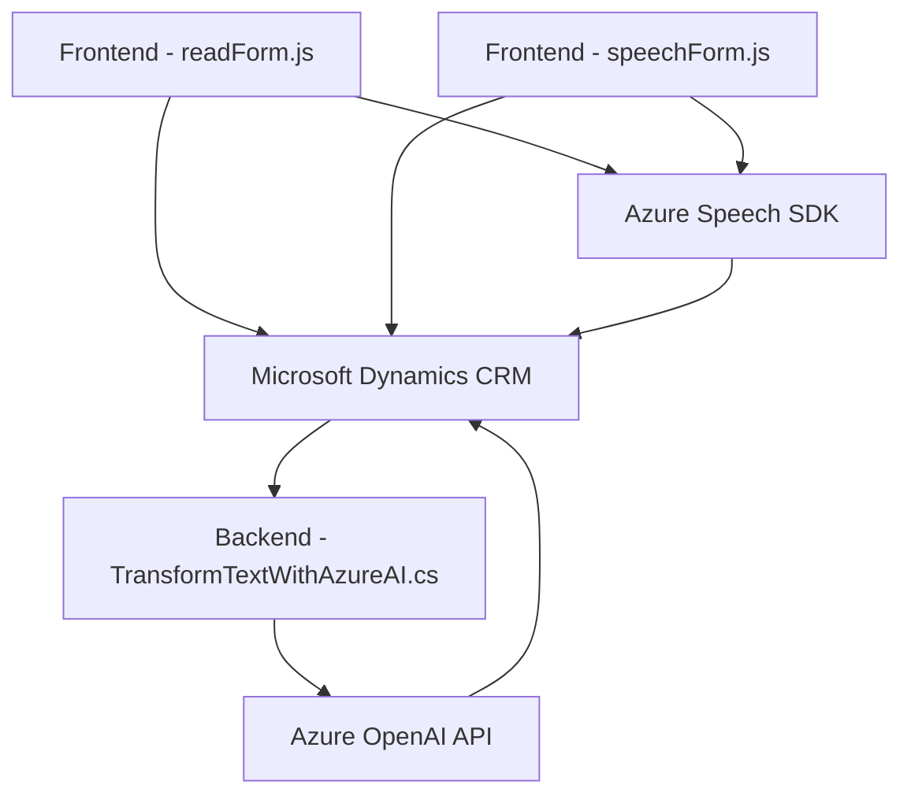

# Breve Resumen Técnico

Este repositorio combina múltiples componentes y archivos relacionados con la integración de tecnologías de Azure Cognitive Services y Microsoft Dynamics CRM (Customer Relationship Management). El núcleo de la solución es procesar datos de formularios CRM mediante entrada de voz, transformación de texto en audio, y procesamiento avanzado de datos usando Azure OpenAI API. La funcionalidad abarca tanto el frontend (JavaScript) como el backend (C# plugin).

---

# Descripción de Arquitectura

La arquitectura identificada es un sistema basado en **n capas**, integrando componentes del frontend, lógica de negocio y servicios externos (Azure Cognitive Services, Azure OpenAI). La visión modular se destaca, con la separación clara en responsabilidades.

### Capas principales:
1. **Presentación (Frontend)**: Scripts en **JavaScript** que manejan la interacción del usuario con formularios en CRM. Realizan síntesis de voz y reconocimiento.
    - Ejemplo: `readForm.js` y `speechForm.js` procesan datos del formulario en tiempo real y usan el **Azure Speech SDK**.

2. **Lógica de Negocio**: Plugins en **C#** dentro de una solución para **Microsoft Dynamics CRM**, que extienden funcionalidades mediante integración con **Azure OpenAI API** para transformar datos.

3. **Servicios Externos**:
    - **Azure Speech SDK**: Manejo de entrada de voz y síntesis.
    - **Azure OpenAI API**: Transformación avanzada de texto basado en normas.

### Patrones utilizados:
1. **Modularidad**:
    - Cada función en los scripts y clases C# se enfoca en una responsabilidad específica.
    - Ejemplo: `readForm.js` usa encapsulación para leer, validar y sintetizar datos.

2. **Integración de SDK externo**:
    - Azure SDK cargado dinámicamente con validaciones previas (`ensureSpeechSDKLoaded`).

3. **Contextual Processing**:
    - Operaciones como leer campos visibles o mapear textos a campos de formularios, según el contexto dinámico del usuario en CRM.

4. **Service Integration Pattern**:
    - Llamadas a APIs externas como Azure Speech y OpenAI, incorporando respuestas procesadas en el flujo CRM.

---

# Tecnologías Usadas

1. **Frontend**:
    - **JavaScript**: Base de la lógica interactiva y uso de APIs.
    - **Azure Speech SDK**: Para síntesis y procesamiento de voz (idioma configurado como `es-ES`).

2. **Backend**:
    - **C#**: Plugins en Dynamics CRM extensibles que integran reglas de negocio.
    - **Microsoft Dynamics CRM SDK**: Extensión de funcionalidades del sistema CRM.
    - **Azure OpenAI API**: Procesamiento inteligente de texto.

3. **Integración**:
    - **REST** APIs para comunicación con servicios externos (Azure).

---

# Diagrama Mermaid Válido para GitHub

---

# Conclusión Final

El repositorio presenta una solución basada en **n capas**, combinando un frontend JavaScript para interacción dinámica con formularios CRM y un backend C# que extiende las funcionalidades de Dynamics con capacidad de procesamiento avanzado vía servicios externos (Azure Speech y OpenAI). La modularidad y las integraciones hacen que el sistema sea robusto, extensible y orientado a casos de uso complejos con interacción inteligente.

Se recomienda evaluar áreas de mejora:
- Implementar procedimientos de autenticación más seguros para claves API (Azure).
- Optimizar llamadas síncronas en C# con programación asíncrona. 

Este proyecto refleja buenas prácticas en arquitectura modular, integración de servicios externos y patrones de diseño.