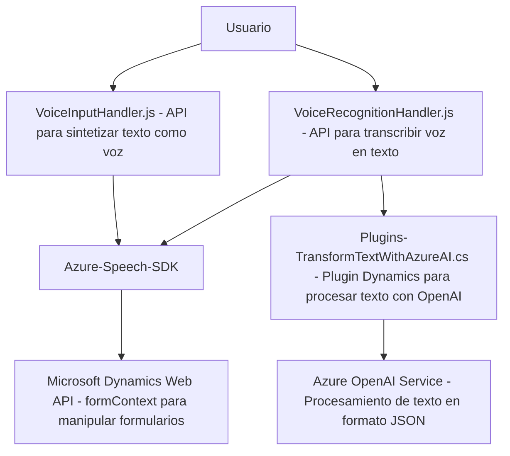

## Breve Resumen Técnico

El enfoque general del repositorio indica un sistema que realiza funcionalidades de síntesis y reconocimiento de voz para interactuar con formularios dentro de Microsoft Dynamics 365 mediante integraciones con Azure services. Se emplean tecnologías como el **Azure Speech SDK**, **Azure OpenAI**, y **Microsoft Dynamics CRM**. Además, el sistema se divide en dos grandes componentes: un *frontend* en JavaScript que interactúa con formularios dinámicos y una lógica de *backend* en C# que implementa un plugin de Dynamics para procesar texto estructurado usando Azure OpenAI.

---

## Descripción de la Arquitectura

El sistema presenta una arquitectura híbrida con las siguientes características:
1. **N Capas**:
   - **Frontend**: Implementado en JavaScript, que usa APIs para integrar con el servicio de Azure Speech para reconocimiento y síntesis de voz. Manipula dinámicamente datos y formularios en tiempo real.
   - **Backend**: Un plugin asociado a Microsoft Dynamics CRM, desarrollado en C#, que utiliza la Azure OpenAI API para transformar texto y devolverlo como JSON estructurado.

2. **Dependencias Externas**:
   - **Azure Speech SDK**: Utilizado para la síntesis y reconocimiento de voz a través de funciones frontend.
   - **Azure OpenAI Service**: Usado en el plugin para procesar datos con inteligencia artificial.
   - **Microsoft Dynamics CRM API**: Interacción con formularios dinámicos y datos almacenados en la plataforma CRM.

3. **Patrones de Diseño**:
   - **Event-driven Architecture**: El sistema responde a eventos generados por el usuario (voz de entrada/generación de voz desde texto).
   - **Plugin Design Pattern**: En el ambiente de Dynamics para extender funcionalidades del CRM.
   - **Modularidad**: Fragmentación adecuada de funcionalidades en métodos independientes para facilitar mantenimiento y escalabilidad.

---

## Tecnologías Usadas

1. **Frontend**:
   - **JavaScript**: Manejo dinámico de formularios y lógica de síntesis/reconocimiento de voz.
   - **Azure Speech SDK**: Procesamiento y generación de voz.
   - **Microsoft SDK**: Interacción con el contexto del formulario (`formContext`).

2. **Backend**:
   - **C# Plugins for Dynamics CRM**: Extender la funcionalidad de Dynamics para integrar servicios de procesamiento de texto.
   - **Newtonsoft.Json.Linq**: Manipulación de objetos JSON.
   - **System.Net.Http / System.Text.Json**: Comunicación HTTP para consumir APIs de Azure.

3. **Servicios Externos**:
   - **Azure Speech SDK**: Integración con servidores de Azure para la transcripción y síntesis de voz.
   - **Azure OpenAI Service**: Procesamiento de texto de usuario mediante IA.

---

## Diagrama Mermaid

---

## Conclusión Final

Este repositorio provee una solución robusta para la interacción entre usuarios y formularios dinámicos en Microsoft Dynamics 365 usando entrada y salida de voz. Utiliza tecnologías de Microsoft como **Azure Speech SDK**, **Azure OpenAI**, y **Dynamics CRM plugins**, y adopta una arquitectura de múltiples capas que facilita la modularidad, escalabilidad y mantenimiento. La integración de servicios externos y la dependencia en eventos clave refuerzan un enfoque moderno y adaptable para trabajar con datos de usuario y formularios.