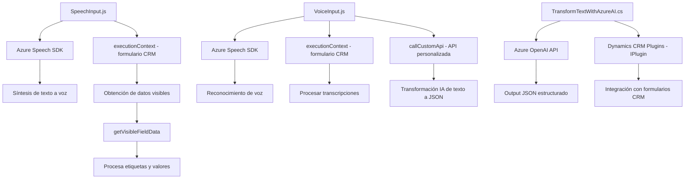

### Breve Resumen Técnico
El repositorio contiene funcionalidades diseñadas para integrar servicios de Azure, específicamente el Azure Speech SDK y Azure OpenAI (GPT), dentro de aplicaciones de formularios dinámicos asociadas a Dynamics CRM. Incluye componentes en JavaScript para el frontend y un plugin en C# que expande las capacidades de procesamiento de texto mediante un servicio externo de IA.

---

### Descripción de Arquitectura
1. **Tipo de solución:** Esta solución es una combinación de **frontend** y **backend** que implementa servicios para integración de voz (Azure Speech SDK) y transformación de texto (Azure OpenAI). Se conceptualiza como un sistema orientado a **API** que interactúa con servicios externos y un CRM.
  
2. **Arquitectura:**  
   - **Híbrida**: Combina características de **n capas** y **plugin-based**, al ser compatible con el modelo de Dynamics CRM, donde se usan plugins para extender funcionalidades.  
   - **Cliente-Servidor ECMAScript en frontend**: Manejo de datos dinámicos y eventos en la interfaz de usuario.  

3. **Patrones Usados:**  
   - **Event-based programming:** Gestión de eventos y callbacks en `SpeechInput.js` y `VoiceInput.js` para carga dinámica y ejecución de SDK/funciones.
   - **Singleton**: Uso global de `SpeechSDK` como recurso único.
   - **Repository Pattern:** En funciones como `getFieldMap` y manipulación de datos del formulario.
   - **Service-Oriented Architecture:** Interacción con servicios externos (Azure Speech y OpenAI).  

---

### Tecnologías y Frameworks Usados
- **Frontend:**
  - **JavaScript**: Principal lenguaje de implementación.
  - **Azure Speech SDK**: Reconocimiento y síntesis de voz en la interfaz del formulario.
  - **Dynamics CRM (executionContext)**: Contexto orientado a manipular formularios.
  
- **Backend:**
  - **C#:** Junto con los paquetes `.NET` necesarios para plugins.
  - **Newtonsoft.Json**: Procesamiento de JSON.
  - **System.Net.Http**: Envío de solicitudes REST (OpenAI API).

- **Servicios Externos:**
  - **Azure OpenAI GPT**: Transformación de texto.
  
---

### Dependencias o Componentes Externos Presentes
1. **Azure Speech SDK**: Servicios de voz y reconocimiento.
2. **Azure OpenAI (GPT)**: Procesamiento avanzado de texto.
3. **Dynamics CRM SDK (Microsoft.Xrm.Sdk)**: Extensiones mediante plugins y gestión de datos.
4. **Newtonsoft.Json / System.Text.Json**: Procesos de serialización JSON.
5. API personalizada para procesamiento adicional (`callCustomApi` en `VoiceInput.js`).

---

### Diagrama Mermaid válido para GitHub Markdown

---

### Conclusión Final
La solución combina elementos de frontend y backend para extender funcionalidades de Dynamics CRM hacia capacidades avanzadas de accesibilidad mediante voz y procesamiento de datos estructurados con IA. Su arquitectura es híbrida, utilizando patrones como plugins (para CRM) y cliente servidor (para interacción con Azure). Aunque la solución está bien estructurada, ciertas áreas, como la gestión de credenciales y la dependencia de servicios externos, podrían beneficiarse de una mejor administración para optimizar seguridad y escalabilidad.