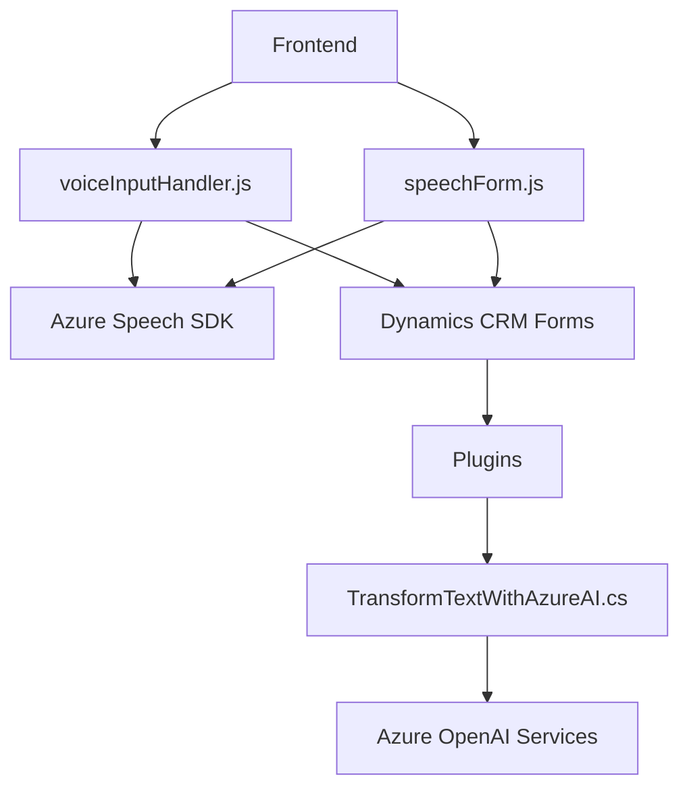

### Breve resumen técnico
El repositorio contiene implementaciones para frontend en JavaScript y plugins en C#. La solución general está diseñada para integrar funcionalidades de entrada y salida de voz mediante **Azure Speech SDK** y procesamiento avanzado de texto mediante **Azure OpenAI Services**. La arquitectura combina elementos modulares del frontend y servicios en el backend con integración hacia **Dynamics CRM**.

---

### Descripción de la arquitectura

La arquitectura se puede considerar híbrida:
- **Frontend (JavaScript)**: Modular y basado en eventos, orientado a la integración dinámica con el formulario de Dynamics, utilizando **Azure Speech SDK** para entrada/salida de voz.
- **Backend (C#)**: Plugin basado en **Dynamics CRM**, que utiliza **Azure OpenAI Services** mediante una integración REST para refinamiento y transformación de texto. Sigue un esquema parecido a **hexagonal**, con manejo de lógica central separado de las interfaces externas como OpenAI y el servicio CRM.

Los elementos trabajan como una solución consolidada:
1. **Frontend** maneja interacción con el usuario.
2. **Backend**, mediante plugins, ofrece procesamiento centralizado, especialmente útil para transformar datos o realizar cálculos complejos que no se ejecutan en el navegador.

---

### Tecnologías usadas

- **Frontend (JavaScript)**:
  - **Azure Speech SDK**: Para síntesis y reconocimiento de voz.
  - **Dynamics CRM**: Integración directa para obtención y manipulación de datos de formularios.
  - **ES6+ JavaScript**: Sintaxis moderna con funciones auxiliares para manejo de datos y DOM.

- **Backend (C#)**:
  - **Dynamics Plugin Framework**: Implementaciones basadas en `IPlugin`.
  - **Azure OpenAI Services**: Llamadas REST para generación de texto.
  - **Newtonsoft.Json** y **System.Text.Json**: Parsing de datos JSON.
  - **HTTP Client**: Implementación personalizada para envío de solicitudes hacia el servicio OpenAI.

---

### Diagrama Mermaid

---

### Conclusión final

El repositorio presenta una solución bien estructurada que integra servicios innovadores como **Azure Speech SDK** y **Azure OpenAI Services** dentro de una plataforma CRM empresarial como Dynamics. La arquitectura combina modularidad en el frontend y un diseño basado en plugins para el backend. Hay buenas prácticas en distribución de responsabilidades, aunque algunas debilidades como la presencia de dependencias rígidas (ej. credenciales fijas) deben verse como áreas de mejora. El enfoque híbrido permite que las partes de frontend y backend sean independientes para facilitar su mantenimiento y escalabilidad.