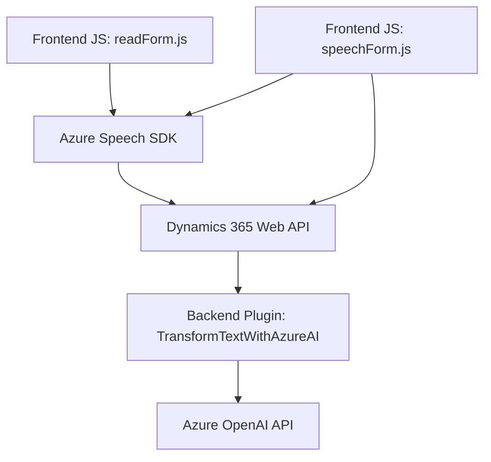

### Breve resumen técnico
El repositorio describe diversos archivos relacionados con tecnologías frontend (JavaScript) y backend (C#), todos enfocados en integrar capacidades de voz y procesamiento de texto, particularmente utilizando servicios de Azure, como el Azure Speech SDK y Azure OpenAI API. Los componentes parecen estar diseñados para interactuar con Microsoft Dynamics 365 en un flujo CRM.

---

### Descripción de arquitectura
1. **Arquitectura general**:
   - La solución sigue una **estructura modular**:
     - Frontend: JavaScript para interacción en tiempo real (sintetización y reconocimiento de voz).
     - Backend: Plugin en C# para extensiones de Dynamics 365.
   - Se integra con servicios externos como Azure Speech SDK y Azure OpenAI API, lo que sugiere una arquitectura de **integración orientada a servicios** y **event-driven architecture** (para plugins).

2. **Arquitectura del backend y los plugins**:
   - Diseño basado en **capas**:
     - Capa de ejecución: Plugins para Dynamics que encapsulan lógica específica (e.g., transformación de texto).
     - Capa de servicios: Interacción con Azure OpenAI API.
   - **Plugin Design Pattern** y **Facade Pattern** facilitan el desacoplamiento entre servicios externos y la lógica CRM.

3. **Arquitectura del frontend**:
   - **Separación de responsabilidades**: Cada archivo JS gestiona una función específica (e.g., síntesis, reconocimiento).
   - Diseño basado en componentes y **modelo modular**.

---

### Tecnologías utilizadas
1. **Frontend**:
   - Lenguaje: JavaScript.
   - SDK usado: Azure Speech SDK.
   - Dependencias: DOM para carga dinámica y estructuras del CRM para datos del formulario.

2. **Backend**:
   - Lenguaje: C#.
   - Framework: Microsoft Dynamics SDK.
   - Dependencias:
     - Azure OpenAI API para procesamiento de texto.
     - .NET Core frameworks (`System.Text.Json`, `System.Net.Http`).

3. **Integraciones externas**:
   - Azure Speech SDK: Reconocimiento y síntesis de voz.
   - Dynamics 365 Web API: Gestión de datos CRM.
   - Azure OpenAI API: Transformación de texto.

4. **Patrones detectados**:
   - Singleton (para cargar el SDK dinámicamente en frontend).
   - Modularidad (funciones separadas para responsabilidades).
   - Callback design pattern (verificación dinámica de SDK).
   - Integration-oriented design (uso intensivo de APIs externas).

---

### Diagrama Mermaid válido para GitHub

---

### Conclusión final
La solución descrita combina integración de voz, inteligencia artificial y CRM extendido, indicando un enfoque en **servicios basados en tecnología Azure** y **Microsoft Dynamics 365**. La arquitectura es modular y desacoplada, aunque dependiente de APIs externas. Esto la hace adecuada para entornos corporativos que requieren alta personalización y escalabilidad en flujos CRM.

Los patrones seleccionados, como modelos de plugin y lógica enfocados en SDKs externos, son beneficiosos, pero pueden aumentar la complejidad en depuración o tiempo de ejecución si las dependencias externas presentan problemas. Por último, esta solución modular podría derivar en microservicios si se mejora la separación entre dominios de frontend, backend y lógica de negocios.