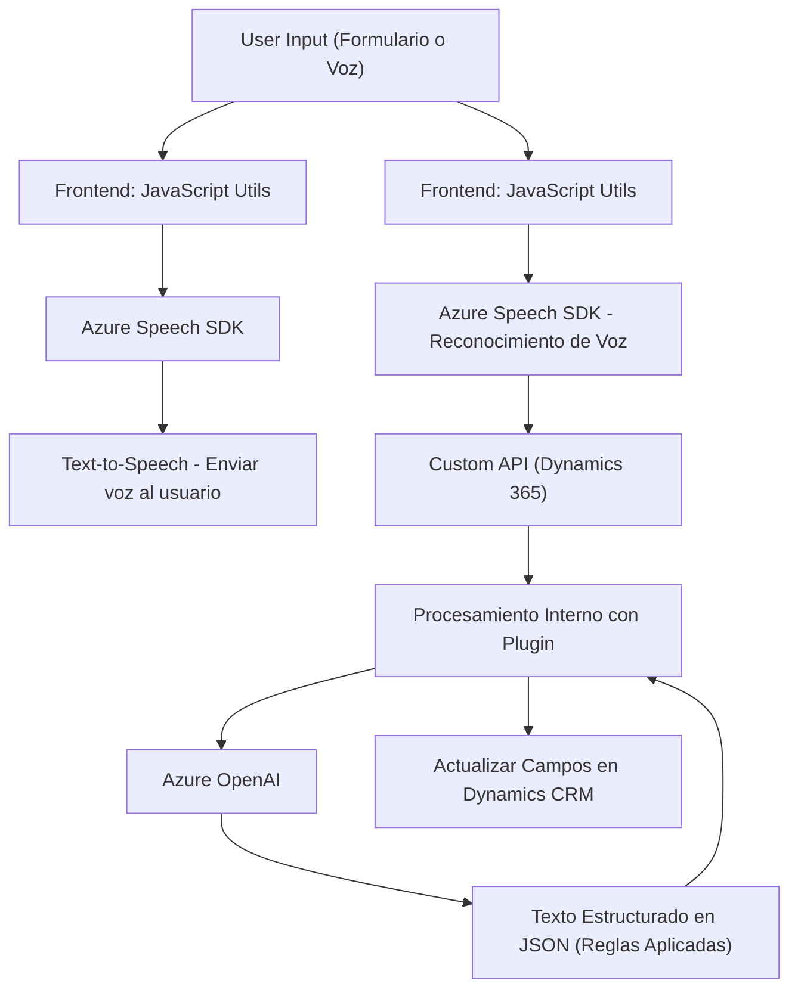

### **Breve Resumen Técnico**

El repositorio parece contener una solución integrada que utiliza servicios en la nube (Azure Speech SDK y Azure OpenAI) para procesar formularios mediante voz y texto. Está orientada principalmente al reconocimiento de voz, síntesis de texto a voz, procesamiento semántico de texto y su integración dentro de un sistema de CRM como Microsoft Dynamics 365.

### **Descripción de Arquitectura**

#### General:
- **Tipo de solución**: Una solución web híbrida con frontend en JavaScript que interactúa con un backend (plugin `.NET` para Dynamics CRM) y servicios externos como Azure Speech SDK y Azure OpenAI. La arquitectura gira en torno a la integración con APIs en la nube y componentes locales del CRM.
  
#### Detalles arquitectónicos:
1. **Frontend**:
   - Uso de un modelo funcional basado en servicios con funciones independientes para tareas específicas, como la síntesis de voz y el reconocimiento de comandos. La solución aprovecha el sistema de carga dinámica del Azure Speech SDK.
   - Lógica orientada a separar tareas de entrada de voz, transformación de texto y vinculación con formularios.
   - Integración con API personalizada de Dynamics 365 CRM para tareas más complejas, delegando trabajo al backend.

2. **Backend**:
   - Plugin desarrollado para Dynamics CRM que emplea la interfaz `IPlugin` estándar.
   - La transformación de texto se realiza mediante un microservicio externo, Azure OpenAI, mediante API REST.
   - Arquitectura de tipo n-capas, con una separación visible de responsabilidades entre el frontend (interacciones del usuario), las funciones en el backend (plugin que procesa datos), y servicios externos (Azure).

---

### **Tecnologías Usadas**
1. **Frontend**:
   - **Language**: JavaScript.
   - **Libraries**: 
     - Azure Speech SDK (importado dinámicamente).
     - APIs de Dynamics 365 (Xrm.WebApi.online).
2. **Backend**:
   - **Language**: C# (.NET Framework).
   - **Libraries**:
     - Microsoft Dynamics SDK (Microsoft.Xrm.Sdk).
     - Newtonsoft.Json (manejo JSON).
     - System.Net.Http (para realizar solicitudes REST al Azure OpenAI).
3. **Servicios en la nube**:
   - Azure Speech SDK para Text-to-Speech y reconocimiento de voz.
   - Azure OpenAI para transformación semántica de texto.

---

### **Dependencias y Componentes Externos**
1. **Dependencias internas**:
   - Interacción con formularios y entidades en Microsoft Dynamics CRM.
   - Contexto del formulario (`formContext`) utilizado en ambos archivos JavaScript.
  
2. **Dependencias externas**:
   - Azure Speech SDK: Sintetizar y reconocer voz.
   - Azure OpenAI: Transformar texto mediante procesamiento semántico.
   - Microsoft Dynamics SDK: Plugins integrados en el sistema CRM para lógica interna.

---

### **Diagrama Mermaid**

El siguiente diagrama sintetiza la interacción entre los elementos del sistema, mostrando los componentes y el flujo de datos entre frontend, backend y servicios externos.

---

### **Conclusión Final**

Esta solución es una integración robusta de múltiples tecnologías enfocadas en la entrada y salida de datos mediante voz y texto, dirigida a sistemas empresariales como Microsoft Dynamics CRM. Su arquitectura combina n-capas con microservicios ligeros de procesamiento externo (Azure OpenAI), lo que permite ampliar sus capacidades sin sobrecargar el sistema CRM interno.

Aunque la solución es funcional y bien estructurada, podría beneficiarse de mejoras como la eliminación de redundancias entre funciones en el frontend y la estandarización de las reglas de transformación del texto en el backend (por ejemplo, mediante configuraciones externas o almacenamientos dinámicos).