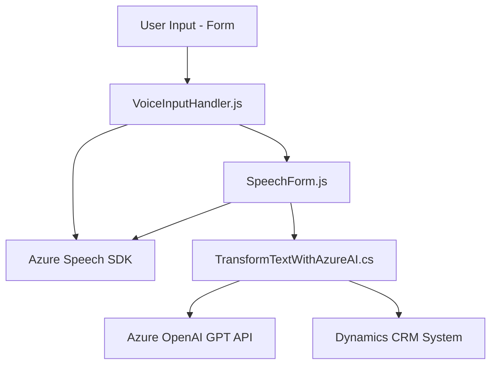

### Breve resumen técnico

Este repositorio ofrece una solución modular que integra tres componentes principales: un **frontend** (basado en JavaScript), un ^backend** extensible (plugin en C# para Dynamics 365 CRM), y servicios de terceros como **Azure Speech SDK** y **Azure OpenAI GPT** para reconocimiento de voz y procesamiento del lenguaje natural respectivamente. La solución es diseñada para facilitar la interacción por voz y la síntesis de texto en aplicaciones empresariales (Dynamics 365), transformando datos ingresados en formularios.

### Descripción de arquitectura

La solución adopta un enfoque de arquitectura **multicomponente basada en servicios**. Aunque no es estrictamente un sistema de microservicios, el diseño habilita la interacción entre módulos (frontend y backend) que se integran con servicios externos. Además:
- **Frontend**: Funciona como el cliente, realizando la interacción con usuarios, extracción de datos de formularios y comandos por voz.
- **Backend plugin**: Implementa una lógica que utiliza la OpenAI API de Azure para dar formato estructurado al texto transcrito.
- **Servicios externos**: El uso de **Azure Speech SDK** para el reconocimiento y síntesis de voz, junto con la integración de la API de Azure OpenAI, refuerza la arquitectura distribuida y modular en línea con el diseño orientado a servicios (Service-Oriented Architecture - SOA).

### Tecnologías usadas

1. **Frontend**
   - **JavaScript**: Lenguaje principal para la interacción, datos y cliente SDK.
   - **Azure Speech SDK**: SDK de reconocimiento y síntesis de voz.
   - **Framework Dynamics 365**: Métodos y objetos específicos como `executionContext`, `formContext`.

2. **Backend plugin**
   - **C#**: Lenguaje principal para el desarrollo del plugin.
   - **Microsoft Dynamics CRM SDK**: Para interoperar y capturar datos desde el entorno de Dynamics.
   - **Azure OpenAI (API)**: Uso de GPT en aplicaciones empresariales.
   - **JSON Manipulation**:
     - `System.Text.Json`
     - `Newtonsoft.Json.Linq`
   - **System.Net.Http**: Comunicación mediante API REST.

### Diagrama Mermaid

### Conclusión Final

El repositorio representa una solución integradora para mejorar la experiencia de usuario en aplicaciones empresariales como Dynamics CRM. Los usuarios pueden interactuar mediante voz para rellenar formularios y transformar textos. La arquitectura modular y las dependencias externas (SDK, Azure APIs) favorecen el mantenimiento y escalabilidad del proyecto. Sin embargo, el diseño del código puede ser optimizado para fortalecer la separación de responsabilidades y facilitar pruebas unitarias mediante abstracciones o interfaces adicionales.