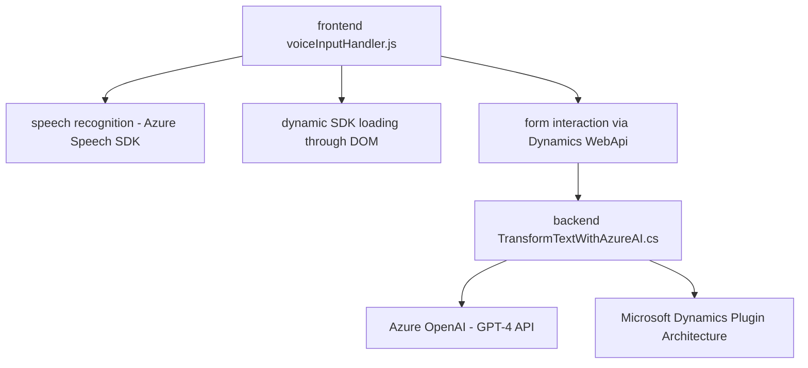

### Breve resumen técnico

El repositorio analiza la integración de servicios Cloud como **Azure Speech SDK** y **Azure OpenAI** en un entorno empresarial basado en Dynamics 365. Incorpora tanto funciones para frontend (procesamiento por reconocimiento de voz y síntesis de texto a voz) como un backend (plugin para CRM) para ejecutar transformaciones de texto. La arquitectura, altamente modular y escalable, combina patrones como integración de servicios externos (SDK y APIs), procesamiento semántico avanzado (IA/AI), y extensibilidad personalizada (Dynamics plugins).

---

### Descripción de arquitectura

La solución emplea una arquitectura **n-capas**, dividiéndose principalmente en tres capas:

1. **Capa de presentación (Frontend)**:
   - Implementada con JavaScript, facilita la interacción con el usuario, lectura de formularios, procesamiento local y síntesis de voz.
   - Utiliza el SDK de **Azure Speech** para funcionalidades de reconocimiento y transcripción de voz (speech-to-text) y síntesis de texto a voz (text-to-speech).

2. **Capa de lógica empresarial (CRM Plugins)**:
   - Plugin basado en **C#** y diseñado para integrarse con Dynamics 365.
   - Realiza procesamiento profundo del texto utilizando servicios externos como Azure OpenAI.
   - Interactúa con entidades del sistema CRM para enriquecer los datos y personalizar transformaciones.

3. **Capa de servicios externos**:
   - Servicios de Microsoft Azure: Speech SDK y OpenAI API.
   - Comunicación con APIs RESTful para análisis y creación de contenido estructurado.

---

### Tecnologías usadas

- **Frontend**:
  - **JavaScript** para lógica de frontend y procesamiento.
  - **HTML DOM Manipulation** para cargar dinámicamente bibliotecas externas.
  - **Azure Speech SDK** para procesamiento de voz y síntesis de texto.  
  - **Dynamics 365 Web APIs** para integración directa con formularios y entidades.

- **Backend**:
  - **C# .NET framework** para implementación del plugin.
  - **Microsoft Dynamics SDK** (`IPlugin`, `IOrganizationService`) para integración con el ecosistema CRM.
  - **Azure OpenAI** como servicio externo para procesamiento semántico y generación JSON.
  - **JSON Libraries**: `System.Text.Json`, `Newtonsoft.Json` para construcción y manejo de datos JSON.
  - **HTTP Client** para invocar servicios REST externos.

---

### Componentes externos y dependencias

1. **Azure Speech SDK**: 
   - Provee APIs para procesamiento de voz, reconocimiento y síntesis.
   - Dependencia principal.
   - Se carga dinámicamente en el frontend.

2. **Azure OpenAI Service**:
   - Realiza transformaciones semánticas avanzadas (GPT-4).
   - Configurable mediante normas específicas en el backend.

3. **Microsoft Dynamics CRM APIs**:
   - Interacción con el ecosistema CRM para obtener y actualizar formatos estructurados como datos de formularios.

4. **Web APIs (HTTP)**:
   - Dependencia utilizada para comunicación con servicios REST externos en el plugin backend.

---

### Diagrama Mermaid

---

### Conclusión final

Esta solución implementa una arquitectura moderna basada en **n-capas**, abarcando el frontend para interacción directa con el usuario, backend extensible mediante plugins para Dynamics CRM, y servicios externos que añaden capacidades avanzadas de AI e integración. El diseño modular del código asegura escalabilidad, mientras los patrones empleados (SDK dinámico, integración RESTful, plugin extensible) garantizan flexibilidad y adaptabilidad en entornos empresariales dinámicos. La implementación está alineada con las mejores prácticas en integración de servicios externos y procesamiento semántico.