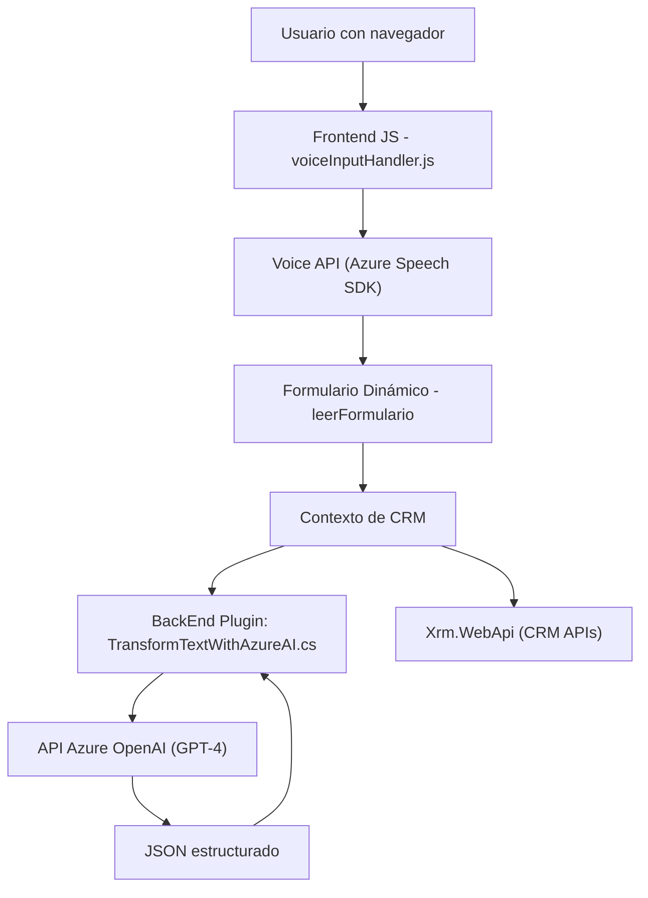

### Breve resumen técnico:
El repositorio implementa funcionalidades de reconocimiento y síntesis de voz usando Azure Speech SDK, además de integración con Azure OpenAI y Microsoft Dynamics CRM como parte de un ecosistema CRM. Los archivos del repositorio corresponden a una solución mixta, con frontend (en JavaScript) y backend (Microsoft Dynamics plugins en C#), habilitando entrada de voz y procesamiento de comandos o datos de manera automática.

---

### Descripción de arquitectura:
Este proyecto tiene una arquitectura basada en **n capas**, donde:
1. **Frontend:** Implementa la interacción directa con usuarios (captura de voz y síntesis de audio) usando JavaScript y Azure Speech SDK.
2. **Backend:** Consiste en plugins de Dynamics CRM (codificados en C#) que interactúan con una API OpenAI para transformar texto, y con Microsoft Dynamics CRM para lectura/escritura de atributos de formularios.
3. **Servicios Externos:** Usa servicios externos como:
   - Azure OpenAI para procesamiento avanzado del lenguaje.
   - Azure Speech SDK para reconocimiento y síntesis de voz.

---

### Tecnologías usadas:
1. **Frontend:**
   - **Lenguaje:** JavaScript (ES6).
   - **Frameworks/Librerías:** Azure Speech SDK.
   - **Patrones:** 
     - Modularización funcional.
     - Carga dinámica de dependencias (lazy loading para SDK).
   - **CRM Contexto:** Se interactúa indirectamente con formularios dinámicos o APIs CRM mediante `executionContext`.
   
2. **Backend:**
   - **Lenguaje:** C# (.NET Framework).
   - **Frameworks/Librerías:**
     - Microsoft Dynamics SDK (`Microsoft.Xrm.Sdk`) para plugins.
     - Azure OpenAI Service (GPT APIs).
     - JSON libraries (`Newtonsoft.Json`, `System.Text.Json`).
     - `HttpClient` para consumo de APIs externas.
   - **Patrones:** 
     - Plugin extensible mediante la interfaz `IPlugin`.
     - API Gateway para delegación en servicios como Azure OpenAI.

---

### Dependencias o componentes externos:
1. **Azure Speech SDK:** Maneja reconocimiento y síntesis de voz.
2. **Azure OpenAI:** Procesa texto con modelos avanzados como GPT-4.
3. **Microsoft Dynamics CRM:** Interactúa con entidades del sistema CRM mediante `IPluginExecutionContext`.
4. **Xrm.WebApi:** API para el manejo de datos/entidades desde el frontend.
5. **HTTP Dependency:** Realiza solicitudes HTTP en el backend para consumir servicios de Azure.

---

### Diagrama Mermaid válido para GitHub:

---

### Conclusión final:
Este repositorio es una solución híbrida destinada a enriquecer la experiencia en un CRM mediante integración de tecnologías avanzadas como reconocimiento de voz, síntesis de audio y procesamiento de lenguaje natural. Su arquitectura es de **n capas**, con un fuerte acoplamiento al SDK de Azure y a los servicios relacionados. Utiliza prácticas modernas como carga dinámica de SDK, modularización de funcionalidades en el frontend y extensibilidad mediante plugins en el backend. Sin embargo, algunas mejoras necesarias incluyen:
- Externalización de configuraciones sensibles como claves API.
- Optimización de la interacción entre frontend y backend para un manejo más robusto de errores.
- Mejor separación entre la lógica de procesamiento y la lógica de integración (por ejemplo, una capa adicional de abstracción para APIs).

En general, esta solución es adecuada para entornos que requieren automatización y personalización avanzada en sistemas CRM.