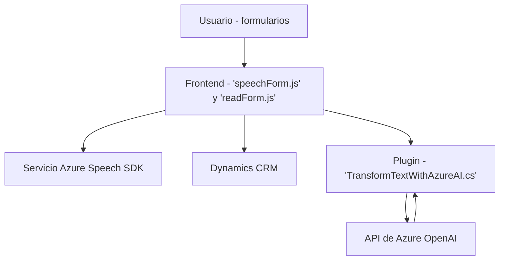

### Breve resumen técnico
El análisis presenta una solución orientada al manejo de entrada y salida de voz con integración de servicios externos de inteligencia artificial (Azure Speech SDK y Azure OpenAI), así como procesamiento de datos en formularios de Dynamics CRM utilizando un plugin. Es una solución híbrida que abarca una aplicación web (frontend) y backend con lógica extendida en la plataforma empresarial.

---

### Descripción de arquitectura
La arquitectura se basa en la integración de múltiples capas dentro de una solución que utiliza servicios externos como Azure Speech SDK y Azure OpenAI para gestionar funcionalidades de voz y procesamiento de texto. La solución está organizada del siguiente modo:

- **Frontend**: basado en JavaScript, implementado según un modelo modular y con patrones como Lazy Loading y MVC.
- **Backend**: integrado con Dynamics CRM mediante la arquitectura de Plugins en .NET. Los plugins generan eventos en Dynamics y se conectan con Azure OpenAI para la transformación de datos textuales.

El diseño general puede ser clasificado como **modular con integración de servicios externos**, donde se observa separación horizontal en capas que permiten el desacoplamiento y extensibilidad.

---

### Tecnologías usadas
1. **Frontend**:
   - JavaScript: Lenguaje principal para la interacción de formularios, reconocimiento de voz y síntesis de texto.
   - Azure Speech SDK: Para tareas de reconocimiento y síntesis de voz.
   - Dynamics CRM Web API: Para manipulación de datos entre formularios y el backend.

2. **Backend**:
   - C#: Lenguaje principal para el desarrollo del plugin.
   - Microsoft.Xrm.Sdk: API nativa para desarrollo con Dynamics CRM.
   - Newtonsoft.Json.Linq / System.Text.Json: Para manejo de JSON en las transformaciones de datos.
   - System.Net.Http: Para integración con la API REST de Azure OpenAI.
   - Azure OpenAI API: Servicio de IA para transformación de texto.

---

### Dependencias o componentes externos
- **Azure Speech SDK**: Dinámicamente cargado para proporcionar funcionalidades de reconocimiento y síntesis de voz.
- **Azure OpenAI API**: Para realizar transformaciones inteligentes de texto en JSON estructurado.
- **Dynamics CRM Web API**: Manejo de datos de formularios y automatización de campos.
- **API Custom de Dynamics CRM**: Procesamiento específico de texto transcrito con IA.
- **Bibliotecas C#**: Newtonsoft.Json y System.Net.Http para manejo de datos y conexión a servicios externos.

---

### Diagrama **Mermaid** 100 % compatible con **GitHub Markdown**

---

### Conclusión Final
La solución implementada es una integración avanzada entre frontend y backend, diseñada para proporcionar un flujo automatizado de entrada de datos por medio de voz. La interconexión entre Azure Speech SDK, Dynamics CRM y Azure OpenAI demuestra una arquitectura modular y extensible, que favorece el desacoplamiento y el uso de servicios en la nube. Se aplican patrones como Lazy Loading, Observer/Callback, Factory y Plugin Architecture, y se enfatiza en la separación de responsabilidades.

Una recomendación sería considerar la seguridad en el manejo de claves API y optimizar el sistema de recuperación de datos para manejar fallos (por ejemplo, pérdida de conexión o errores en los servicios API).