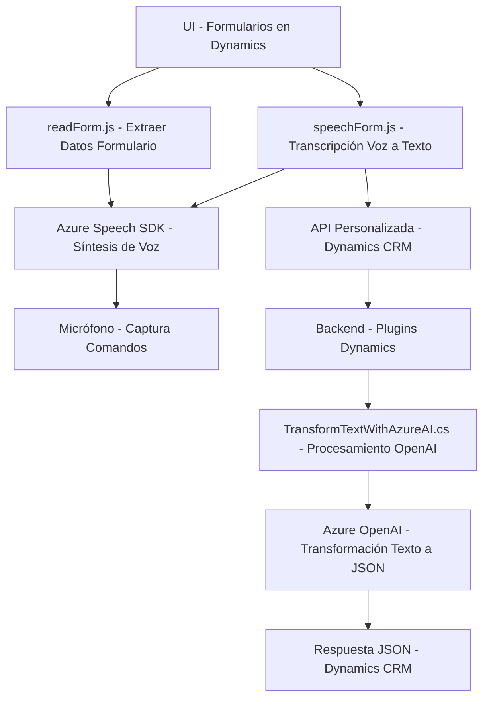

### Breve Resumen Técnico:
El repositorio contiene implementaciones relacionadas con la interacción usuario-aplicación y extensibilidad de Microsoft Dynamics CRM mediante el uso de Microsoft Azure Speech SDK y Azure OpenAI. Las soluciones están diseñadas para agregar características como síntesis y reconocimiento de voz, edición de formularios y transformación de textos mediante inteligencia artificial, todo dentro de un contexto modular.

---

### Descripción de Arquitectura:
1. **Tipo de Solución**:  
   - Este repositorio es una solución **API integrada con frontend y plugins**.  
   - Los archivos del frontend (`readForm.js`, `speechForm.js`) se centran en la interacción con el usuario, capturando comandos de voz y presentando datos en formularios web.  
   - El plugin (`TransformTextWithAzureAI.cs`) es parte del backend de Dynamics CRM y extiende capacidades mediante Azure OpenAI.

2. **Tipo de Arquitectura**:  
   - **Híbrida**: Este repositorio integra un frontend con características tradicionales de cliente-servidor (n-capas) y un enfoque de microservicios para la interacción con SDKs y APIs.  
   - Usa **Hexagonal Architecture** en el plugin para desacoplar la lógica del negocio de las dependencias externas (Azure OpenAI).  
   - En el frontend, prevalecen los principios de procesamiento modular de datos (Microsoluciones dentro de una aplicación monolítica).

---

### Tecnologías Usadas:
1. **Frontend**:
   - **JavaScript/ES6**: Lenguaje principal.
   - **Dynamics CRM SDK**: Para integración con formularios y datos.
   - **Azure Speech SDK**: Reconocimiento y síntesis de voz.
   - **Promises/Async-Await**: Manejo de operaciones asincrónicas.

2. **Backend**:
   - **C#**: Lenguaje principal del plugin.
   - **Microsoft Dynamics CRM SDK**:
     - `IPlugin` para extender la funcionalidad.
     - `IOrganizationService` para interacción con la base de datos del CRM.
   - **Azure OpenAI**: Transformación de texto utilizando el servicio OpenAI vía HTTP.
   - **HTTPClient** y **JSON**: Para envío de solicitudes API y parseo JSON.

---

### Dependencias y Componentes Externos:
1. **Dependencias Frontend**:  
   - `Azure Speech SDK`: Para reconocimiento y síntesis de voz.  
   - `Dynamics Forms API`: Para manipulación de datos en formularios.  

2. **Dependencias Backend**:  
   - `Azure OpenAI API`: Llamadas para procesamiento de texto con inteligencia artificial.  
   - **Dynamic CRM SDK**: Extensibilidad del ecosistema Dynamics.  

3. **Posibles Configuraciones Externas**:  
   - Las claves de Azure Services para Speech SDK y OpenAI deberían configurarse en un archivo protegido.

---

### Diagrama Mermaid:

---

### Conclusión Final:
Esta solución representa una integración robusta entre el frontend de Dynamics CRM, Microsoft Azure Speech SDK y Azure OpenAI. La arquitectura utiliza enfoques **modulares** y **asincrónicos** en el frontend mientras desacopla dependencias en el backend mediante patrones como **hexagonal**. Esto permite que los componentes funcionen como servicios distribuidos, enfocándose en la interacción con formularios y el procesamiento de voz/texto.

Sin embargo, es recomendable mejorar la gestión de claves y configurar las dependencias externas en archivos seguros o sistemas de gestión como **Azure Key Vault**.