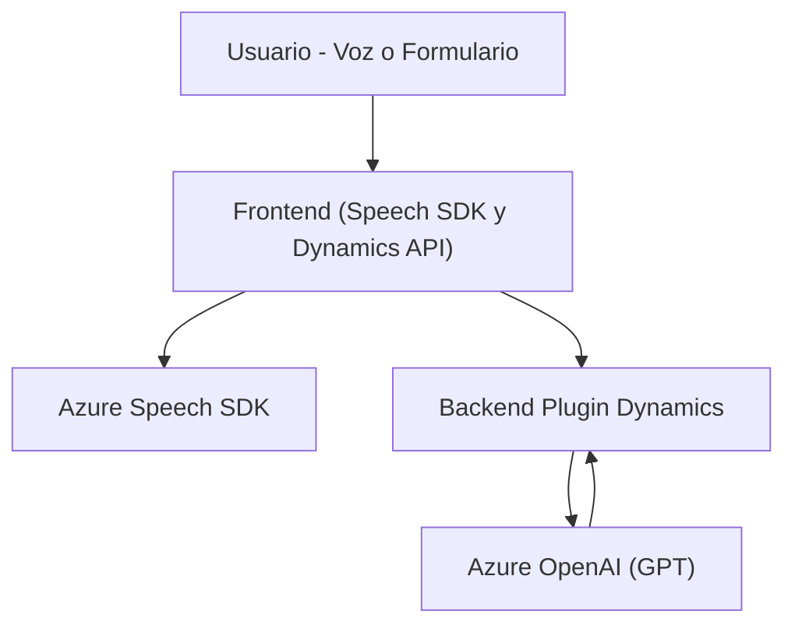
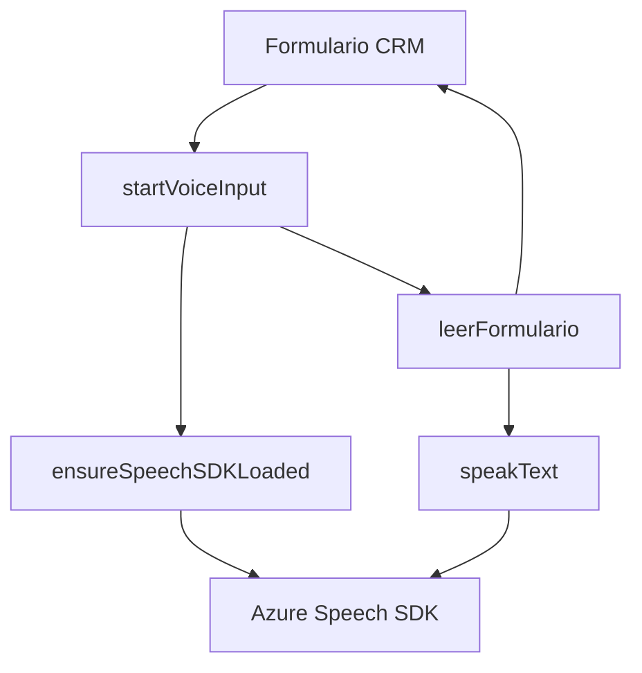
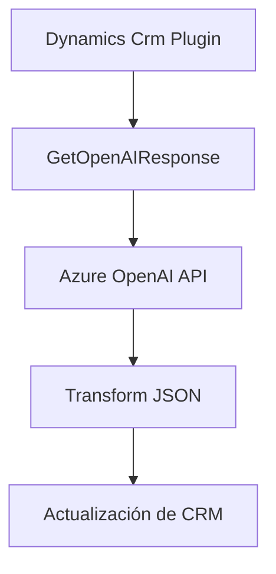

### Breve resumen técnico
El repositorio implementa una solución orientada a CRM (Dynamics 365) que utiliza tecnologías de voz y procesamiento IA en la interfaz de usuario y como complemento en el backend. La solución permite entrada de voz para actualizar formularios dinámicos y proporciona transformación de texto mediante Azure Speech SDK y OpenAI GPT API para mejorar la interacción y usabilidad dentro del sistema.

---

### Descripción de la arquitectura
Esta solución parece seguir una arquitectura **mixta entre n-capas y extensibilidad**:

1. **Frontend (JavaScript)**:
   - Actúa como una capa de presentación integrada con Dynamics CRM, manipulando formularios y gestionando datos desde el SDK de voz de Azure.

2. **Plugin (C#)**:
   - Un componente backend que sigue el patrón de plugins de Dynamics CRM. Aquí, las transformaciones complejas de texto se realizan mediante llamada a Azure OpenAI API, sirviendo como lógica de negocio adicional.

---

### Tecnologías usadas
- **Frontend**:
  - Azure Speech SDK: Reconocimiento de voz, generación de voz y administración de la entrada/salida de texto.
  - Window API: Para validación y carga de módulos (e.g., SDK).
  - Dynamics CRM JS API: Interacción con formularios y atributos.
  - ECMAScript (JavaScript): Lenguaje base para frontend con estructura modular.

- **Backend**:
  - Microsoft Dynamics CRM SDK: Framework para desarrollar extensiones y plugins dentro de Dynamics.
  - Azure OpenAI GPT API: Procesamiento avanzado de texto instruccionado.
  - C#: Lenguaje usado para implementar el plugin.
  - Newtonsoft.Json: Manipulación estructurada de JSON.

---

### Diagramas Mermaid
A continuación se presenta un diagrama de la interacción general de componentes en la solución usando Markdown-compliant Mermaid:

#### Diagrama de arquitectura general

---

#### Diagrama detallado de flujo en el **frontend**

---

#### Diagrama de procesamiento en el **plugin backend**

---

### Conclusión final
Esta solución combina una **arquitectura modular de frontend** con un backend en formato **n-capas**, integrada perfectamente con Dynamics CRM mediante el uso de su API y el patrón de plugins. La síntesis de voz y transformación de texto es habilitada mediante servicios externos como **Azure Speech SDK** y **Azure OpenAI GPT API**, haciendo de esta una solución eficiente, versátil y apta para un entorno corporativo.

Gracias a la integración de servicios externos y la separación de roles en funciones bien definidas, esta solución promueve una alta mantenibilidad y adaptabilidad. Sin embargo, el uso de servicios externos requiere configuraciones de seguridad (como manejo de claves de API).