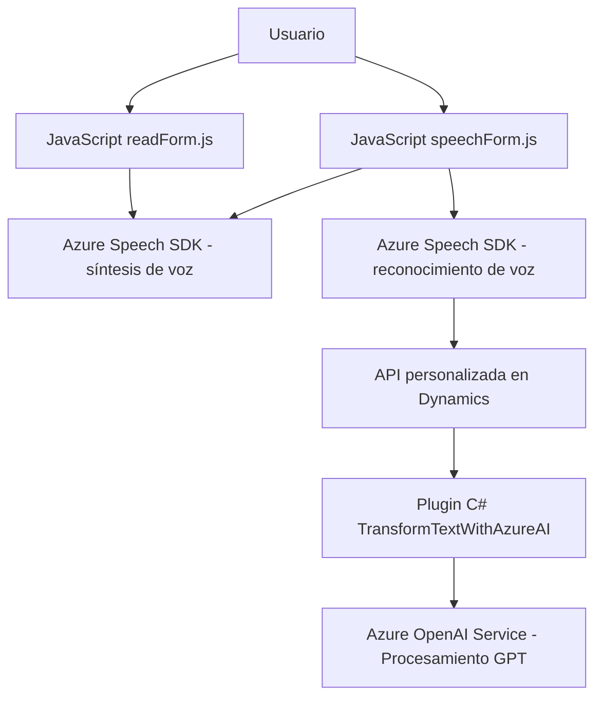

### Breve resumen técnico
El repositorio alberga una solución destinada a la interacción avanzada entre usuarios y formularios en aplicaciones empresariales. Principalmente, ofrece funcionalidades de síntesis de voz, entrada de datos por reconocimiento de voz y procesamiento inteligente del texto mediante servicios en la nube, específicamente **Azure Speech SDK** y **Azure OpenAI Service**.

---

### Descripción de arquitectura
El sistema es una solución orientada a una arquitectura **n-capas**:
1. **Frontend**: Scripts en JavaScript que interactúan directamente con formularios dinámicos del cliente (posiblemente en Dynamics 365).
2. **Logica de backend**: Plugins en C# que operan en la capa del servidor (Dynamics CRM), extendiendo funcionalidades nativas.
3. **Servicios externos**: Dependencia de APIs de Azure para operaciones de procesamiento de voz y texto mediante modelos de IA y servicios cognitivos.

Los componentes trabajan en conjunto de manera acoplada con Dynamics 365, formando una **arquitectura extensible basada en plugins y APIs externas**.

---

### Tecnologías usadas
1. **Frontend**:
   - **JavaScript**: Para la captura y procesamiento de datos dinámicos en el browser y generación de solicitudes al backend.
   - **Azure Speech SDK**: Para síntesis y reconocimiento de voz.
2. **Backend**:
   - **C#**: Para extender la funcionalidad de Dynamics CRM mediante plugins.
   - API de Dynamics CRM: Para las operaciones en el servidor.
   - **Azure OpenAI (GPT)**: Para el procesamiento de texto alojado en el servicio de inteligencia artificial.
   - **System.Net.Http**: Para consumo de API REST en Azure.
   - **Microsoft.Xrm.SDK**: Framework nativo de Dynamics para interactuar con el entorno CRM.
3. **Patrones de Diseño**:
   - **Facade Pattern**: Simplifica las interacciones complejas con SDKs o APIs externas mediante puntos únicos de entrada.
   - **Observable Pattern**: Uso de callbacks en JavaScript para asíncronamente verificar carga de SDKs externos.
   - **Plugin Architecture**: Extensibilidad de Dynamics CRM basada en plugins ejecutados dentro del pipeline de operaciones CRM.

---

### Dependencias o componentes externos
1. **Azure Speech SDK**:
   - Utilizado para operaciones de síntesis de voz y reconocimiento.
   - Descargado dinámicamente mediante URL.
2. **Azure OpenAI Service**:
   - Proceso de texto con IA, usando el modelo GPT, para transformar texto en estructuras predefinidas.
3. **Dynamics CRM Custom API**:
   - Integración con APIs empresariales personalizadas en Dynamics, como `trial_TransformTextWithAzureAI`.
4. **API de Dynamics CRM (`Xrm.WebApi`)**:
   - Para la lectura/escritura de datos en formularios dinámicos.

---

### Diagrama Mermaid

---

### Conclusión final
La solución es un **sistema híbrido basado en n-capas**, donde se aprovechan tecnologías avanzadas como SDKs de Azure y servicios de IA para enriquecer la experiencia del usuario en entornos empresariales, específicamente en CRM. Implementa patrones de diseño sólidos y sigue los principios de modularidad y extensibilidad. Aunque el repositorio incluye funcionalidades avanzadas, para asegurar escalabilidad y seguridad es crucial integrar pruebas unitarias, monitorización de servicios, y optimizaciones en el manejo de dependencias externas.