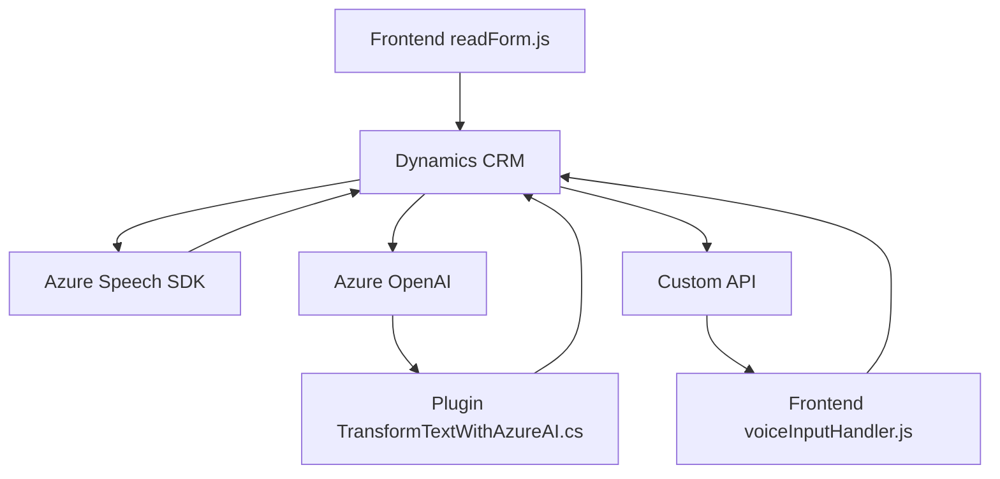

### Breve Resumen Técnico
Este repositorio incluye archivos orientados a la integración entre formularios de Dynamics 365 y tecnologías externas como Azure Speech SDK y Azure OpenAI. Su enfoque principal está en manipular datos provenientes de formularios, sintetizar las entradas en texto o audio, y realizar transformaciones mediante servicios externos.

---

### Descripción de Arquitectura
La arquitectura base utiliza un modelo **n capas**:
1. **Capa de presentación:** Archivos frontend (`readForm.js`, `voiceInputHandler.js`) que interactúan directamente con Dynamics CRM y cargan dinámicamente el SDK de Azure Speech.
2. **Capa de lógica de dominio:** La lógica aquí procesada organiza y transforma los datos extraídos de los formularios.
3. **Capa de integración:** Extensiones (`Plugins/TransformTextWithAzureAI.cs`) que llaman APIs externas (Azure OpenAI).

Los patrones destacados incluyen:
- **Integración con APIs externas:** Uso del SDK de Azure Speech y OpenAI para reconocimiento de voz y transformación de texto respectivamente.
- **Modularidad:** Implementación de funciones específicas para separar responsabilidades de extracción de datos, mapeo y procesamiento.
- **Plug-ins Dynamics CRM:** Para extender funcionalidades sobre los eventos y datos del sistema CRM.
- **Cliente/servidor:** Arquitectura basada en llamadas HTTP a servicios externos.

---

### Tecnologías Usadas
1. **Frontend (JavaScript):**
   - **SDK:** Azure Speech SDK.
   - **Framework:** Dynamics 365 context API para manipular formularios (Xrm objects).

2. **Backend (C#):**
   - **Framework:** Dynamics CRM Plugin Framework (`IPlugin`).
   - **APIs externas:** Azure OpenAI (para procesamiento basado en IA).
   - **Librerías de serialización:** `System.Text.Json` y `Newtonsoft.Json`.

---

### Diagrama Mermaid

---

### Conclusión Final
Este repositorio forma parte de una solución híbrida que integra tecnología web (Javascript) con extensiones para un sistema CRM corporativo (Dynamics 365). Se apoya en servicios en la nube como Azure para voz y procesamiento de texto basado en IA. Su arquitectura modular garantiza flexibilidad y escalabilidad, mientras que el uso de APIs externas permite agregar funcionalidades avanzadas de voz y transformación inteligente de datos al sistema.