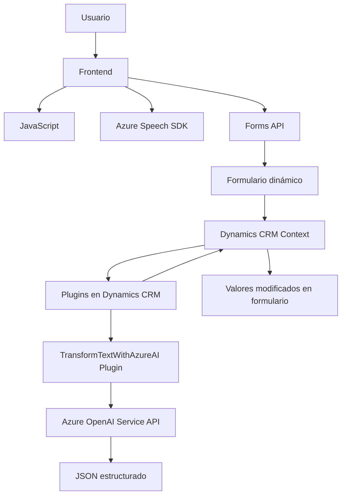

### Breve resumen técnico

El repositorio presenta una solución que integra una interfaz frontend con funcionalidades avanzadas de reconocimiento y síntesis de voz (basadas en Azure Speech SDK), junto con plugins personalizados para Microsoft Dynamics CRM que apelan a modelos de OpenAI en Azure para transformar texto en JSON estructurado. Los tres archivos analizados representan diferentes capas funcionales en una arquitectura que combina integración en tiempo real y procesamiento asíncrono.

---

### Descripción de la arquitectura

La arquitectura adoptada parece ser una combinación de arquitectura **en capas** y **microservicios**:
1. **Frontend**: Se encarga de la visualización e interacción directa con los usuarios utilizando formularios dinámicos.
2. **Backend - Plugins en Dynamics CRM**: Gestiona la lógica de negocio y la integración con el servicio OpenAI de Azure.
3. **Servicios Externos en la Nube**:
   - Azure Cognitive Services para manejo de entradas y síntesis de voz.
   - Azure OpenAI para transformación de texto.

Esta estructura presenta separación de responsabilidades siendo adecuada para escenarios de aplicaciones empresariales modularizadas.

---

### Tecnologías usadas

1. **Frontend**:
   - **Javascript**: Como lenguaje para la funcionalidad del frontend.
   - **Azure Speech SDK**: Para entrada de voz, síntesis de voz en tiempo real y manejo dinámico del idioma.
   - **Forms API**: Presumiblemente hace uso de APIs internas de Dynamics CRM para interactuar con formularios.

2. **Backend**:
   - **C#**: Lenguaje utilizado en los plugins.
   - **Microsoft Dynamics CRM SDK**: Para manipulación de los contextos y eventos de CRM.
   - **Azure OpenAI Service**: API REST integrada para procesamiento de texto con modelos de lenguaje.

3. **Patrones de diseño presentes**:
   - **Plug-in Pattern**: En los componentes de Dynamics CRM.
   - **Facade Pattern**: Simplificación de interacción con servicios externos mediante métodos encapsulados.
   - **Delegación de Eventos**: Manejo de callbacks para carga dinámica de SDK.
   - **Service-Oriented Architecture (SOA)**: Interacción con servicios en la nube.

---

### Diagrama Mermaid válido para GitHub

---

### Conclusión final

La solución presenta una arquitectura orientada a modularidad con una implementación que equilibra un frontend dinámico y una funcionalidad backend robusta basada en Microsoft Dynamics CRM. Aprovecha las capacidades avanzadas de reconocimiento de voz y procesamiento de lenguaje natural ofrecidas por los servicios de Azure. 

Aunque la integración con servicios externos es un punto positivo, hay un acoplamiento directo al API de Azure OpenAI que podría beneficiarse de mayor parametrización para extensibilidad futura. La separación de responsabilidades entre frontend (interacción) y backend (procesamiento avanzado) junto con el uso de arquitecturas en capas y servicios orientados a eventos hace de esta solución escalable y adaptable.