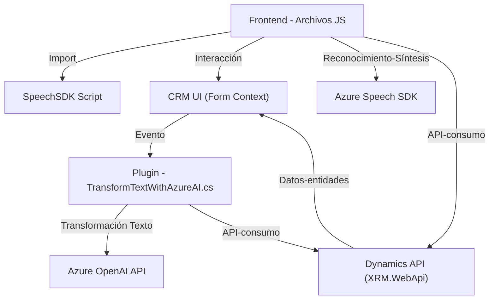

### Breve resumen técnico:

El repositorio contiene tres archivos principales que implementan una solución orientada al procesamiento del lenguaje natural (NLU), particularmente para formularios en aplicaciones CRM. La solución aprovecha servicios de Azure como Speech SDK y OpenAI API para habilitar funcionalidades de síntesis y reconocimiento de voz, así como transformación de texto mediante inteligencia artificial.

---

### Descripción de Arquitectura:

1. **Tipo de solución:**
   - **API + Plugins (backend)**: El archivo `TransformTextWithAzureAI.cs` implementa un plugin para Microsoft Dynamics 365 que interactúa con Azure OpenAI y ofrece un punto de transformación para datos textuales.
   - **Frontend (JS UI)**: Los archivos `readForm.js` y `speechForm.js` implementan funcionalidades relacionadas con síntesis y reconocimiento de voz, aplicables directamente a formularios visuales en sistemas CRM como Dynamics 365. Estas también funcionan como módulos frontend orientados a la interacción del usuario.

2. **Patrones arquitectónicos:**
   - **Modularidad:** Los archivos JS y el plugin están organizados de manera que cada función cumple un objetivo específico.
   - **Orquestación:** Algunas funciones como `startVoiceInput` y `Execute` centralizan la lógica y actúan como puntos de entrada al sistema.
   - **Integración con APIs Externas:** Uso de Azure Speech SDK y Azure OpenAI para operaciones avanzadas (síntesis de voz y procesamiento de texto).
   - **Event-Driven Architecture:** En el caso del plugin, la ejecución depende de los eventos del modelo de Dynamics CRM.

3. **Tipo de arquitectura de la solución:**
   - **Capas N (N-Layer Architecture):** La solución divide claramente el sistema en tres capas: 
     - **Capa de Presentación (Frontend - Archivos JS):** Responsable de interactuar con el usuario (síntesis y reconocimiento de voz).
     - **Capa de Lógica y Plugins (Backend - Plugin):** Ejecuta reglas de negocio y delega tareas a Azure OpenAI.
     - **Capa de Servicios Externos:** Responsable de procesar texto (Azure OpenAI) y realizar síntesis o reconocimiento de voz (Azure Speech SDK).

---

### Tecnologías usadas:

- **Lenguajes y frameworks**
  - **JavaScript**: Para desarrollo del frontend (integración en sistema CRM).
  - **C#**: Para desarrollar el plugin que interactúa con Dynamics CRM.
- **External APIs and SDKs**
  - **Azure Speech SDK**: Síntesis y reconocimiento de voz.
  - **Azure OpenAI API**: Transformaciones de texto usando modelos de lenguaje avanzado.
- **Microsoft Dynamics 365 SDK**:
  - Para desarrollar plugins conforme al contrato `IPlugin`.
- **JSON Libraries**:
  - `Newtonsoft.Json.Linq` y `System.Text.Json` en .NET para el trabajo con estructuras JSON.
- **HTTP Client Framework:**
  - En C# para hacer solicitudes a la API de Azure OpenAI.

---

### Dependencias y componentes externos:

- **Azure Speech SDK**:
  - Utilizado en el frontend JavaScript para síntesis y reconocimiento de voz.
  - URL de carga dinámica: `https://aka.ms/csspeech/jsbrowserpackageraw`.

- **Azure OpenAI API**:
  - Utilizado por el plugin en backend para transformar texto y generar respuestas avanzadas.

- **Microsoft Dynamics 365 Web API**:
  - Consultas y operaciones con entidades CRM desde el frontend y el plugin.

- **JSON manipulation libraries**:
  - `Newtonsoft.Json.Linq` para trabajar con objetos JSON en C#.
  - `System.Text.Json` para generar y leer JSON.

---

### Diagrama Mermaid:

---

### Conclusión Final:

Este repositorio implementa una solución innovadora que combina síntesis de voz, reconocimiento de voz y inteligencia artificial para trabajar con datos en formularios de un sistema CRM (Microsoft Dynamics 365). Mediante el uso de tecnologías avanzadas como Azure Speech SDK y OpenAI, se logra un flujo integrado que mejora la experiencia de usuario y la eficiencia de los procesos de entrada de datos mediante una arquitectura modular en capas. 

El diseño está orientado a la integración con servicios externos mediante APIs, y emplea patrones pertinentes para la modularidad, orquestación y asincronía. La solución es adecuada para escenarios empresariales donde la automatización, la accesibilidad y la integración APIs como OpenAI son requeridas dentro de un sistema dinámico.