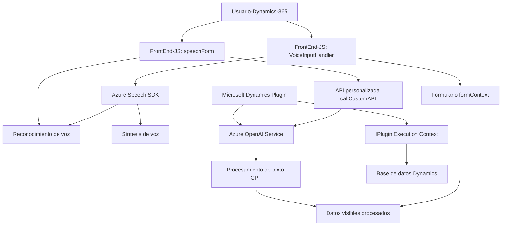

### Breve resumen técnico

El repositorio ofrecido implementa una solución que integra capacidades de reconocimiento y síntesis de voz (frente al usuario) y procesamiento de texto avanzado (plugin backend) en un entorno Microsoft Dynamics 365. Utiliza tecnologías como Azure Speech SDK y Azure OpenAI para mejorar la interacción con formularios y datos estructurados.

---

### Descripción de arquitectura

La arquitectura global tiene componentes claramente orientados a **servicios**:
- **Frontend:** Módulos JS para manejo de reconocimiento y síntesis de voz. Estas funciones configuran y cargan dinámicamente SDKs de Azure para trabajar con formularios de Dynamics 365.
- **Backend:** Plugins desarrollados para Microsoft Dynamics CRM utilizan APIs de Azure OpenAI para transformar texto conforme a reglas personalizadas. El patrón de arquitectura aquí puede clasificarse como **n-capas**, donde cada capa tiene una responsabilidad separada:
  - Presentación (frontend)
  - Procesamiento de datos (plugins y APIs)
  - Persistencia y comunicación con la plataforma Dynamics.

---

### Tecnologías usadas

- **Frontend (JavaScript/JS):**
  - **Azure Speech SDK:** Reconocimiento y síntesis de voz.
  - Browsers Dynamics 365 (formContext para manipulación de atributos y DOM).

- **Backend (.NET y C#):**
  - **Dynamics CRM Plugin Framework:** Plugins desarrollados como extensiones de Microsoft Dynamics CRM.
  - **Azure OpenAI Service:** Integración con endpoint de GPT para transformar el texto.
  - **Newtonsoft.Json**, **HttpClient**: Manejo de JSON y solicitudes HTTP.

- **Arquitectura observada:** Predomina el enfoque **n-capas**, donde cada capa tiene módulos bien definidos, integrándose con servicios externos (Azure).

---

### Posibles dependencias externas

1. **SDKs y APIs externas:**
   - Azure Speech SDK (manejo dinámico de reconocimiento y síntesis de voz).
   - Azure OpenAI Service (transformación de texto con GPT).
   - Dynamics CRM Web API (`Xrm.WebApi`).

2. **Frameworks y librerías específicas:**
   - Newtonsoft.Json (para procesamiento JSON en .NET backend).
   - HTTPClient (solicitudes API hacia Azure).

3. **Infraestructura:**
   - Dynamics 365 instance (servicios de configuración y datos organizativos).
   - Componentes de Azure configurados para Speech SDK y OpenAI (Key Management, Deployment).

---

### Diagrama **Mermaid** válido para GitHub

---

### Conclusión final

El repositorio implementa una solución híbrida **frontend-backend** integrada con Dynamics CRM para potenciar el manejo de datos formales y experiencia del usuario. La arquitectura está basada en **n-capas**, con responsabilidades claras: interacción del usuario (JS frontend), procesamiento avanzado de voz y texto (Azure SDKs y OpenAI), y persistencia de contenido en Dynamics 365. 

Esta estructura modular y orientada a servicios facilita la extensión del sistema mediante integraciones externas como Speech y OpenAI, además de permitir adaptaciones en el entorno organizativo. Perfecta para sistemas que necesitan comunicación dinámica con usuarios finales y procesamiento profundo de datos empresariales.