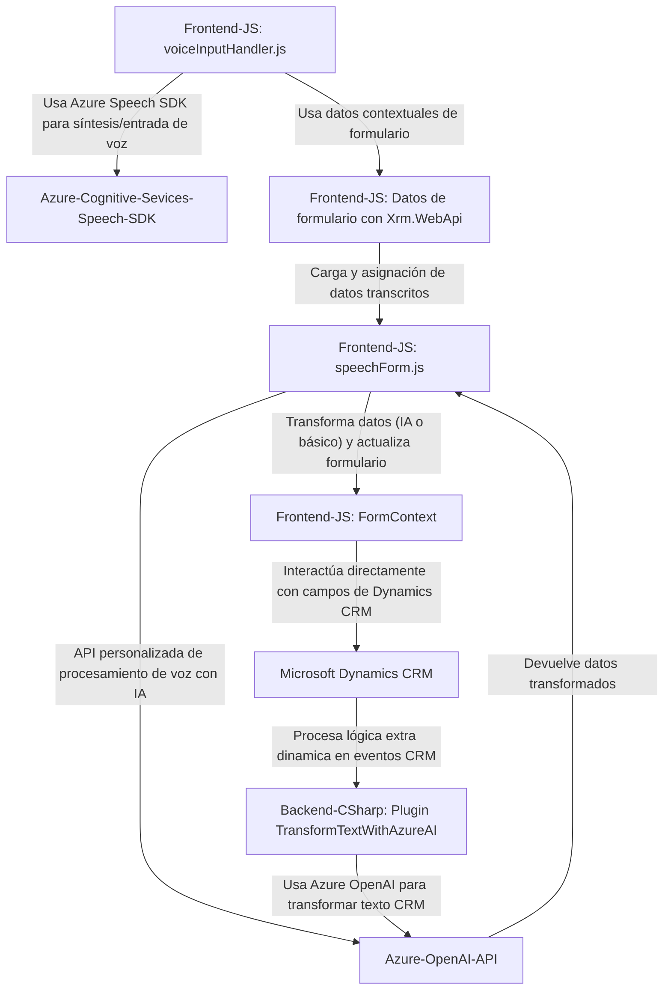

### Breve resumen técnico

El repositorio contiene una solución integral diseñada para trabajar con formularios interactivos y herramientas de procesamiento de lenguaje natural basadas en la nube (Azure Cognitive Services). Se compone de tres principales módulos/archivos enfocados en proporcionar funcionalidades como entrada/salida de voz desde formularios mediante Azure Speech SDK, reconocimiento de voz, síntesis de voz, y un plugin en C# para Microsoft Dynamics CRM que interactúa con Azure OpenAI.

### Descripción de arquitectura

La arquitectura general se asemeja a un **multicapa (n-capas)** que opera con una **composición modular**:
1. **Frontend:** Implementado en JavaScript, diseñado para manejar la interacción del usuario, formularios dinámicos, y comunicación con servicios en la nube (Azure Speech SDK, APIs personalizadas).
2. **Backend:** Un plugin desarrollado en C# que se integra directamente con Dynamics CRM y que utiliza servicios de Azure OpenAI para transformación avanzada de texto.
3. **Infraestructura externa:** Dependencia de servicios gestionados como Azure Speech y OpenAI, que siguen el patrón de arquitectura de **microservicios y API REST** para interacciones específicas con la nube.

### Tecnologías usadas

1. **Frontend:**
   - **JavaScript:** Para el desarrollo del cliente.
   - **Azure Speech SDK:** SDK para síntesis de audio y reconocimiento de voz.
   - **Dynamics 365 Xrm.WebApi:** Para realizar interacciones con registros CRM.

2. **Backend:**
   - **Microsoft Dynamics CRM SDK (C#, IPlugin interface):** Incorporación de lógica extendida en eventos CRM.
   - **Azure OpenAI API:** Procesamiento y transformación avanzada de textos con NLP (Natural Language Processing).
   - **System.Collections**, **System.Net.Http**, **Newtonsoft.Json**, **System.Runtime.Serialization:** Módulos estándar para hacer solicitudes web y trabajar con datos en JSON.

3. **Frameworks/patrones:**
   - Modular design.
   - API integration pattern.
   - Client-server communication model.
   - Façade design pattern.
   - Asynchronous workflows using Promises in JavaScript and `async/await` in C#.

### Dependencias o componentes externos

1. **Azure Speech SDK**
   - Servicio de reconocimiento y síntesis de voz.
   - URL: `https://aka.ms/csspeech/jsbrowserpackageraw`

2. **Azure OpenAI API**
   - Usado para transformar texto según normas específicas proporcionadas.
   - URL: `https://openai-netcore.openai.azure.com/`

3. **Microsoft Dynamics SDK (Xrm.WebApi)**
   - Utilizado para integración CRM y manipulación de datos en formularios.

4. **Adicionales**
   - Dependencias para procesamiento de datos JSON (`System.Text.Json`, `Newtonsoft.Json.Linq`).
   - HTTP clients (`System.Net.Http`) para interacción con servicios externos.
   - Posible relación directa con bases de datos de Dynamics CRM para el almacenamiento y recuperación de información.

### Diagrama **Mermaid** compatible con GitHub Markdown

### Conclusión final

La solución presentada combina herramientas de frontend y un backend personalizado para crear una experiencia rica e interactiva en un sistema empresarial complejo como Dynamics CRM. Se apoya en tecnologías avanzadas como Azure Cognitive Services (Speech SDK) para manejo de voz y Azure OpenAI API para procesamiento de texto, ambos como servicios externos en la nube. Su arquitectura modular facilita la separación de responsabilidades y asegura que los distintos componentes puedan ser reutilizados o escalados independientemente. Aunque la estructura tiene elementos de multicapa, tiende hacia un enfoque modernizado con integración de APIs externas.