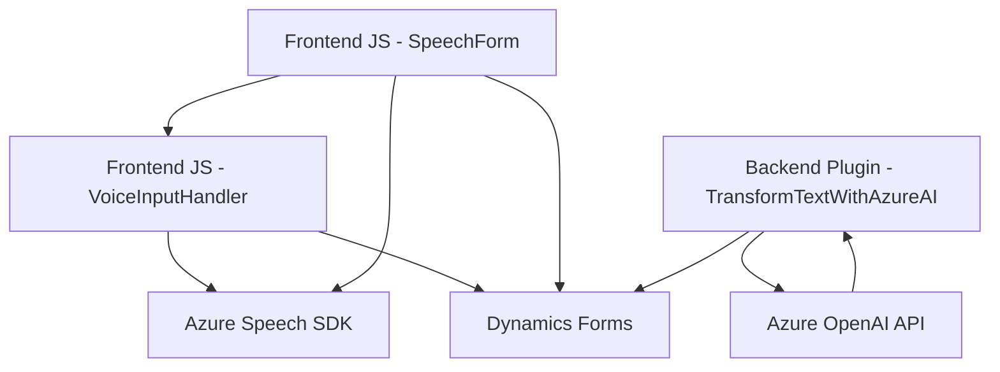

**Breve resumen técnico:**  
El repositorio funciona como una solución que implementa un sistema de entrada de voz y síntesis hablado en combinación con el procesamiento de datos por IA utilizando Azure Speech SDK y Azure OpenAI en un contexto de integración con Microsoft Dynamics 365. Está diseñado como un frontend interactivo que gestiona eventos en formularios y utiliza plugins personalizados en el backend.

---

**Descripción de arquitectura:**  
La arquitectura es híbrida con características de múltiples capas:  
- **Frontend:** Archivos JavaScript (`readForm.js`, `speechForm.js`) que capturan datos de formularios y gestionan la entrada/salida de voz.  
- **Backend:** Plugin en C# (`TransformTextWithAzureAI.cs`) que actúa como intermediario entre Dynamics 365 y Azure OpenAI, proporcionando un procesamiento adicional de datos.  
- **Patrones:**  
  - **Event-driven architecture:** En el frontend se utiliza el patrón observador para interactuar con eventos del formulario y del SDK de voz.  
  - **Plugin-based architecture:** El backend está diseñado como un plugin extendiendo Microsoft Dynamics CRM.  
  - **External dependency injection:** Tanto el frontend como el backend dependen de servicios externos (Azure Speech SDK y Azure OpenAI).

---

**Tecnologías y frameworks usados:**  
1. **Frontend:**  
   - JavaScript.  
   - Azure Speech SDK para la síntesis y reconocimiento de voz.  
   - Integración con Microsoft Dynamics 365 APIs (`executionContext`, `Xrm.WebApi`).  
2. **Backend:**  
   - C# y .NET SDK.  
   - Microsoft Dynamics CRM SDK (`Microsoft.Xrm.Sdk`).  
   - Azure OpenAI mediante `HttpClient` para realizar solicitudes HTTP.  
3. **Dependencias adicionales:**  
   - `Newtonsoft.Json` y `System.Text.Json` para manipulación de objetos JSON.  

---

**Diagrama Mermaid:**  
Se representa la interacción entre componentes y dependencias:

---

**Conclusión final:**  
El sistema combina funcionalidades de percepción (entrada de voz y síntesis hablada), manipulación de datos con APIs externas (Azure Speech SDK y OpenAI), y comunicación directa con formularios en Microsoft Dynamics 365. La arquitectura, aunque híbrida, muestra una separación de tareas con un enfoque modular que facilita la escalabilidad y adaptación a nuevas características. Las dependencias externas se gestionan adecuadamente, aunque se sugiere mover configuraciones sensibles como claves de API hacia archivos de configuración seguros.