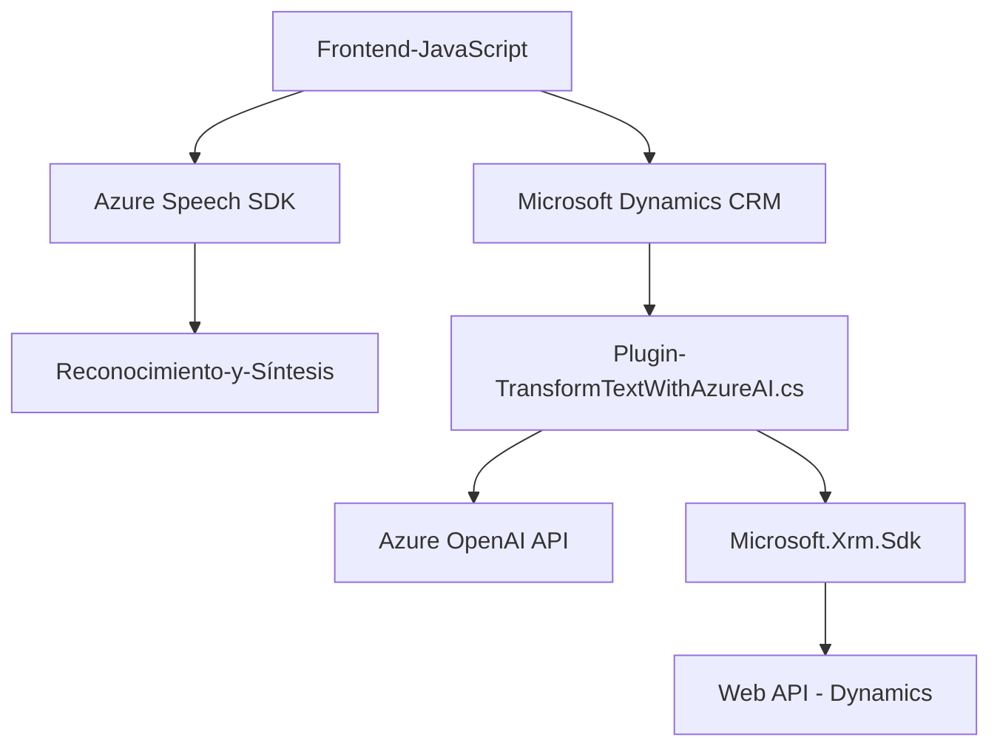

### Breve resumen técnico:
Este repositorio implementa una solución centrada en la interacción de voz y texto con formularios en un entorno Microsoft Dynamics CRM, utilizando el Azure Speech SDK y Azure OpenAI para síntesis y reconocimiento de voz, además de transformación de texto. Consta de un frontend en JavaScript para la interfaz del usuario y un backend en C# mediante un plugin para procesar solicitudes en el CRM.

---

### Descripción de arquitectura:
La arquitectura sigue un patrón modular y una orientación a servicios. En el frontend, las funciones están distribuidas para la lectura y gestión de datos de formularios, junto con la integración de síntesis y reconocimiento de voz en tiempo real. El backend utiliza el patrón de Plugin Architecture para Microsoft Dynamics CRM junto con un SOA (Service-Oriented Architecture) al integrar servicios externos como Azure OpenAI API. 

En resumen, la solución sigue una arquitectura híbrida basada en una arquitectura n-capas:

1. **Capa de Presentación (Frontend/JS):** Captura, traducción y procesamiento de voz y datos en los formularios mediante el navegador Web.
2. **Capa Lógica de Negocio (Plugins):** Procesa datos y las transformaciones de texto en el contexto del CRM.
3. **Capa de Servicios Externos:** Integra servicios externos como Azure Speech SDK y Azure OpenAI para funcionalidades avanzadas.

---

### Tecnologías usadas:
1. **Frontend:**
   - **Azure Speech SDK (https://aka.ms/csspeech/jsbrowserpackageraw):** Para sintetizar texto y reconocer voz en tiempo real.
   - **JavaScript (ES6):** Desarrollo de lógica modular y programación asíncrona.
  
2. **Backend:**
   - **Microsoft Dynamics CRM SDK (`Microsoft.Xrm.Sdk`):** Para procesamiento del contexto de ejecución del CRM.
   - **C#:** Implementación del plugin y comunicación con servicios externos.
   - **HttpClient:** Para interactuar con Azure OpenAI API vía HTTP.
   - **Azure OpenAI API:** Transformación de texto basada en modelos avanzados de lenguaje.
   - **System.Text.Json:** Serialización/deserialización de datos JSON.
   - **Newtonsoft.Json:** Procesamiento avanzado de JSON.

3. **Patrones:**
   - **Modularidad:** Lógica dividida en funciones unitarias.
   - **Service-Oriented Architecture (SOA):** Uso de servicios externos como Azure Speech SDK y OpenAI.
   - **Plugin Architecture:** Extensión de Dynamics CRM mediante plugins.
   - **Callback Pattern:** Gestión asincrónica de tareas en el frontend.

---

### Diagrama Mermaid

---

### Conclusión final:
Este repositorio implementa una solución híbrida diseñada para integrarse con Microsoft Dynamics CRM y enriquecer su funcionalidad mediante tecnologías de vanguardia, como voz a texto y transformación de texto utilizando inteligencia artificial. La solución está cuidadosamente estructurada en funciones reutilizables y patrones bien definidos, lo que favorece la mantenibilidad. Está claro que se persigue automatizar y mejorar la experiencia del usuario en el manejo de formularios en el entorno del CRM con tecnologías emergentes de Microsoft Azure.