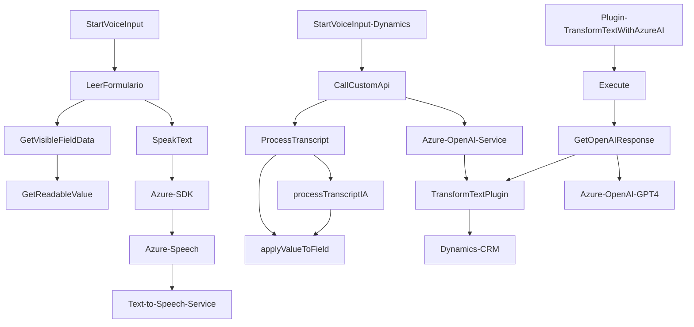

### Breve resumen técnico
El sistema presentado implementa una integración avanzada de entrada por voz y transformación de texto usando tecnologías de Microsoft Azure. Está enfocado en servicios que trabajan con formularios dinámicos y funcionalidad de voz para mejorar la accesibilidad y automatización en contextos como aplicaciones CRM mediante Dynamics y servicios de Azure.

---

### Descripción de arquitectura
La solución aplica una arquitectura de **n capas**, donde los módulos interactúan con servicios externos (Azure Speech y OpenAI) para procesar datos. El frontend (JavaScript) maneja la entrada y salida de datos a través del SDK de Azure y APIs de Dynamics. El backend (C# plugin) actúa como un microservicio dinámico especializado en transformación de texto mediante Azure OpenAI, encapsulando sus operaciones en una estructura clara y autónoma.

Patrones observados:
- **Loader Pattern**: Carga dinámica del Azure Speech SDK.
- **Facade**: Ocultamiento de complejidad para interacción con servicios externos como OpenAI.
- **Strategy Pattern**: Diferenciación entre flujos IA y tradicionales.
- **Data Transformation Layer**: Transformación de datos de voz a texto/formato JSON.

---

### Tecnologías usadas
- **Frontend (JavaScript)**:
  - SDK: Azure Speech SDK.
  - APIs de navegador (DOM, carga dinámica de scripts).
  - Integración con `Xrm.WebApi` para llamadas a APIs de Microsoft Dynamics.

- **Backend (C#)**:
  - Azure OpenAI (GPT-4) para transformación de texto.
  - `Microsoft.Xrm.Sdk` para conectar con el entorno de Microsoft Dynamics CRM.
  - `System.Net.Http` y `Newtonsoft.Json.Linq` para interacción RESTful con la API de Azure AI.

---

### Diagrama **Mermaid** válido para GitHub Markdown

---

### Conclusión final
La solución presentada combina tecnologías frontend y backend orientadas a procesar y manejar entrada de voz y transformación de texto en entornos de negocio dinámicos. Aprovecha APIs y SDKs de Microsoft Azure para reconocer voz, sintetizar texto y realizar comunicaciones RESTful con servicios de IA. Su diseño es modular, empleando patrones como **Strategy** y **Facade** para integrar lógica de negocio con capacidades avanzadas de inteligencia artificial.

Los componentes incluyen dependencias externas como el SDK de Azure Speech, Microsoft Xrm SDK y Azure OpenAI. La arquitectura, basada en n capas, hace uso de servicios externos, lo que permite una integración escalable con otros flujos de trabajo en aplicaciones CRM. El diseño, aunque no es estrictamente microservicios, demuestra la capacidad de manejar dicha arquitectura en plugins y servicios web externos.