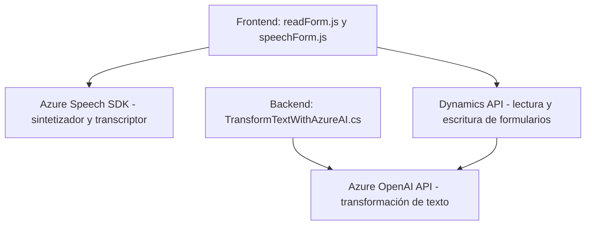

### Breve resumen técnico
El repositorio describe una solución integrada para la interacción entre un frontend en Dynamics CRM, procesamiento de texto mediante voz, transcripción desde audio y transformación de texto usando servicios de Azure (Azure Speech SDK y Azure OpenAI). Además, incluye un componente backend desarrollado como un plugin de Dynamics CRM para manejar las transformaciones de texto en base a reglas específicas.

---

### Descripción de arquitectura
La arquitectura tiene varios niveles:
1. **Frontend**: Constituido principalmente por archivos JavaScript (`readForm.js`, `speechForm.js`), que actúan como intermediarios para leer formularios, utilizar servicios como Azure Speech SDK, y enviar solicitudes al backend. Está diseñado bajo un patrón modular y con integración directa a servicios externos.
2. **Backend**: Plugin desarrollado en C# (`TransformTextWithAzureAI.cs`) que actúa como un microservicio dentro de Dynamics CRM para manejar transformaciones complejas de texto usando la API de Azure OpenAI.
3. **Servicios externos**: Azure Speech SDK, Dynamics CRM Web APIs, y Azure OpenAI funcionarán como bancos de funciones externas para la solución.

La arquitectura sigue patrones de integración con servicios externos y una separación clara de responsabilidades. Puede considerarse una arquitectura de **n capas**, ya que existen separaciones horizontales (presentación, lógica de negocio, servicios externos) pero con elementos que podrían escalar en un modelo híbrido hacia **microservicios**, por ejemplo, el uso del plugin separado en Dynamics.

---

### Tecnologías usadas
1. **Frontend**:
   - **JavaScript**: Utilizado como lenguaje principal para interactuar con APIs y formularios de Dynamics CRM.
   - **Azure Speech SDK**: Para sintetizar texto en voz y transcribir voz a texto.
   - **Dynamics CRM API**: Para manipular y rellenar valores de formularios y realizar búsquedas en registros.

2. **Backend**:
   - **C# (TransformTextWithAzureAI)**: Implementación de los plugins específicamente para Dynamics CRM.
   - **Azure OpenAI API**: Utilizado para transformar texto con reglas específicas mediante GPT-4 utilizando HTTP requests.
   - **Newtonsoft.Json / System.Text.Json**: Para manejar transformaciones en formato JSON en la comunicación API.

---

### Dependencias o componentes externos presentes
1. **Azure Speech SDK**: Servicio para síntesis de voz y reconocimiento de voz.
2. **Azure OpenAI API**: Usado para transformar texto de entrada según reglas específicas.
3. **Dynamics CRM Web API**: permite integración directa con formularios y bases de datos internas de Dynamics CRM.
4. **HTTP libraries**: En el backend para comunicación con la API de Azure OpenAI.
5. **JSON libraries**: Para serialización y deserialización de datos en el backend.

---

### Diagrama Mermaid

---

### Conclusión final
La solución describe una combinación de frontend y backend que interactúa con servicios externos sofisticados como Azure Speech SDK y Azure OpenAI API para ofrecer funcionalidades avanzadas en la gestión de formularios, transcripción de audio, y transformación de texto en Dynamics CRM. La arquitectura está diseñada en **n capas**, aunque con ciertos componentes (como el plugin de Dynamics) que poseen características de microservicios. Es una estructura efectiva para una plataforma extensible y adaptable a nuevas capacidades futuras.