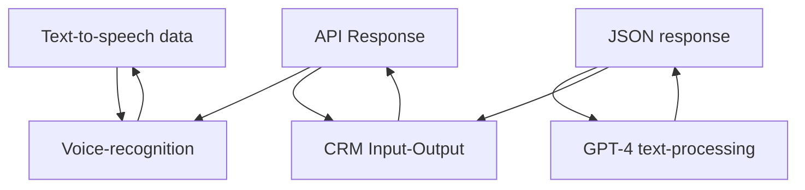

### Breve resumen técnico
El repositorio incluye una solución que conecta **capacidades de voz** y **procesamiento de texto por IA** con un entorno CRM (Microsoft Dynamics 365). Utiliza servicios externos como **Azure Speech SDK** y **Azure OpenAI API**. Combina interfaces de frontend, servicios de backend y plugins para generación y transformación de datos mediante IA.

---

### Descripción de arquitectura
1. **Tipo de solución**:  
   La solución es híbrida, enfocada en:
   - Frontend: Gestión de formularios mediante entrada por voz (Azure Speech SDK).
   - Backend: Procesamiento de texto y decisiones mediante plugins (Dynamics CRM) integrados con Azure OpenAI.

2. **Patrón de arquitectura**:  
   La arquitectura combina múltiples patrones:
   - **N capas**:
     - Capa de presentación (frontend).
     - Capa de negocio (Dynamics CRM plugins y APIs).
     - Capa de servicios (Azure).
   - **Plugin Design Pattern**:
     - Extiende la funcionalidad del sistema CRM.
   - **Integración con SDK externo**:
     - Dinámica, mediante la carga condicional de **Azure Speech SDK**.
   - **Service Locator Pattern**:
     - Gestión de dependencias a través de `IServiceProvider`.

---

### Tecnologías usadas
1. **Frontend**:  
   - **JavaScript (ES6)**:
     - Funciones y métodos organizados de manera modular.
     - Uso de promesas y callbacks.
   - **Azure Speech SDK**: Reconocimiento y síntesis de voz, cargado dinámicamente.
   - **HTTP API Consumption**:
     - Llamadas a APIs personalizadas de Dynamics 365.

2. **Backend (Plugins)**:  
   - **C# con Dynamics CRM**:
     - Extensiones para procesamiento de texto mediante OpenAI.
   - **Azure OpenAI API**:
     - Uso de modelos GPT para transformación de texto.
   - **Newtonsoft.Json** y **System.Text.Json**:
     - Serialización/Deserialización JSON.

---

### Dependencias y componentes externos  
1. **Azure Speech SDK**:
   - Sintetización de texto a voz y reconocimiento en formularios dinámicos.

2. **Azure OpenAI**:
   - Modelo compuesto (ej. GPT-4), utilizado en plugins para transformar texto.

3. **Dynamics 365 APIs**:
   - `Xrm.WebApi` para servicios CRM.
   - Extensiones del ecosistema Dynamics (e.g., `formContext`, `IPlugin`).

4. **APIs HTTP personalizadas**:
   - Integración con servicios adicionales en CRM.

---

### Diagrama Mermaid

---

### Conclusión final
La solución presentada está bien articulada para entornos **Microsoft Dynamics CRM**, integrando voz y procesamiento textual inteligente. Utiliza patrones modernos como separación por capas, carga dinámica de dependencias externas y extensibilidad mediante plugins. El uso de **Azure Speech SDK** y **Azure OpenAI API** agrega potencia y flexibilidad, haciendo posible la implementación de interacciones avanzadas con el usuario mediante voz e IA. Fomenta modularidad, escalabilidad y tecnología puntera compatible con el sistema CRM.