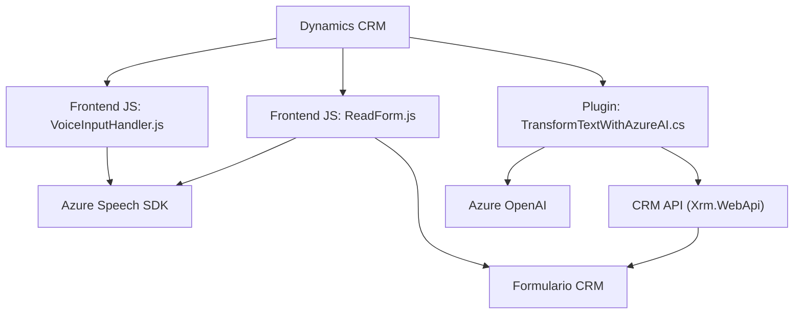

### Análisis Técnico del Repositorio

#### 1. **Tipo de Solución**
Este repositorio es una solución híbrida orientada al desarrollo de **integraciones entre Dynamics 365 CRM y Azure Cloud Services**. Contiene elementos de:
- **Frontend:** Archivos JS para la captura y procesamiento de datos en formularios (VoiceInputHandler.js, ReadForm.js).
- **Backend:** Plugin .NET (TransformTextWithAzureAI.cs) que se ejecuta dentro de Dynamics CRM.
- **API/Servicios Externos:** Integración directa con servicios en la nube como Azure Speech SDK y Azure OpenAI para funciones avanzadas como síntesis y transformación de texto.

---

#### 2. **Tecnologías, Frameworks y Patrones Usados**
##### **Tecnologías**
- **Frontend:** Vanilla JavaScript para manipulación de datos en formularios.
- **Backend:** .NET Framework (C#) para plugins en Dynamics CRM.
- **Servicios Externos:** 
  - Azure Speech SDK (manejo de entrada/salida de voz).
  - Azure OpenAI para crear transformaciones a texto según reglas específicas.
  - Dynamics 365 API para interacción directa con el CRM mediante `Xrm.WebApi`.

##### **Frameworks y Librerías**
- **Microsoft Dynamics SDK**: Integración con formulación interna del CRM.
- **Azure Speech SDK**: SDK de JavaScript para habilitar funciones de voz de Azure.
- **Azure OpenAI API**: Gestión avanzada de inteligencia artificial para transformación de texto.
- **Newtonsoft.Json**: Biblioteca para la manipulación de objetos JSON en C#.

##### **Patrones de Desarrollo Observados**
- **Patrón de Plugin:** (Backend) Dinámica de integración modular dentro de Dynamics CRM mediante la implementación de la interfaz `IPlugin`.
- **Patrón Cliente-Controlador (JavaScript):** Separación de funciones para capturar datos, procesar texto y sintetizar voz en el frontend.
- **Modelo Modular:** Cada archivo está organizado con una clara separación de responsabilidades:
  - `ReadForm.js`: Procesamiento de datos del formulario.
  - `VoiceInputHandler.js`: Captura y manejo de entrada/salida de voz.
  - `TransformTextWithAzureAI.cs`: Procesamiento del texto con IA.
- **Cargador dinámico de dependencias:** Para integrar el SDK de Azure Speech en tiempo de ejecución.

---

#### 3. **Tipo de Arquitectura**
La solución implementada combina múltiples paradigmas dentro de una arquitectura distribuida:
- **Monolito con Complementos:** Dynamics CRM tiene una arquitectura monolítica, y los plugins .NET y scripts de frontend extienden su funcionalidad para casos específicos.
- **N Capas:** Implementación de lógica divide capas en backend (plugins en C#), integración de servicios externos (Azure Speech y OpenAI), y lógica cliente (JavaScript).
- **Arquitectura basada en Integración de Servicios:** Uso intensivo de APIs para interacción con Microsoft Azure Services.

Aunque no es completamente **microservicios**, la integración modular permite un desacoplamiento funcional a nivel de interacción con servicios externos.

---

#### 4. **Dependencias y Componentes Externos**
1. **Azure Speech SDK**: Proporciona entrada y salida de voz para las aplicaciones JavaScript.  
2. **Azure OpenAI API**: Utilizado en el plugin backend (.NET) para transformación de texto.
3. **Dynamics CRM API (`Xrm.WebApi`)**: Para la interacción y manipulación de datos en formularios del CRM.
4. **Newtonsoft.Json**: Biblioteca esencial para manipulación de JSON en C#.
5. **Script Loader Dinámico:** Se utiliza para cargar el SDK de Azure Speech en tiempo de ejecución directamente desde CDN.

---

### **Diagrama Mermaid (GitHub Compatible)**

---

#### Conclusión Final
Este repositorio tiene como objetivo extender la funcionalidad de Dynamics CRM integrando **Azure Speech SDK** para manejo de voz y **Azure OpenAI** para procesamiento avanzado de texto con IA. La solución combina una arquitectura distribuida basada en servicios externos, con patrones de diseño que optimizan la modularidad y reutilización de código. Aunque no es completamente desacoplada como una arquitectura de microservicios, es capaz de integrarse perfectamente con el ecosistema de Microsoft Dynamics, asegurando una extensibilidad y capacidad de adaptación sólida.