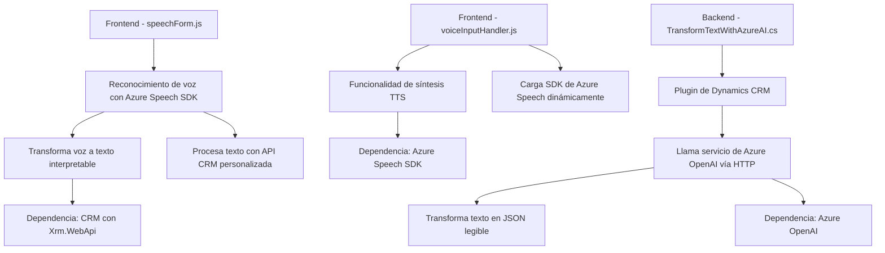

### Breve resumen técnico
El repositorio analiza varios componentes relacionados con el reconocimiento de voz, síntesis de texto a voz (TTS), y procesamiento de datos utilizando APIs externas como **Azure Speech SDK** y **Azure OpenAI**. Los archivos tienen aplicaciones en entornos como formularios dinámicos (en CRM, por ejemplo) y plugins que interactúan directamente con servicios externos para enriquecer datos procesados.

---

### Descripción de arquitectura
1. **Tipo de solución**: La solución combina funciones de frontend (procesamiento de formularios interactivos) con un plugin de backend basado en Dynamics CRM. Esto apunta a una arquitectura de **aplicación híbrida** con integración entre servicios de frontend y backend.
2. **Arquitectura**: Modular, organizada principalmente en capas separadas:
   - **Frontend**: Organización funcional mediante JavaScript.
   - **Backend**: Plugin basado en el modelo de lógica de negocios de Dynamics CRM.
   - **Integración con APIs externas**: Facilita la comunicación directa con servicios como Azure Speech y Azure OpenAI desde los diferentes módulos.

---

### Tecnologías y patrones usados
1. **Tecnologías principales**:
   - **Frontend**: 
     - JavaScript con Azure Speech SDK.
     - Interacción con formularios dinámicos vía `DOM` API.
   - **Backend**: 
     - Dynamics CRM.
     - Azure OpenAI.
     - Plugins escritos en C# aprovechando `Microsoft.Xrm.Sdk`.

2. **Patrones observados**:
   - **Facade Pattern**: Uso de funciones intermedias para encapsular interacciones con APIs.
   - **Loader Pattern**: En los archivos JS se cargan dependencias como Azure Speech SDK dinámicamente (cuando es requerido).
   - **Microkernel Architecture**: El plugin en C# tiene una estructura que actúa como capacidad extensible en el contexto de Dynamics CRM.

---

### Dependencias externas y componentes externos
Algunas de las dependencias y servicios incluyen:
1. **Azure Speech SDK**: Procesamiento de voz (frontend).
2. **Azure OpenAI**: Transformación y enriquecimiento de datos.
3. **Dynamics CRM**:
   - Integración de plugins como parte de eventos de ejecución en el sistema CRM.
   - APIs como `Xrm.WebApi` y servicios basados en `IPlugin`.
4. **Bibliotecas para manejo de JSON**: `Newtonsoft.Json` y `System.Text.Json`.

---

### Diagrama Mermaid válido para GitHub

---

### Conclusión final
El repositorio está diseñado para manejar tareas especializadas en el procesamiento e interacción con datos dinámicos en formularios CRM junto con enriquecimiento de servicios externos como **Azure Speech SDK** y **Azure OpenAI**. Utiliza una arquitectura modular basada en la separación de responsabilidades entre frontend (JS) y backend (plugins de CRM), promoviendo escalabilidad e integración con APIs. Este diseño es idóneo para aplicaciones que necesitan interacción avanzada con entrada de voz, datos dinámicos, e inteligencia artificial en el contexto empresarial.