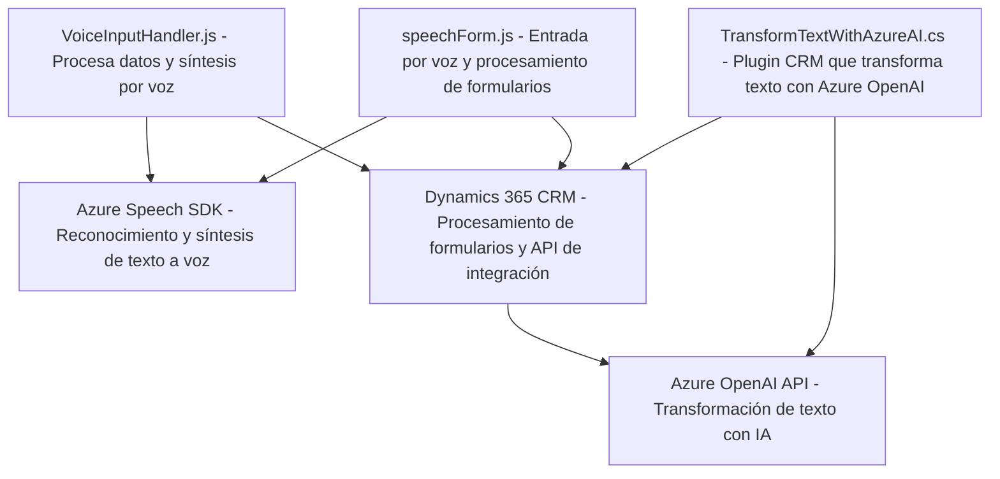

### Breve Resumen Técnico:

El repositorio contiene tres archivos principales que implementan diferentes funcionalidades para la interacción entre interfaces frontend y un backend orientado a servicios integrados en Microsoft Dynamics CRM. Las soluciones en el repositorio se enfocan en el procesamiento de datos usando voz, reconocimiento mediante Azure Speech SDK, formulación, y transformación de datos mediante Azure OpenAI.

---

### Descripción de Arquitectura:

1. **Tipo de solución**: 
   - La solución abarca principalmente la integración entre un frontend (interacción por voz) y un backend (procesamiento de datos y plugins en un CRM), con aspectos de API backend que interactúan con Azure OpenAI para la generación y transformación de contenido.
   - Es una combinación de **frontend modular** y plugins que complementan la lógica de negocio del backend (Dynamics 365 CRM).

2. **Arquitectura**: 
   - **N capas**: Dividida en frontend (interacción por voz y comandos hablados), procesamiento mediante plugins backend en CRM, y comunicación con servicios externos (Azure Speech SDK, OpenAI).
   - **Microservicio parcial**: Las funciones encapsuladas en el plugin delegan procesamiento intenso a APIs externas, lo que refuerza la modularidad.

---

### Tecnologías Usadas:

1. **Frontend**:
   - **JavaScript**: Funciones client-side para gestionar interacción con formularios y entrada/salida de voz.
   - **Azure Speech SDK**: Integra la funcionalidad de síntesis y reconocimiento de voz.

2. **Backend**:
   - **C#**: Uso de plugins de Microsoft Dynamics CRM para la lógica personalizada de procesamiento de texto.
   - **Microsoft Dynamics 365 SDK**: Manipulación de entidades y formularios CRM directamente vinculados al entorno de Dynamics.
   - **Azure OpenAI API (GPT)**: Procesa y transforma datos textuales de entrada en un formato estructurado.

3. **Servicios Externos**:
   - Azure Cognitive Services (Speech y OpenAI APIs).
   - HttpClient para realizar solicitudes HTTP asíncronas al API REST.

---

### Diagramas Mermaid Válidos Para GitHub:

---

### Conclusión Final:

El repositorio representa una solución integrada que combina **frontend modular**, **backend dinámico basado en plugins para Microsoft Dynamics CRM**, y **servicios de inteligencia artificial en Azure**. La arquitectura de **n capas** permite una separación lógica entre las herramientas que interactúan con el usuario, procesan datos, y aprovechan servicios externos para inteligencia artificial. Esto lo hace una solución robusta para sistemas CRM que demandan capacidades avanzadas de entrada, procesamiento y salida de datos integrados con tecnología de nube.