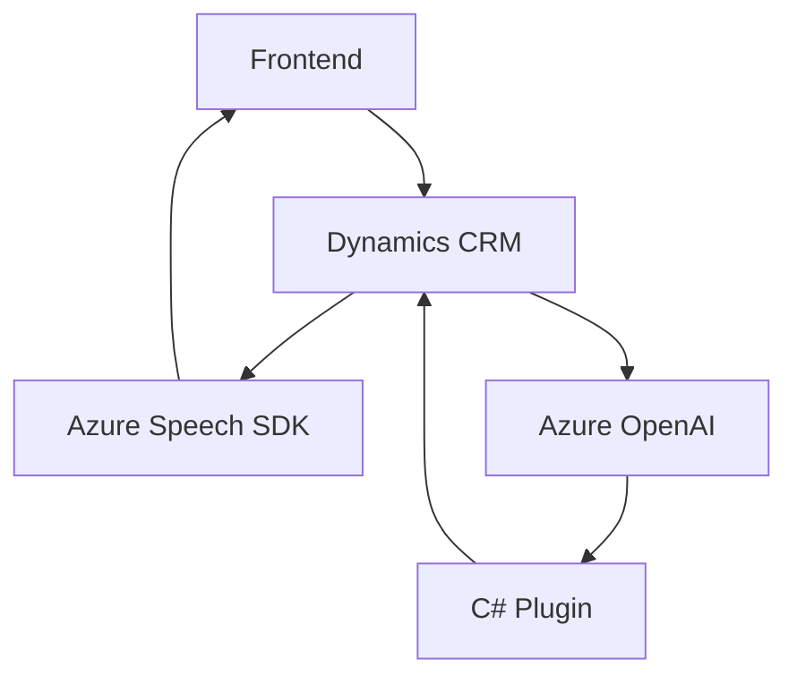

### Breve Resumen Técnico
El repositorio contiene diferentes archivos que implementan funcionalidades relacionadas con procesamiento de voz y texto utilizando **Azure Speech SDK** y **Azure OpenAI**, orientadas a integrar servicios externos en Dynamics CRM. Los elementos principales son:

1. **Frontend basado en JavaScript**: Implementa reconocimiento de voz, síntesis de texto a voz y mapeo de datos del formulario.
2. **Plugin en C#:** Extiende las capacidades de Dynamics CRM mediante procesamiento de texto en Azure OpenAI, estructurando datos de entrada en formato JSON.
3. **Dependencias Externas**: Azure Speech SDK, Azure OpenAI, y APIs de Dynamics CRM.

---

### Descripción de Arquitectura
La arquitectura tiene un enfoque **orientado a servicios** (SOA) con elementos **modulares** que interactúan entre ellos y con servicios externos. Se divide en:
- **Frontend**: Implementa lógica en cliente usando JavaScript para interactuar con Dynamics CRM y servicios de voz.
- **Backend**: Extiende las capacidades del CRM con un plugin en C# para integración con Azure OpenAI.
- **Exposición de Servicios**: Múltiples integraciones con APIs externas como OpenAI y Azure Speech SDK.

Aunque los componentes son modulares, no se utiliza una arquitectura distribuida como microservicios. El repositorio mantiene una estructura basada en "componentes interdependientes".

---

### Tecnologías Usadas
1. **Microsoft Dynamics CRM**: Actúa como plataforma base.
2. **Azure Speech SDK**: Reconocimiento de voz y síntesis de texto.
3. **Azure OpenAI**: Procesamiento avanzado de texto mediante inteligencia artificial.
4. **Microsoft.Xrm.Sdk**: Comunicación e integración directa con Dynamics CRM.
5. **JavaScript/TypeScript**: Domina la implementación de las interacciones en el cliente en el frontend.

---

### Dependencias o Componentes Externos
1. **Azure Speech SDK**
2. **Azure OpenAI**
3. **Microsoft Dynamics CRM API**
4. **Librerías de manejo de JSON:** `System.Text.Json`, `Newtonsoft.Json.Linq`
5. **HTTP Client Framework:** Para consumo de APIs externas.

---

### Diagrama Mermaid Válido para GitHub

---

### Conclusión Final
El repositorio implementa una solución **orientada a servicios** con una interacción modular entre frontend, backend y servicios externos como Azure Speech SDK y OpenAI. Aunque no es una arquitectura distribuida como microservicios, la modularidad es clara y se integra con Microsoft Dynamics CRM para atender necesidades específicas de reconocimiento y síntesis de voz, así como procesamiento avanzado de texto con inteligencia artificial.