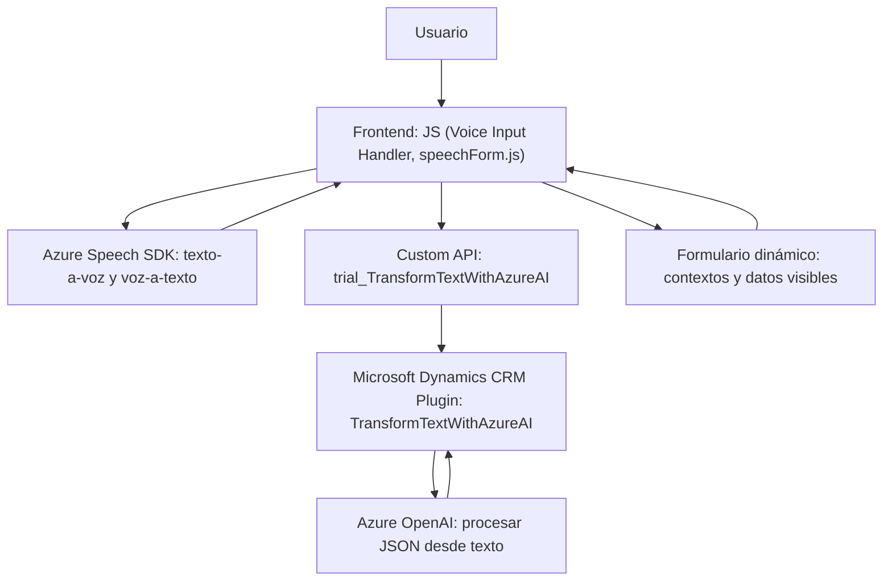

### **Breve resumen técnico**
El repositorio contiene archivos relacionados con dos principales componentes funcionales:
1. **Frontend (JavaScript)**: Permitiendo interacción conversacional mediante texto a voz y reconocimiento de voz, integrando **Azure Speech SDK** para procesamiento de voz e integrando funciones de manipulación de formularios dinámicos de Microsoft Dynamics.
2. **Backend Plugin (C#)**: Extendiendo funcionalidades de Microsoft Dynamics CRM mediante un plugin que utiliza Azure OpenAI para transformación de texto en objetos JSON estructurados.

La solución combina elementos de un **frontend interactivo**, una **extensión plugin backend** y conexiones con servicios externos.

---

### **Descripción de arquitectura**
1. **Tipo de solución**: Es una **API-extendida con frontend especializado**, que integra procesamiento externo mediante Azure Services.
2. **Arquitectura**:
   - La arquitectura global es de **tipo n-capas**: Frontend interactivo + Backend Plugin + servicios externos (Azure Speech y Azure OpenAI).
   - El frontend utiliza los contextos de formularios dinámicos de Dynamics CRM para manipulación de datos orientados al usuario.
   - El backend actúa como un conector con servicios de AI para transformación avanzada del texto.

---

### **Tecnologías, frameworks y patrones usados**
1. **Técnicas/Patrones**:
   - **Modularidad**: Funciones separadas en el frontend para carga dinámica del SDK, lectura/formularios y procesamiento de voz sin dependencias entre sí.
   - **Callback-based**: Uso de funciones asíncronas y promesas para operaciones como carga del SDK y comunicación con API.
   - **Extensión Plugin en Backend**: Al implementar `IPlugin` se respetan patrones de desarrollo de extensiones en Dynamics CRM.
   - **Separación de la lógica por métodos específicos**: Backend C# agrupa transformación externa y limpieza en partes reutilizables como `GetOpenAIResponse`.
2. **Frontend**:
   - **Azure Speech SDK** (JavaScript): Proporciona transcripción texto-a-voz y voz-a-texto.
   - **Dynamics 365 Context API (Xrm)**: Manipulación de formularios dinámicos en una solución empresarial.
3. **Backend Plugin**:
   - **Microsoft Dynamics CRM SDK** (C#): Personalización del ecosistema CRM.
   - **Azure OpenAI REST API**: Llama al servicio OpenAI de Azure para procesamiento de texto.
   - **Newtonsoft.Json** y **System.Net.Http**: Gestión de JSON y solicitudes HTTP para intercambiar datos estructurados.

---

### **Dependencias externas**
- **Azure Speech SDK (Frontend)**: Para texto a voz y voz a texto.
  - Endpoint: `https://aka.ms/csspeech/jsbrowserpackageraw`.
- **Azure OpenAI Service (Backend)**: Transformación de texto en JSON mediante inteligencia artificial.
- **Dynamic 365 APIs**:
  - Manipulación de formularios, como atributos, valores de campo y lookups.
  - Xrm context para integraciones específicas.
- **Newtonsoft.Json**: Serialización/deserialización de valores JSON en C#.

---

### **Diagrama Mermaid**

---

### **Conclusión final**
La solución global es una implementación híbrida que combina frontend especializado en interacción conversacional con un backend extendido mediante un plugin para Microsoft Dynamics CRM. Usa tecnologías de Microsoft como **Azure Speech SDK** y **Azure OpenAI** para implementar un sistema inteligente que procesa datos del usuario mediante voz, reconocimiento y síntesis, y manipula formularios de manera programática.

La arquitectura **n-capas** del sistema, junto con las capacidades avanzadas de Azure, lo hacen ideal para entornos de CRM robustos, habilitando una interacción moderna y dinámica para usuarios empresariales. Sin embargo, hay puntos de mejora como la gestión de claves de API para evitar exposición directa de credenciales en código.