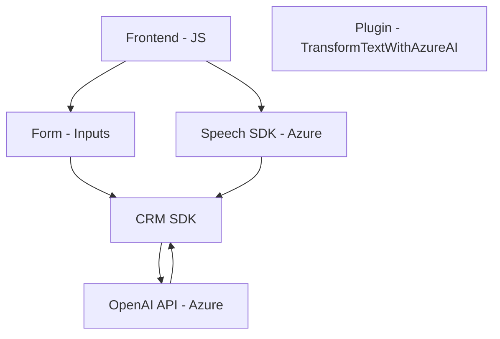

### Breve resumen técnico
El repositorio contiene tres componentes principales: 
1. **Frontend JavaScript scripts**: Gestión de formularios en UI y funcionalidades de síntesis/reconocimiento de voz conectadas a Azure Speech SDK.
2. **Backend plugin para Dynamics CRM**: Lógica de procesamiento de texto usando la API de Azure OpenAI.

Combina **tecnologías Microsoft** (Azure Speech SDK, Dynamics CRM SDK) y una arquitectura extensible para enriquecer formularios mediante reconocimiento de voz y generación/síntesis de texto automatizados.

---

### Descripción de la arquitectura
La solución puede clasificarse como una **aplicación híbrida basada en servicios**:
- **UI Layer (Frontend)**: Scripts de JavaScript conectados al SDK de Azure Speech, optimizados para gestionar formularios y manejar captura de audio, síntesis, y reconocimiento de voz.
- **Business Logic Layer (Plugin)**: Dinámicas en el servidor usando el SDK de Dynamics CRM para transformar texto con Azure OpenAI API y generar JSON estructurado.
- **External Services Layer**: Dependencia fuerte en servicios de Azure (Speech SDK, OpenAI API).

La arquitectura sigue el patrón de **n capas**:
1. **Presentación (Frontend)**: Scripts JS para interactuar con usuarios.
2. **Aplicación (plugin)**: Lógica del servidor para procesamiento de texto.
3. **Servicios externos**: APIs de Azure para IA y voz.

---

### Tecnologías usadas
1. **Frontend**:
   - Lenguaje: JavaScript.
   - Framework: Dynamics CRM Web API.
   - SDK: Azure Speech SDK (Reconocimiento de voz y síntesis de texto).
   - Integración: Xrm.WebApi para interacción con CRM.

2. **Plugin**:
   - Lenguaje: C# (.NET Framework).
   - Framework: Dynamics CRM SDK.
   - APIs externas: Azure OpenAI API.
   - Librerías: `Newtonsoft.Json`, `System.Text.Json`.

---

### Dependencias y componentes externos
1. **Azure Speech SDK**:
   - Sintetizar texto a voz.
   - Reconocer audio y convertirlo en texto.

2. **Azure OpenAI API**:
   - Transformación avanzada de texto con capacidades de IA.

3. **Dynamics CRM SDK**:
   - Extensibilidad de CRM.
   - Interacción directa con datos y capturas del formulario.

4. **Third-party libraries**:
   - `Newtonsoft.Json` y `System.Text.Json` para manipulación JSON en plugins.

---

### Diagrama Mermaid

---

### Conclusión final
La solución presentada es una **integración extendida y modular** sobre una base de Dynamics CRM, diseñada para mejorar la accesibilidad y funcionalidad de los formularios en la interfaz de usuario. Mediante la integración con Azure Speech SDK y Azure OpenAI API, la solución permite el reconocimiento y síntesis de voz, junto con procesamiento avanzado de texto.

La arquitectura basada en **n capas** garantiza una clara separación entre el frontend, la lógica de negocio y los servicios externos. La elección de tecnologías como Dynamics CRM y Azure añade gran capacidad escalable para aplicaciones empresariales. Sin embargo, depender completamente de servicios de Azure podría implicar desafíos en términos de costos y disponibilidad en regiones específicas.